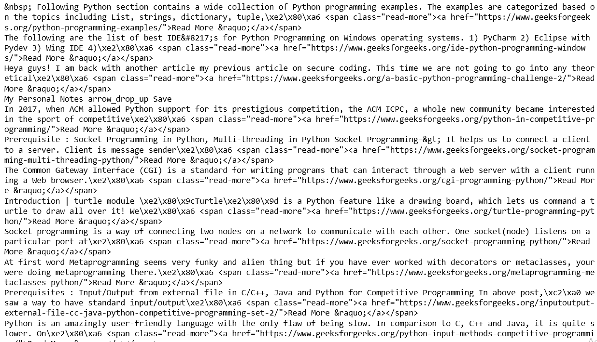
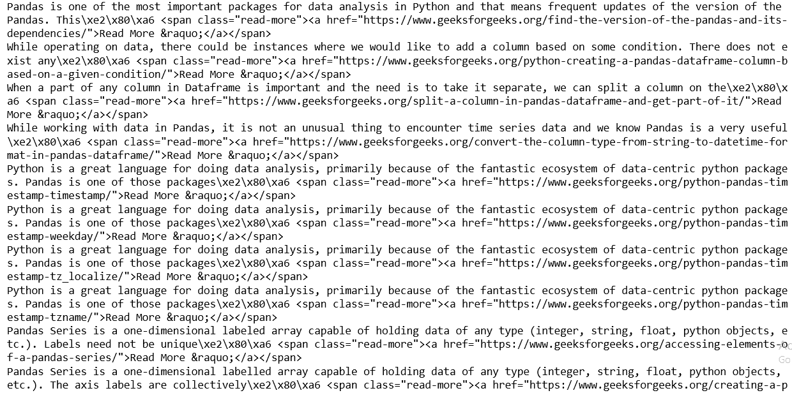

# Python |用正则表达式和 urllib 解析网站

> 原文:[https://www . geesforgeks . org/python-parse-a-网站-with-regex-and-urllib/](https://www.geeksforgeeks.org/python-parse-a-website-with-regex-and-urllib/)

让我们讨论使用 python 解析的概念。在 python 中，我们有很多模块，但是对于解析，我们只需要 **urllib** 和 **re** 即正则表达式。通过使用这两个库，我们可以获取网页上的数据。

请注意，解析网站意味着获取整个源代码，并且我们希望使用给定的 url 链接进行搜索，它会将输出作为您无法理解的大量 HTML 内容提供给您。让我们看一下带有解释的演示，让您更好地理解解析。

**代码#1:** 需要库

```py
# importing libraries
import urllib.request
import urllib.parse
import re
```

**代码#2:**

```py
url = 'https://www.geeksforgeeks.org/'
values = {'s':'python programming',
          'submit':'search'}
```

我们已经定义了一个 url 和一些我们想要搜索的相关值。请记住，我们将值定义为字典，在这个键值对中，我们定义了 **python 编程**到**在定义的 url 上搜索**。

**代码#3:**

```py
data = urllib.parse.urlencode(values)        
data = data.encode('utf-8')                  
req = urllib.request.Request(url, data)      
resp = urllib.request.urlopen(req)    

respData = resp.read()                      
```

在第一行中，我们对前面定义的值进行编码，然后(第 2 行)对机器理解的相同数据进行编码。
在第三行代码中，我们在定义的 url 中请求值，然后使用模块`urlopen()`打开 HTML 的 web 文档。
在最后一行`read()`将帮助逐行读取文档，并将其分配给 *respData* 命名变量。

**代码#4:**

```py
paragraphs = re.findall(r'<p>(.*?)</p>', str(respData))

for eachP in paragraphs:
    print(eachP)
```

为了提取相关数据，我们应用正则表达式。第二个参数必须是类型字符串，如果我们想打印数据，我们应用简单的打印功能。

以下是几个例子:

**示例#1:**

```py
import urllib.request
import urllib.parse
import re

url = 'https://www.geeksforgeeks.org/'
values = {'s':'python programming',
          'submit':'search'}

data = urllib.parse.urlencode(values)
data = data.encode('utf-8')
req = urllib.request.Request(url, data)
resp = urllib.request.urlopen(req)
respData = resp.read()

paragraphs = re.findall(r'<p>(.*?)</p>',str(respData))

for eachP in paragraphs:
    print(eachP)
```

**输出:**


**例 2:**

```py
import urllib.request
import urllib.parse
import re

url = 'https://www.geeksforgeeks.org/'
values = {'s':'pandas',
          'submit':'search'}

data = urllib.parse.urlencode(values)
data = data.encode('utf-8')
req = urllib.request.Request(url, data)
resp = urllib.request.urlopen(req)
respData = resp.read()

paragraphs = re.findall(r'<p>(.*?)</p>',str(respData))

for eachP in paragraphs:
    print(eachP)
```

**输出:**
