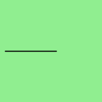

# Python–魔杖中的路径 _ 曲线 _ 到 _ 二次 _ 贝塞尔()函数

> 原文:[https://www . geesforgeks . org/python-path _ curve _ to _ squared _ bezier-in-function-in-wand/](https://www.geeksforgeeks.org/python-path_curve_to_quadratic_bezier-function-in-wand/)

**path _ curve _ to _ squared _ bezier()**从当前点到给定坐标绘制一条二次 Bezier 曲线。如果 smooth 为 True，则控制点被假定为控制点在前一个命令上的反映，否则必须给出一对控制坐标。

> **语法:**wand . drawing . path _ curve _ to _ squared _ bezier(to，controls，smooth，relative)
> 
> <figure class="table">
> 
> | 参数 | 输入类型 | 描述 |
> | --- | --- | --- |
> | 到 | 序列或(数字。真实的数字。真实) | 表示要绘制到的坐标的对。 |
> | 控制 | collections . ABC . sequence or(numbers。真实的数字。真实) | 用于影响曲线的坐标 |
> | 光滑的 | 弯曲件 | 假设最后定义的控制坐标 |
> | 亲戚 | 弯曲件 | 将给定坐标视为相对于当前点。 |
> 
> </figure>

**示例#1:**

## 蟒蛇 3

```py
from wand.image import Image
from wand.drawing import Drawing
from wand.color import Color

with Drawing() as draw:
    draw.stroke_width = 2
    draw.stroke_color = Color('black')
    draw.fill_color = Color('white')
    draw.path_start()
    # points list to determine curve
    points = [(40, 10), # Start point
              (20, 50), # First control
              (90, 10), # Second control
              (70, 40)] # End point
    # Start middle-left
    draw.path_move(to =(10, 100))
    # Curve across top-left to center
    draw.path_curve_to_quadratic_bezier(to =(100, 0),
                    control = points,
                    smooth = True,
                    relative = True)
    draw.path_finish()
    with Image(width = 200,
               height = 200,
               background = Color('lightgreen')) as image:
        draw(image)
        image.save(filename ="pathbcurve.png")
```

**输出:**



**例 2:**

## 蟒蛇 3

```py
from wand.image import Image
from wand.drawing import Drawing
from wand.color import Color

with Drawing() as draw:
    draw.stroke_width = 2
    draw.stroke_color = Color('black')
    draw.fill_color = Color('white')
    draw.path_start()
    # Start middle-left
    draw.path_move(to=(100, 100))
    # Curve across top-left to center
    draw.path_curve_to_quadratic_bezier(to=(100, 0),
                                        control=[(20,50),(90,10)],
                                        smooth=True,relative=True)

    draw.path_finish()
    with Image(width=200, height=200, background=Color('lightgreen')) as image:
        draw(image)
        image.save(filename="pathbcurve.png")
```

**输出:**

