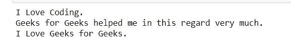
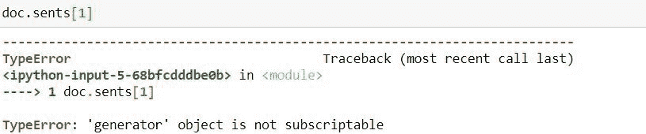
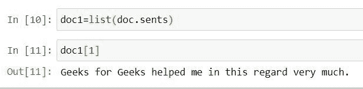

# Python |使用 Spacy 执行句子分割

> 原文:[https://www . geeksforgeeks . org/python-执行-句子-分段-使用-spacy/](https://www.geeksforgeeks.org/python-perform-sentence-segmentation-using-spacy/)

在自然语言处理中，决定句子实际从哪里开始或结束的过程，或者我们可以简单地说，这里我们是根据句子来划分段落。这个过程被称为**句子切分**。在 Python 中，我们使用**空间**库来实现自然语言处理的这一部分。

在 Python 中，Spacy 用于自然语言处理。

要在 python 程序中使用这个库，我们首先需要安装它。

安装此库的命令:

```
pip install spacy
python -m spacy download en_core_web_sm
Here en_core_web_sm  means core English Language available online of small size.
```

**示例:**

```
we have the following paragraph:
"I Love Coding. Geeks for Geeks helped me in this regard very much. I Love Geeks for Geeks."
here there are 3 sentences.
1\. I Love Coding.
2\. Geeks for Geeks helped me in this regard very much.
3\. I Love Geeks for Geeks
```

在 python 中， `.sents`用于句子分割，存在于 spacy 中。`.sents` 给出的输出是一个生成器，如果我们想随机打印，我们需要使用列表。

**代码:**

```
#import spacy library
import spacy

#load core english library
nlp = spacy.load("en_core_web_sm")

#take unicode string  
#here u stands for unicode
doc = nlp(u"I Love Coding. Geeks for Geeks helped me in this regard very much. I Love Geeks for Geeks.")
#to print sentences
for sent in doc.sents:
  print(sent)
```

**输出:**

现在如果我们尝试随机使用 doc.sents，那么会发生什么:


**代码:为了克服这个错误，我们首先需要使用 list 函数将这个生成器转换成一个列表。**

```
#converting the generator object result in to list
doc1 = list(doc.sents)

#Now we can use it randomly as
doc1[1]
```

**输出:**
