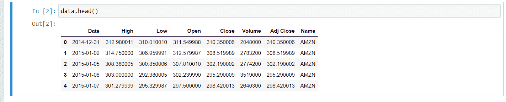
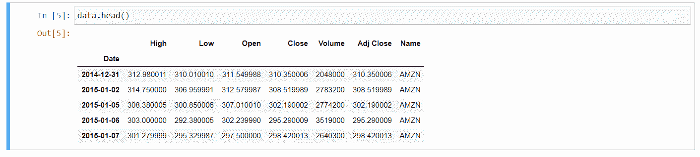
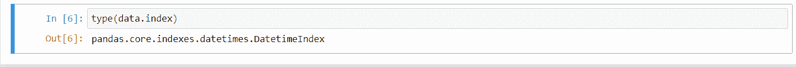
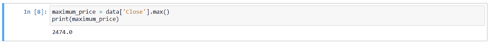
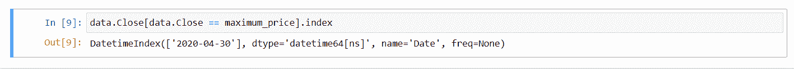
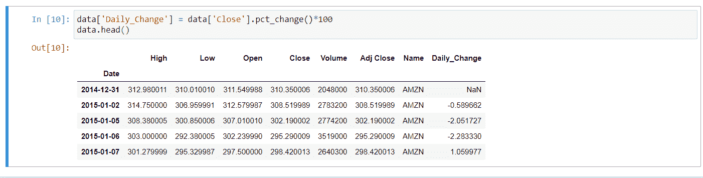
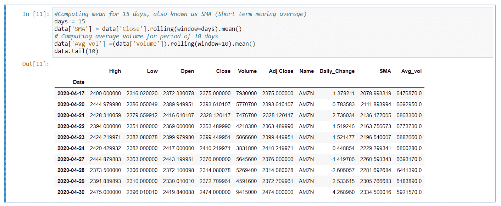

# Python–对库存数据执行操作

> 原文:[https://www . geesforgeks . org/python-在库存数据上执行操作/](https://www.geeksforgeeks.org/python-performing-operations-on-the-stock-data/)

本文演示了使用 Python 分析和构建股票数据算法交易策略的基本操作。我们运行了一些简单的操作，可以使用 Python 对股票数据执行这些操作，我们从从 CSV 文件中读取股票数据开始。Python 已经成为发展最快的编程语言，这源于多种因素，如易学性、可读性、简洁性、大量开发人员、跨领域应用等。Python 在交易中也得到了广泛的采用，这导致了基于 Python 的分析工具、Python APIs 和使用 Python 的交易策略的增长。
本文旨在说明学习和应用 Python 来制定和分析交易策略是多么容易。如果你是这个博客的新手，你可能只是在帮助克服你的编程焦虑。Python 附带了内置的日期时间模块来处理日期和时间。正如你可能猜到的，它有不同的功能来控制日期和时间。我们可以使用这个模块轻松解析任何日期时间字符串，并将其转换为 DateTime 对象。让我们运行一些简单的操作，这些操作可以使用 Python 在股票信息上完成。我们首先从股票的 CSV 文件中读取数据。CSV 文件包含股票编号“开盘-高点-低点-收盘(OHLC)”和“成交量”。

**Code:**

```py
import pandas as pd

# Load data from csv file
data = pd.read_csv('YourFileName.csv', index_col ="Date", parse_dates = True)

data.head()
```



解析允许我们通过仅仅提到日期或月份
来访问数据



解析日期后的数据帧

Determine if the object is a DateTime index for pandas using **type()**function.

**代码:**

```py
type(data.index)
```



数据帧是一个日期时间索引

If you want to know the number of trading days (number of rows) in the given set of data,  it can be done using the **count()** method.

**代码:**

```py
# Number of rows in the data set. You can use any column for that purpose.
# I have used 'Close'
data['Close'].count()
```


数据框中的行数。

What is the highest close price achieved over the given period? This is made possible by the use of the **max()** method.

**代码:**

```py
maximum_price = data['Close'].max()
print(maximum_price)
```



最高价

Is it possible to know the date this maximum price was reached on as well? We apply **index** property as shown below to find the respective date.

**代码:**

```py
data.Close[data.Close == maximum_price].index
```



股票的最高价格在 2020 年 4 月 30 日被突破

Let’s calculate the change in percentage in closing price per day. We ‘re adding a new ‘Daily_Change’ column to our existing data set. We use **pct_change()** method to calculate daily returns.

**代码:**

```py
# Compute the percentage change
data['Daily_Change'] = data['Close'].pct_change()*100
data.head()
```



股票的每日收益

In the end, let’s add a few indicators. We measure the simple moving average of 15 days, and the average volume of 10 days. We will add more measures to our data frame and then evaluate the trend in stocks to see whether it is bullish or bearish.

**代码:**

```py
# Computing mean for 15 days, also known as SMA (Short term moving average)
days = 15
data['SMA'] = data['Close'].rolling(window = days).mean()

# Computing average volume for period of 10 days
data['Avg_vol'] =(data['Volume']).rolling(window = 10).mean()
data.tail(10)
```


在这篇短文中，我们介绍了一些简单的方法来评估数据集，并加深对股票数据的理解。你能考虑用具体的基本操作和简单的指标来构建一个贸易策略吗？简单的交易策略可能是有效的，这可以由许多活跃的交易者来保证。