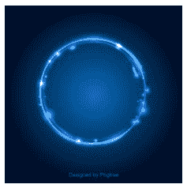
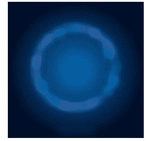

# Python PIL | BoxBlur()方法

> 原文:[https://www.geeksforgeeks.org/python-pil-boxblur-method/](https://www.geeksforgeeks.org/python-pil-boxblur-method/)

PIL 是 python 图像库，它为 Python 解释器提供图像编辑功能。ImageFilter 模块包含一组预定义过滤器的定义，可以与 Image.filter()方法一起使用。
**PIL。ImageFilter.BoxBlur()** 通过将每个像素设置为在每个方向上延伸半径像素的方形框中像素的平均值来模糊图像。支持任意大小的浮动半径。对于任何半径值，使用相对于图像大小在线性时间内运行的优化实现。

```py
Syntax: PIL.ImageFilter.BoxBlur()

Partameters: 
radius: Size of the box in one direction. Radius 0 does not blur, returns an identical image. Radius 1 takes 1 pixel in each direction, i.e. 9 pixels in total.
```

所用图像:


## 蟒蛇 3

```py
# Importing Image and ImageFilter module from PIL package 
from PIL import Image, ImageFilter

# creating a image object
im1 = Image.open(r"C:\Users\sadow984\Desktop\download2.JPG")

# applying the boxblur method
im2 = im1.filter(ImageFilter.BoxBlur(0))

im2.show()
```

**输出:**



## 蟒蛇 3

```py
# Importing Image and ImageFilter module from PIL package 
from PIL import Image, ImageFilter

# creating a image object
im1 = Image.open(r"C:\Users\sadow984\Desktop\download2.JPG")

# applying the boxblur method
im2 = im1.filter(ImageFilter.BoxBlur(2))

im2.show()
```

**输出:**


## 蟒蛇 3

```py
# Importing Image and ImageFilter module from PIL package 
from PIL import Image, ImageFilter

# creating a image object
im1 = Image.open(r"C:\Users\sadow984\Desktop\download2.JPG")

# applying the boxblur method
im2 = im1.filter(ImageFilter.BoxBlur(8))

im2.show()
```

**输出:**

