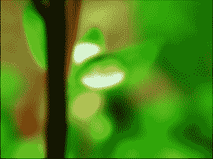
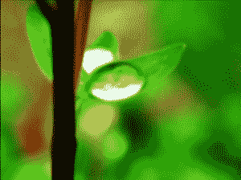

# Python PIL | gaussianbulr()方法

> 原文:[https://www . geesforgeks . org/python-pil-gaussianbulr-method/](https://www.geeksforgeeks.org/python-pil-gaussianblur-method/)

PIL 是 python 图像库，它为 Python 解释器提供图像编辑功能。**图像过滤器**模块包含一组预定义过滤器的定义，可用于**图像过滤器()**方法。

`**PIL.ImageFilter.GaussianBlur()**`方法创建高斯模糊滤镜。

> **语法:** PIL。ImageFilter . GaussianBlur(半径=5)
> 
> **参数** :
> **半径**–模糊半径。通过改变半径值，获得了不同强度的高斯光束图像。
> 
> **返回类型**:图像。

**所用图像:**


```

# Importing Image and ImageFilter module from PIL package 
from PIL import Image, ImageFilter 

# creating a image object 
im1 = Image.open(r"C:\Users\System-Pc\Desktop\leave.JPG") 

# applying the Gaussian Blur filter 
im2 = im1.filter(ImageFilter.GaussianBlur(radius = 5))

im2.show() 
```

**输出:**


**半径:**这里使用的半径值为 2。

```
Importing Image and ImageFilter module from PIL package 
from PIL import Image, ImageFilter 

# creating a image object 
im1 = Image.open(r"C:\Users\System-Pc\Desktop\leave.JPG") 

# applying the Gaussian Blur filter 
im2 = im1.filter(ImageFilter.GaussianBlur(radius = 2))

im2.show() 
```

**输出:**
