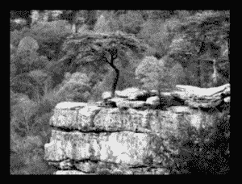
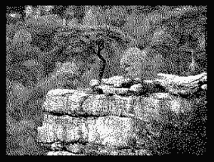
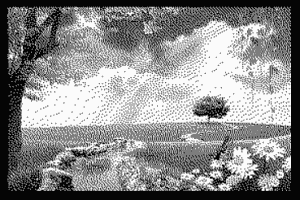

# Python PIL | Image.convert()方法

> 原文:[https://www . geesforgeks . org/python-pil-image-convert-method/](https://www.geeksforgeeks.org/python-pil-image-convert-method/)

PIL 是 python 图像库，它为 Python 解释器提供图像编辑功能。`Image`模块提供了一个同名的类，用于表示 PIL 图像。该模块还提供了许多工厂功能，包括从文件加载图像和创建新图像的功能。

`**Image.convert()**`返回该图像的转换副本。对于“P”模式，此方法通过调色板转换像素。如果省略了模式，则选择一个模式，以便可以在没有调色板的情况下表示图像和调色板中的所有信息。

> **语法:**图像.转换(模式=无，矩阵=无，抖动=无，调色板=0，颜色=256)
> 
> **参数:**
> **模式**–请求的模式。请参阅:模式。
> **矩阵**–可选转换矩阵。如果给定，它应该是包含浮点值的 4 元组或 12 元组。
> **抖动**–抖动方法，从模式“RGB”转换为“P”或从“RGB”或“L”转换为“1”时使用。可用的方法是 NONE 或 FLOYDSTEINBERG(默认)。
> **调色板**–从模式“RGB”转换为“P”时使用的调色板。可用的调色板有网络调色板或自适应调色板。
> **颜色**–用于自适应调色板的颜色数量。默认为 256。
> 
> **返回:**一个图像对象。

**所用图像:**


```py

# importing image class from PIL package
from PIL import Image

# creating image object
img = Image.open(r"C:\Users\System-Pc\Desktop\scene3.jpg")

# using convert method for img1
img1 = img.convert("L")
img1.show()

# using convert method for img2
 img2 = img.convert("1")
img2.show()
```

**输出 1:**


**输出 2:**


**另一个例子:**拍摄另一个图像。

**所用图像:**


```py

# importing image class from PIL package
from PIL import Image

# creating image object
img = Image.open(r"C:\Users\System-Pc\Desktop\scene4.jpg")

# using convert method for img1
img1 = img.convert("L")
img1.show()

# using convert method for img2
 img2 = img.convert("1")
img2.show()
```

**输出 1:**


**输出 2:**
