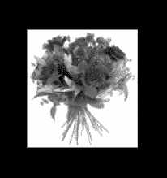

# Python PIL | Image.draft()方法

> 原文:[https://www . geesforgeks . org/python-pil-image-draft-method/](https://www.geeksforgeeks.org/python-pil-image-draft-method/)

PIL 是 python 图像库，它为 Python 解释器提供图像编辑功能。图像模块提供了一个同名的类，用于表示 PIL 图像。该模块还提供了许多工厂功能，包括从文件加载图像和创建新图像的功能。
**Image.draft()** 配置图像文件加载器，使其返回尽可能匹配给定模式和大小的图像版本。例如，您可以使用此方法在加载彩色 JPEG 时将其转换为灰度，或者从 PCD 文件中提取 128×192 版本。

> **语法:** Image.draft(模式，大小)
> **参数:**
> **模式**–请求的模式。
> **尺寸**–要求的尺寸。
> **返回:**一个图像对象。
> **返回类型:**图像

**使用的图像:**


## 蟒蛇 3

```
# importing image object from PIL
from PIL import Image

# creating an image object
im = Image.open(r"C:\Users\System-Pc\Desktop\rose.jpg")

# print the original image object
print(im)

# using draft function
# convert mode and size as well
im1 = im.draft("L", (im.width // 2, im.height // 2))
im2 = im1.decoderconfig, im1.mode, im.size, im1.tile
print(im1)
print(im2)

# show the converted image
im1.show()
```

**输出 1:**T2】

```
PIL.JpegImagePlugin.JpegImageFile image mode=RGB size=217x232 at 0x27A3D65FD68
PIL.JpegImagePlugin.JpegImageFile image mode=L size=109x116 at 0x27A3D65FD68
((2, 0), 'L', (109, 116), [('jpeg', (0, 0, 109, 116), 0, ('L', ''))])
```

**输出 2:**T2】



**另一个例子:**这里我们使用另一个图像。

**使用的图像:**


## 蟒蛇 3

```
# importing image object from PIL
from PIL import Image

# creating an image object
im = Image.open(r"C:\Users\System-Pc\Desktop\tree.jpg")

# print the original image object
print(im)

# using draft function
# convert mode and size as well
im1 = im.draft("L", (im.width // 2, im.height // 2))
im2 = im1.decoderconfig, im1.mode, im.size, im1.tile
print(im1)
print(im2)

# show the converted image
im1.show()
```

**输出 1:**T2】

```
PIL.JpegImagePlugin.JpegImageFile image mode=RGB size=259x194 at 0x28A1C2C1CC0
PIL.JpegImagePlugin.JpegImageFile image mode=L size=130x97 at 0x28A1C2C1CC0
((2, 0), 'L', (130, 97), [('jpeg', (0, 0, 130, 97), 0, ('L', ''))])
```

**输出 2:**T2】

