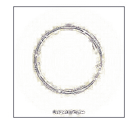
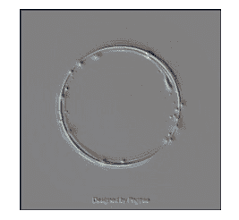
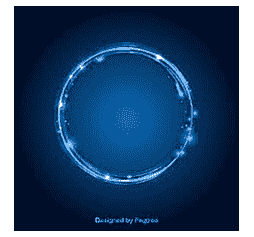
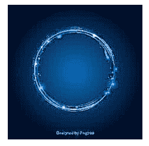

# Python PIL |带 Image filter 模块的图像过滤器

> 原文:[https://www . geesforgeks . org/python-pil-image-filter-with-image filter-module/](https://www.geeksforgeeks.org/python-pil-image-filter-with-imagefilter-module/)

PIL is the Python Imaging Library which provides the python interpreter with image editing capabilities.

ImageFilter 模块包含一组预定义过滤器的定义，可与`Image.filter()`方法一起使用。

所用图像:


**滤镜–**
当前版本的图库提供了一组预定义的图像增强滤镜:

**1。模糊**

```
# Importing Image and ImageFilter module from PIL package 
from PIL import Image, ImageFilter

# creating a image object
im1 = Image.open(r"C:\Users\sadow984\Desktop\download2.JPG")

# applying the blur filter
im2 = im1.filter(ImageFilter.BLUR)

im2.show()
```

**输出:**


**2。轮廓**

```
# Importing Image and ImageFilter module from PIL package 
from PIL import Image, ImageFilter

# creating a image object
im1 = Image.open(r"C:\Users\sadow984\Desktop\download2.JPG")

# applying the contour filter
im2 = im1.filter(ImageFilter.CONTOUR)

im2.show()
```

**输出:**


**3。压花**

```
# Importing Image and ImageFilter module from PIL package 
from PIL import Image, ImageFilter

# creating a image object
im1 = Image.open(r"C:\Users\sadow984\Desktop\download2.JPG")

# applying the emboss filter
im2 = im1.filter(ImageFilter.EMBOSS)

im2.show()
```

**输出:**


**4。EDGE _ enhanced**

```
# Importing Image and ImageFilter module from PIL package 
from PIL import Image, ImageFilter

# creating a image object
im1 = Image.open(r"C:\Users\sadow984\Desktop\download2.JPG")

# applying the EDGE_ENHANCE filter
im2 = im1.filter(ImageFilter.EDGE_ENHANCE)

im2.show()
```

**输出:**


**5。边缘增强更多**

```
# Importing Image and ImageFilter module from PIL package 
from PIL import Image, ImageFilter

# creating a image object
im1 = Image.open(r"C:\Users\sadow984\Desktop\download2.JPG")

# applying the EDGE_ENHANCE_MORE filter
im2 = im1.filter(ImageFilter.EDGE_ENHANCE_MORE)

im2.show()
```

**输出:**
