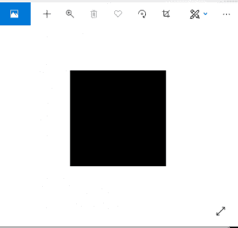
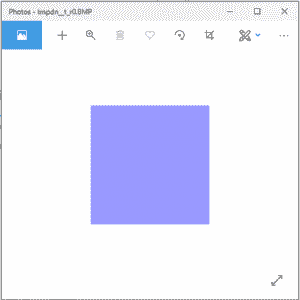

# Python PIL | Image.new()方法

> 原文:[https://www.geeksforgeeks.org/python-pil-image-new-method/](https://www.geeksforgeeks.org/python-pil-image-new-method/)

PIL 是 python 图像库，它为 Python 解释器提供图像编辑功能。
**PIL。Image.new()** 方法创建一个具有给定模式和大小的新图像。尺寸以像素为单位表示为(宽，高)元组。颜色作为单波段图像的单个值给出，作为多波段图像的元组给出(每个波段一个值)。
我们也可以使用颜色名称。如果省略了颜色参数，图像将被零填充(这通常对应于黑色)。如果颜色为“无”，则图像不会初始化。如果您要在图像中粘贴或绘制东西，这可能会很有用。

> **句法:**
> PIL。Image.new(模式，大小)
> PIL。Image.new(模式、大小、颜色)
> **参数:**
> **模式:**用于新图像的模式。(可能是 RGB，RGBA)
> **大小:**包含(宽度，高度)像素的二元组。
> **颜色:**图像使用什么颜色。默认为黑色。如果给定，对于单波段模式，这应该是单个整数或浮点值，对于多波段模式，这应该是一个元组。
> **返回值:**一个**图像**对象。

**代码#1:**

## 蟒蛇 3

```
# Imports PIL module
import PIL

# creating a image object (new image object) with
# RGB mode and size 200x200
im = PIL.Image.new(mode="RGB", size=(200, 200))

# This method will show image in any image viewer
im.show()
```

**输出:**



**代码#2:**

## 蟒蛇 3

```
# imports Pil module
import PIL

# creating image object which is of specific color
im = PIL.Image.new(mode = "RGB", size = (200, 200),
                           color = (153, 153, 255))

# this will show image in any image viewer
im.show()
```

**输出:**



可以改变颜色元组的[值来获得不同的颜色，或者我们可以简单地使用颜色名称(对于单波段图像)。](http://mkweb.bcgsc.ca/tupleencode/?color_charts)