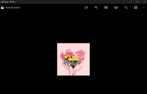

# Python PIL | Image.save()方法

> 原文:[https://www.geeksforgeeks.org/python-pil-image-save-method/](https://www.geeksforgeeks.org/python-pil-image-save-method/)

PIL 是 python 图像库，它为 Python 解释器提供图像编辑功能。`Image`模块提供了一个同名的类，用于表示 PIL 图像。该模块还提供了许多工厂功能，包括从文件加载图像和创建新图像的功能。

`**Image.save()**`以给定的文件名保存该图像。如果没有指定格式，如果可能的话，使用的格式由文件扩展名决定。

关键字选项可用于向编写器提供附加说明。如果一个作者不认可一个选项，它会被默默忽略。每个编写器的图像格式文档中都描述了可用的选项。

您可以使用文件对象代替文件名。在这种情况下，您必须始终指定格式。文件对象必须实现 seek、tell 和 write 方法，并以二进制模式打开。

> **语法:** Image.save(fp，格式=无，* *参数)
> 
> **参数:**
> 
> **FP**–文件名(字符串)，路径名。路径对象或文件对象。
> **格式**–可选格式覆盖。如果省略，使用的格式由文件扩展名决定。如果使用文件对象而不是文件名，则应始终使用此参数。
> **选项**–图像写入器的额外参数。
> 
> **返回:**无
> 
> **加注:**
> 
> **键错误**–如果无法从文件名中确定输出格式。使用格式选项解决这个问题。
> T3】IOError–如果文件无法写入。该文件可能已经创建，并且可能包含部分数据。

**所用图像:**


```

# Importing Image module from PIL package 
from PIL import Image 
import PIL 

# creating a image object (main image) 
im1 = Image.open(r"C:\Users\System-Pc\Desktop\flower1.jpg") 

# save a image using extension
im1 = im1.save("geeks.jpg")
```

**输出:**
