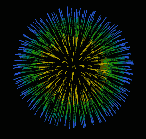

# Python PIL | Image.tell()

> 哎哎哎:# t0]https://www . geeksforgeeks . org/python-pil-image-tell/

PIL 是 python 图像库，它为 Python 解释器提供图像编辑功能。`Image`模块提供了一个同名的类，用于表示 PIL 图像。该模块还提供了许多工厂功能，包括从文件加载图像和创建新图像的功能。

`**Image.tell()**`返回当前帧数。

> **语法:** Image.tell()
> 
> **参数:**
> **图像**–拍摄 gif 图像。
> 
> **返回:**一个图像对象。

**所用图像:**


```

# importing image object from PIL
from PIL import Image

# creating gif image object 
img = Image.open(r"C:\Users\System-Pc\Desktop\time.gif") 
img1 = img.tell() 
print(img1)
```

**输出:**

```
0

```

**另一个例子:**再拍一张 gif 图片。

**所用图像:**


```

# importing image object from PIL
from PIL import Image

# creating gif image object 
img = Image.open(r"C:\Users\System-Pc\Desktop\skyhigh.gif") 
img1 = img.tell() 
print(img1)
```

**输出:**

```
0

```