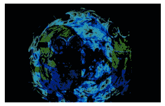
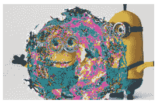

# Python PIL | ImageChops .核减()和 ImageChops .核减 _ 模()方法

> 原文:[https://www . geesforgeks . org/python-pil-image chops-减法和-image chops-减法 _ 模-法/](https://www.geeksforgeeks.org/python-pil-imagechops-subtract-and-imagechops-subtract_modulo-method/)

PIL 是 python 图像库，它为 Python 解释器提供图像编辑功能。

## ImageChops .核减()方法–

此方法减去两幅图像，将结果除以比例并加上偏移量。如果省略，比例默认为 1.0，偏移默认为 0.0。

> **语法:** ImageChops .减法(image1，image2，比例= 1.0，偏移量= 0)
> 
> **参数:**
> **image1:** 第一幅图像
> **image2:** 第二幅图像
> **比例尺:**是浮点值(如果数值不断增加，合成图像变得越来越暗)
> **偏移量:**数值(如果数值不断增加，合成图像变得越来越亮)
> 
> **返回值:**图像

```py
# This will import Image and ImageChops modules
from PIL import Image, ImageChops

# Opening Images
im = Image.open(r"C:\Users\Admin\Pictures\images.png")
im2 = Image.open(r"C:\Users\Admin\Pictures\download.PNG")

# subtracting im and im2
im3 = ImageChops.subtract(image1 = im, image2 = im2)

# showing resultant image
im3.show()
```

**输出:**


## ImageChops .核减 _ 模()方法–

该方法也用于减去两幅图像，但不剪切结果。

> **语法:** ImageChops .核减 _ 模(image1，image2)
> 
> **参数:**该方法以两幅图像为参数。
> 
> **返回值:**一个图像。

```py
# This will import Image and ImageChops modules
from PIL import Image, ImageChops

# Opening Images
im = Image.open(r"C:\Users\Admin\Pictures\images.png")
im2 = Image.open(r"C:\Users\Admin\Pictures\download.PNG")

# subtracting im and im2
im3 = ImageChops.subtract_modulo(image1 = im, image2 = im2)

# showing resultant image
im3.show()
```

**输出:**
