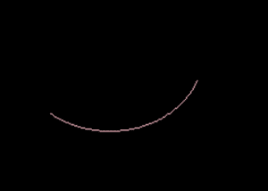
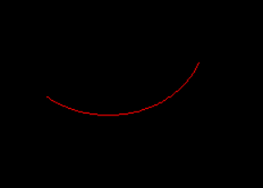

# Python PIL | ImageDraw。Draw.arc()

> 哎哎哎:# t0]https://www . geeksforgeeks . org/python-pil-imagedraw-draw-arc/

PIL 是 python 图像库，它为 Python 解释器提供图像编辑功能。`ImageDraw`模块为图像对象提供简单的 2D 图形。您可以使用此模块创建新图像，注释或修饰现有图像，并动态生成图形以供网络使用。

`**ImageDraw.Draw.arc()**`在给定的边界框内，在起始角和结束角之间绘制一条弧(圆轮廓的一部分)。

> **语法:** PIL。图像绘制。绘制。椭圆(xy，填充=无，轮廓=无)
> 
> **参数:**
> 
> **xy**–定义边界框的四个点。[(x0，y0)，(x1，y1)]或[x0，y0，x1，y1]的序列。
> **起步**–起步角度，单位为度。角度从 3 点开始测量，顺时针方向增加。
> **结束**–结束角度，单位为度。
> **填充**–用于弧线的颜色。
> 
> **返回:**一个弧形的图像对象。

```py

# importing image object from PIL
import math
from PIL import Image, ImageDraw

w, h = 220, 190
shape = [(40, 40), (w - 10, h - 10)]

# creating new Image object
img = Image.new("RGB", (w, h))

# create rectangle image
img1 = ImageDraw.Draw(img)  
img1.arc(shape, start = 20, end = 130, fill ="pink")
img.show()
```

**输出:**


**另一个例子:**这里我们使用不同的颜色进行填充。

```py

# importing image object from PIL
import math
from PIL import Image, ImageDraw

w, h = 220, 190
shape = [(40, 40), (w - 10, h - 10)]

# creating new Image object
img = Image.new("RGB", (w, h))

# create rectangle image
img1 = ImageDraw.Draw(img)  
img1.arc(shape, start = 20, end = 130, fill ="red")
img.show()
```

**输出:**
