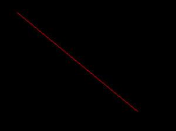

# Python PIL | ImageDraw。Draw.line()

> 原文:[https://www . geesforgeks . org/python-pil-imagedraw-draw-line/](https://www.geeksforgeeks.org/python-pil-imagedraw-draw-line/)

PIL 是 python 图像库，它为 Python 解释器提供图像编辑功能。`ImageDraw`模块为图像对象提供简单的 2D 图形。您可以使用此模块创建新图像，注释或修饰现有图像，并动态生成图形以供网络使用。

`**ImageDraw.Draw.line()**`在 xy 列表中的坐标之间画一条线。

> **语法:** PIL。图像绘制。绘制线(xy，填充=无，宽度=0)
> 
> **参数:**
> **xy**–2 元组序列，如[(x，y)，(x，y)，…]或数值，如[x，y，x，y，…]。
> **填充–用于线条的颜色。
> **宽度**–线宽，以像素为单位。请注意，线连接处理不好，因此宽多段线看起来不太好。**
> 
> ****返回:**椭圆形状的图像对象。**

```py

# importing image object from PIL
import math
from PIL import Image, ImageDraw

w, h = 220, 190
shape = [(40, 40), (w - 10, h - 10)]

# creating new Image object
img = Image.new("RGB", (w, h))

# create line image
img1 = ImageDraw.Draw(img)  
img1.line(shape, fill ="none", width = 0)
img.show()
```

**
**另一个例子:**这里我们使用不同的颜色进行填充。**

```py

# importing image object from PIL
import math
from PIL import Image, ImageDraw

w, h = 220, 190
shape = [(40, 40), (w - 10, h - 10)]

# creating new Image object
img = Image.new("RGB", (w, h))

# create line image
img1 = ImageDraw.Draw(img)  
img1.line(shape, fill ="red", width = 0)
img.show()
```

****输出:**
**