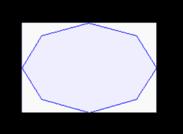
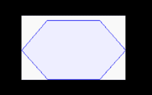

# 蟒蛇 PIL | ImageDraw。绘制多边形()方法

> 原文:[https://www . geesforgeks . org/python-pil-imagedraw-draw-polygon-method/](https://www.geeksforgeeks.org/python-pil-imagedraw-draw-polygon-method/)

PIL 是 python 图像库，它为 Python 解释器提供图像编辑功能。`ImageDraw`模块为图像对象提供简单的 2D 图形。您可以使用此模块创建新图像，注释或修饰现有图像，并动态生成图形以供网络使用。

`**ImageDraw.Draw.polygon()**`绘制多边形。
多边形轮廓由给定坐标之间的直线加上最后一个坐标和第一个坐标之间的直线组成。

> **语法:** PIL。图像绘制。绘制。多边形(xy，填充=无，轮廓=无)
> 
> **参数:**
> 
> 参数:
> 
> **xy**–2 元组序列，如[(x，y)，(x，y)，…]或数值，如[x，y，x，y，…]。
> 
> **轮廓**–用于轮廓的颜色。
> 
> **填充**–用于填充的颜色。
> 
> **返回:**一个图像对象。

```py

import math
from PIL import Image, ImageDraw
from PIL import ImagePath 

side = 8
xy = [
    ((math.cos(th) + 1) * 90,
     (math.sin(th) + 1) * 60)
    for th in [i * (2 * math.pi) / side for i in range(side)]
    ]  

image = ImagePath.Path(xy).getbbox()  
size = list(map(int, map(math.ceil, image[2:])))

img = Image.new("RGB", size, "# f9f9f9") 
img1 = ImageDraw.Draw(img)  
img1.polygon(xy, fill ="# eeeeff", outline ="blue") 

img.show()
```

**输出:**


**另一个例子:**取不同的参数。

```py

import math
from PIL import Image, ImageDraw
from PIL import ImagePath 

side = 6
xy = [
    ((math.cos(th) + 1) * 90,
     (math.sin(th) + 1) * 60)
    for th in [i * (2 * math.pi) / side for i in range(side)]
    ]  

image = ImagePath.Path(xy).getbbox()  
size = list(map(int, map(math.ceil, image[2:])))

img = Image.new("RGB", size, "# f9f9f9") 
img1 = ImageDraw.Draw(img)  
img1.polygon(xy, fill ="# eeeeff", outline ="blue") 

img.show()
```

**输出:**
