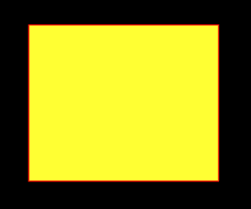

# Python PIL | ImageDraw。Draw.rectangle()

> 哎哎哎:# t0]https://www . geeksforgeeks . org/python-pil-imagedraw-draw-rectangle/

PIL 是 python 图像库，它为 Python 解释器提供图像编辑功能。`ImageDraw`模块为图像对象提供简单的 2D 图形。您可以使用此模块创建新图像，注释或修饰现有图像，并动态生成图形以供网络使用。

`**ImageDraw.Draw.rectangle()**`绘制一个矩形。

> **语法:** PIL。
> **参数:**
> 
> **xy**–定义边界框的四个点。[(x0，y0)，(x1，y1)]或[x0，y0，x1，y1]的序列。第二点就在绘制的矩形之外。
> **轮廓**–用于轮廓的颜色。
> **填充–用于填充的颜色。**
> 
> ****返回:**矩形的图像对象。**

```

# importing image object from PIL
import math
from PIL import Image, ImageDraw

w, h = 220, 190
shape = [(40, 40), (w - 10, h - 10)]

# creating new Image object
img = Image.new("RGB", (w, h))

# create rectangle image
img1 = ImageDraw.Draw(img)  
img1.rectangle(shape, fill ="# ffff33", outline ="red")
img.show()
```

****输出:**
**

****另一个例子:**这里我们使用不同的颜色进行填充。**

```

# importing image object from PIL
import math
from PIL import Image, ImageDraw

w, h = 220, 190
shape = [(40, 40), (w - 10, h - 10)]

# creating new Image object
img = Image.new("RGB", (w, h))

# create  rectangleimage
img1 = ImageDraw.Draw(img)  
img1.rectangle(shape, fill ="# 800080", outline ="green")
img.show()
```

****输出:**
**