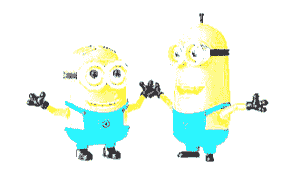
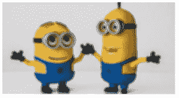
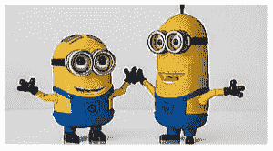

# 蟒蛇 PIL | image enhanced。亮度()和图像增强。锐度()方法

> 原文:[https://www . geeksforgeeks . org/python-pil-image enhance-brightness-and-image enhance-锐度-method/](https://www.geeksforgeeks.org/python-pil-imageenhance-brightness-and-imageenhance-sharpness-method/)

PIL 是 python 图像库，它为 Python 解释器提供图像编辑功能。`ImageEnhance`模块包含许多可用于图像增强的类别。

## `ImageEnhance.Brightness()`方法–

这个类可以用来控制图像的亮度。增强因子为 0.0 会产生黑色图像。因子 1.0 给出原始图像。

**语法:**

```py
obj = ImageEnhance.Brightness(image)
obj.enhance(factor)

```

首先，为了增强图像，需要创建相应类别的对象。

```py
# This will import Image and ImageEnhance modules
from PIL import Image, ImageEnhance

# Opening Image
im = Image.open(r"C:\Users\Admin\Pictures\images.png")

# Creating object of Brightness class
im3 = ImageEnhance.Brightness(im)

# showing resultant image
im3.enhance(2.0).show()
```

**输出:**
对于第一个图像**因子为 2.0** ，对于第二个图像**因子为 5.0**




## `ImageEnhance.Sharpness()`方法–

这个类可以用来调整图像的清晰度。增强因子 0.0 给出模糊图像，因子 1.0 给出原始图像，因子 2.0 给出锐化图像。

**语法:**

```py
obj = ImageEnhance.Sharpness(image)
obj.enhance(factor)

```

首先，为了增强图像，需要创建相应类别的对象。

```py
# This will import Image and ImageChops modules
from PIL import Image, ImageEnhance

# Opening Image
im = Image.open(r"C:\Users\Admin\Pictures\images.png")

# Creating object of Sharpness class
im3 = ImageEnhance.Sharpness(im)

# showing resultant image
im3.enhance(-2.0).show()
```

**输出:**
对于第一个图像**因子为-2.0** ，对于第二个图像**因子为 5.0**


