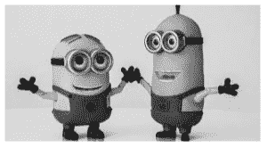
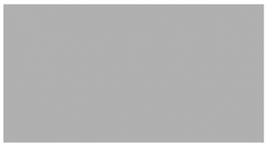

# 蟒蛇 PIL | image enhanced。颜色()和图像增强。对比()方法

> 原文:[https://www . geesforgeks . org/python-pil-image enhanced-color-and-image enhanced-contrast-method/](https://www.geeksforgeeks.org/python-pil-imageenhance-color-and-imageenhance-contrast-method/)

PIL 是 python 图像库，它为 Python 解释器提供图像编辑功能。`ImageEnhance`模块包含许多可用于图像增强的类别。

## ImageEnhance。Color()方法–

此类可用于调整图像的色彩平衡，方式类似于彩色电视机上的控制。增强因子为 0.0 会产生黑白图像。因子 1.0 给出原始图像。

> **语法:**image enhanced。颜色(图像)
> 
> 首先，为了增强图像，需要创建相应类别的对象。

```
# This will import Image and ImageEnhance modules
from PIL import Image, ImageEnhance

# Opening Image
im = Image.open(r"C:\Users\Admin\Pictures\images.png")

# Creating object of Color class
im3 = ImageEnhance.Color(im)

# showing resultant image
im3.enhance(0.0).show()
```

**输出:**
对于第一个图像**因子= 0.0** ，对于第二个图像**因子为 5.0** 。



## ImageEnhance。对比()方法–

此类可用于控制图像的对比度，类似于电视机上的对比度控制。增强因子为 0.0 时，会产生一个纯灰色图像。因子 1.0 给出原始图像。

**语法:**

> obj = ImageEnhance。对比度(图像)
> 目标增强(因子)
> 
> 首先，为了增强图像，需要创建相应类别的对象。

```
# This will import Image and ImageEnhance modules
from PIL import Image, ImageEnhance

# Opening Image
im = Image.open(r"C:\Users\Admin\Pictures\images.png")

# Creating object of Contrast class
im3 = ImageEnhance.Contrast(im)

# showing resultant image
im3.enhance(0.0).show()
```

**输出:**
对于第一个图像**因子为 5.0****对于第二个图像为 0.0**


