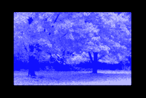

# Python PIL | imageops . colored()方法

> 原文:[https://www . geesforgeks . org/python-pil-imageops-colored e-method/](https://www.geeksforgeeks.org/python-pil-imageops-colorize-method/)

PIL 是 python 图像库，它为 Python 解释器提供图像编辑功能。`Image`模块提供了一个同名的类，用于表示 PIL 图像。该模块还提供了许多工厂功能，包括从文件加载图像和创建新图像的功能。

`**PIL.ImageOps.colorize()**`给灰度图像上色。黑白参数应该是 RGB 元组；该函数计算将源图像中的所有黑色像素映射到第一种颜色，并将所有白色像素映射到第二种颜色的颜色楔。

> **语法:** PIL。彩色化(图像，黑色，白色)
> 
> **参数:**
> 
> **图像**–要着色的图像。
> 
> **黑色**–用于黑色输入像素的颜色。
> 
> **白色**–用于白色输入像素的颜色。
> 
> **返回:**一个图像。

**所用图像:**


**代码:**

```py

# importing image object from PIL
from PIL import Image, ImageOps

# creating an image object
img = Image.open(r"C:\Users\System-Pc\Desktop\pinktree.jpg").convert("L")

# image colorize function
img1 = ImageOps.colorize(img, black ="blue", white ="white")
img1.show()
```

**输出:**


**另一个例子:**这里我们使用不同的参数。

**所用图像:**


**代码:**

```py

# importing image object from PIL
from PIL import Image, ImageOps

# creating an image object
img = Image.open(r"C:\Users\System-Pc\Desktop\bird.jpg").convert("L")

# image colorize function
img1 = ImageOps.colorize(img, black ="red", white ="yellow")
img1.show()
```

**输出:**
