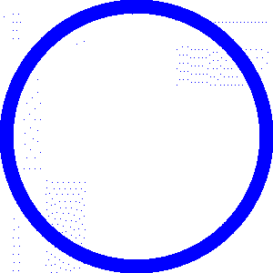
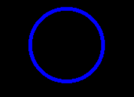

# Python PIL | ImageOps.fit()方法

> 原文:[https://www . geesforgeks . org/python-pil-imageops-fit-method/](https://www.geeksforgeeks.org/python-pil-imageops-fit-method/)

PIL 是 python 图像库，为 Python 解释器提供图像编辑功能。**图像操作模块**包含许多“现成的”图像处理操作。这个模块有些实验性，大多数操作人员只处理 L 和 RGB 图像。

`**ImageOps.fit()**`方法返回图像的大小和裁剪版本，裁剪到请求的纵横比和大小。

> **语法** : PIL。ImageOps.fit(图像，大小，方法=0，出血=0.0，居中=(0.5，0.5))
> 
> **参数** :
> **图像**–图像要大小和裁剪。
> **大小**–以像素为单位的请求输出大小，以(宽度，高度)元组形式给出。
> **方法**–使用什么重采样方法。默认为 pil . image . nearless .
> **出血–**从所有四个边缘移除图像外部周围的边框。
> **居中**–控制裁剪位置。
> 
> *   使用(0.5，0.5)进行中心裁剪(例如，如果裁剪宽度，从左侧减去 50%，因此从右侧减去 50%)。
> *   (0.0，0.0)将从左上角裁剪(即，如果裁剪宽度，则从右侧裁剪掉所有的部分，如果裁剪高度，则从底部裁剪掉所有的部分)。
> *   (1.0，0.0)将从左下角裁剪等。(也就是说，如果裁剪宽度，所有裁剪从左侧开始，如果裁剪高度，没有从顶部开始，因此所有裁剪从底部开始)。
> 
> **返回**:图像。

**所用图像:**


```
# Importing Image and ImageOps module from PIL package
from PIL import Image, ImageOps

# creating a image1 object
im1 = Image.open(r"C:\Users\System-Pc\Desktop\circleimage.PNG")

# applying fit method
# Setting width = 100 and height = 100
im2 = ImageOps.fit(im1, (100, 100), method = 0,
                   bleed = 0.0, centering =(0.5, 0.5))

im2.show()
```

**输出:**
