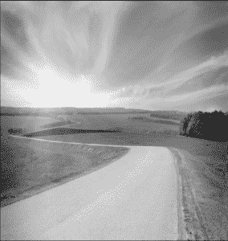

# Python PIL | imageops . grade()方法

> 原文:[https://www . geesforgeks . org/python-pil-imageops-灰度-method/](https://www.geeksforgeeks.org/python-pil-imageops-greyscale-method/)

PIL 是 python 图像库，它为 Python 解释器提供图像编辑功能。**图像操作模块**包含许多“现成的”图像处理操作。这个模块有些实验性，大多数操作人员只处理 L 和 RGB 图像。
T3】imageops . grade()将图像转换为灰度。整个像素变成灰色，看不到其他颜色。

> **语法:** PIL。ImageOps .灰度(图像)
> **参数** :
> **图像**–要转换为灰度的图像。
> **返回**一个图像。

**使用的图像:**


## 蟒蛇 3

```
# Importing Image and ImageOps module from PIL package
from PIL import Image, ImageOps

# creating a image1 object
im1 = Image.open(r"C:\Users\System-Pc\Desktop\a.JPG")

# applying grayscale method
im2 = ImageOps.grayscale(im1)

im2.show()
```

**输出:**

