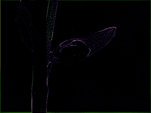

# Python PIL |内核()方法

> 原文:[https://www.geeksforgeeks.org/python-pil-kernel-method/](https://www.geeksforgeeks.org/python-pil-kernel-method/)

PIL 是 python 图像库，它为 Python 解释器提供图像编辑功能。**图像过滤器**模块包含一组预定义过滤器的定义，可用于`**Image.filter()**` 方法。

`**PIL.ImageFilter.Kernel()**`创建卷积核。当前版本只支持 3×3 和 5×5 整数和浮点内核。

> **语法:** PIL。图像过滤器。内核(大小，内核，比例=无，偏移量=0)
> 
> **参数** :
> **大小**–内核大小，给定为(宽度、高度)。在当前版本中，这必须是(3，3)或(5，5)。
> **内核**–包含内核权重的序列。
> **比例**–比例因子。如果给定，每个像素的结果除以这个值。默认值是内核权重的总和。
> **偏移**–偏移。如果给定，该值将在除以比例因子后添加到结果中。
> 
> **返回类型**:图像。

**所用图像:**


```

# Importing Image and ImageFilter module from PIL package 
from PIL import Image, ImageFilter 

# creating a image object 
im1 = Image.open(r"C:\Users\System-Pc\Desktop\leave.JPG") 

# applying the Kernel filter
im2 = im1.filter(ImageFilter.Kernel((3, 3),
      (-1, -1, -1, -1, 9, -1, -1, -1, -1), 1, 0))

im2 = im2.show()                 
```

**输出:**


**另一个例子:**这里改变内核值获得输出，我们也可以改变其他参数。

```
# Importing Image and ImageFilter module from PIL package 
from PIL import Image, ImageFilter 

# Importing Image and ImageFilter module from PIL package 
from PIL import Image, ImageFilter 

# creating a image object 
im1 = Image.open(r"C:\Users\System-Pc\Desktop\leave.JPG") 

# applying the Kernel filter
im2 = im1.filter(ImageFilter.Kernel((3, 3),
          (-1, -1, -1, -1, 11, -2, -2, -2, -2), 1, 0))

im2 = im2.show()                 
```

**输出:**
