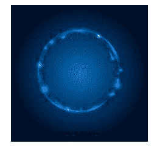

# Python PIL | MinFilter()和 MaxFilter()方法

> 原文:[https://www . geesforgeks . org/python-pil-min filter-and-max filter-method/](https://www.geeksforgeeks.org/python-pil-minfilter-and-maxfilter-method/)

PIL is the Python Imaging Library which provides the python interpreter with image editing capabilities. The ImageFilter module contains definitions for a pre-defined set of filters, which can be used with the `Image.filter()` method.

`**PIL.ImageFilter.MinFilter()**`方法创建一个最小过滤器。在给定大小的窗口中选取最低像素值。

```
Syntax: PIL.ImageFilter.MinFilter(size=3)

Parameters: 
size: The kernel size, in pixels.

```

所用图像:


```
# Importing Image and ImageFilter module from PIL package 
from PIL import Image, ImageFilter

# creating a image object
im1 = Image.open(r"C:\Users\sadow984\Desktop\download2.JPG")

# applying the min filter
im2 = im1.filter(ImageFilter.MinFilter(size = 3))

im2.show()
```

**输出:**


`**PIL.ImageFilter.MinFilter()**`方法创建最大过滤器。在给定大小的窗口中选择最大的像素值。

```
Syntax: PIL.ImageFilter.MaxFilter(size=3)

Parameters: 
size: The kernel size, in pixels.

```

```
# Importing Image and ImageFilter module from PIL package 
from PIL import Image, ImageFilter

# creating a image object
im1 = Image.open(r"C:\Users\sadow984\Desktop\download2.JPG")

# applying the max filter
im2 = im1.filter(ImageFilter.MaxFilter(size = 3))

im2.show()
```

**输出:**
