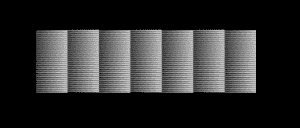

# Python PIL | putdata()方法

> 原文:[https://www.geeksforgeeks.org/python-pil-putdata-method/](https://www.geeksforgeeks.org/python-pil-putdata-method/)

PIL 是 python 图像库，它为 Python 解释器提供图像编辑功能。`Image`模块提供了一个同名的类，用于表示 PIL 图像。该模块还提供了许多工厂功能，包括从文件加载图像和创建新图像的功能。

`**putdata()**`将像素数据复制到该图像。此方法将数据从序列对象复制到图像中，从左上角(0，0)开始，一直持续到图像或序列结束。比例和偏移值用于调整序列值:像素=值*比例+偏移。

> **语法:** Image.putdata(数据，比例=1.0，偏移量=0.0)
> 
> **参数:**
> **数据**–一个序列对象。
> **刻度**–可选刻度值。默认值为 1.0。
> **偏移**–可选偏移值。默认值为 0.0。
> 
> **返回:**图像

```py

# from pure python list data
from PIL import Image

img = Image.new("L", (104, 104))  # single band
newdata = list(range(0, 256, 4)) * 104
img.putdata(newdata)
img.show()
```

**输出:**


**另一个例子:**这里改变参数。

```py

# from pure python list data
from PIL import Image

img = Image.new("L", (224, 224))
newdata = list(range(0, 256, 4)) * 224
img.putdata(newdata)
img.show()
```

**输出:**
