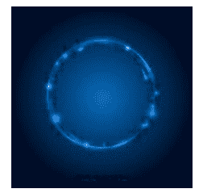
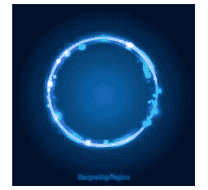
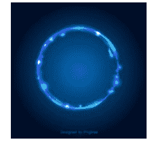

# Python PIL | RankFilter()方法

> 原文:[https://www.geeksforgeeks.org/python-pil-rankfilter-method/](https://www.geeksforgeeks.org/python-pil-rankfilter-method/)

PIL is the Python Imaging Library which provides the python interpreter with image editing capabilities. The `ImageFilter module` contains definitions for a pre-defined set of filters, which can be used with the `Image.filter()` method.

`**PIL.ImageFilter.RankFilter()**`创建等级过滤器。等级过滤器对给定大小的窗口中的所有像素进行排序，并返回等级值。

> **语法:** PIL。图像过滤器。等级过滤器(大小，等级)
> 
> **参数:**
> **大小:**内核大小，以像素为单位。
> **等级:**选择什么像素值。最小过滤器使用 0，中值过滤器使用尺寸*尺寸/ 2，最大过滤器使用尺寸*尺寸–1，等等。
> 
> **注意:等级的值必须是整数类型。**

所用图像:


```py
# Importing Image and ImageFilter module from PIL package  
from PIL import Image, ImageFilter 

# creating a image object 
im1 = Image.open(r"C:\Users\sadow984\Desktop\download2.JPG") 

# applying the rank filter 
im2 = im1.filter(ImageFilter.RankFilter(size = 3, rank = 0)) 

im2.show() 
```

**输出:**


```py
# Importing Image and ImageFilter module from PIL package  
from PIL import Image, ImageFilter 

# creating a image object 
im1 = Image.open(r"C:\Users\sadow984\Desktop\download2.JPG") 

# applying the rank filter 
im2 = im1.filter(ImageFilter.RankFilter(size = 3, rank = 3 * 3-1)) 

im2.show() 
```

**输出:**


```py
# Importing Image and ImageFilter module from PIL package  
from PIL import Image, ImageFilter 

# creating a image object 
im1 = Image.open(r"C:\Users\sadow984\Desktop\download2.JPG") 

# applying the rank filter 
im2 = im1.filter(ImageFilter.RankFilter(size = 3, rank = (3 * 3)//2)) 

im2.show() 
```

**输出:**
