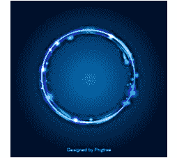
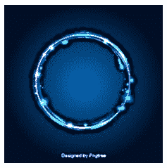
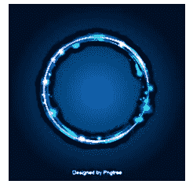

# Python PIL |反锐化掩模()方法

> 原文:[https://www . geesforgeks . org/python-pil-unsharpmask-method/](https://www.geeksforgeeks.org/python-pil-unsahrpmask-method/)

PIL 是 python 图像库，它为 Python 解释器提供图像编辑功能。ImageFilter 模块包含一组预定义过滤器的定义，可以与 Image.filter()方法一起使用。
**PIL。方法对输入图像应用 Unsahrp 蒙版滤镜。**

> **语法:** PIl。ImageFilter.UnsharpMask(半径=2，百分比=150，阈值=3)
> **参数:**
> **半径:**模糊半径
> **百分比:**非锐化强度，以百分比表示
> **阈值:**阈值控制将被锐化的最小亮度变化

参见本[数字反锐化掩模](https://en.wikipedia.org/wiki/Unsharp_masking#Digital_unsharp_masking)了解所用参数
图像的说明:


## 蟒蛇 3

```py
# Importing Image and ImageFilter module from PIL package 
from PIL import Image, ImageFilter

# creating a image object
im1 = Image.open(r"C:\Users\sadow984\Desktop\download2.JPG")

# applying the unsharpmask method
im2 = im1.filter(ImageFilter.UnsharpMask(radius = 3, percent = 200, threshold = 5))

im2.show()
```

**输出:**



## 蟒蛇 3

```py
# Importing Image and ImageFilter module from PIL package 
from PIL import Image, ImageFilter

# creating a image object
im1 = Image.open(r"C:\Users\sadow984\Desktop\download2.JPG")

# applying the unsharpmask method
im2 = im1.filter(ImageFilter.UnsharpMask(radius = 4, percent = 500, threshold = 8))

im2.show()
```

**输出:**



## 蟒蛇 3

```py
# Importing Image and ImageFilter module from PIL package 
from PIL import Image, ImageFilter

# creating a image object
im1 = Image.open(r"C:\Users\sadow984\Desktop\download2.JPG")

# applying the unsharpmask method
im2 = im1.filter(ImageFilter.UnsharpMask(radius = 5, percent = 500, threshold = 10))

im2.show()
```

**输出:**

