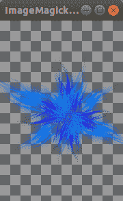

# 蟒蛇:枕头(PIL 的叉子)

> 原文:[https://www.geeksforgeeks.org/python-pillow-a-fork-of-pil/](https://www.geeksforgeeks.org/python-pillow-a-fork-of-pil/)

Python 图像库(PIL 的扩展)是 Python 语言事实上的图像处理包。它集成了轻量级图像处理工具，有助于编辑、创建和保存图像。对 Python 图像库的支持在 2011 年停止了，但是一个名为枕头的项目分叉了最初的 PIL 项目，并增加了对 Python3.x 的支持。枕头被宣布为 PIL 未来使用的替代品。枕头支持大量的图像文件格式，包括 BMP、PNG、JPEG 和 TIFF。该库鼓励通过创建新的文件解码器来增加对库中新格式的支持。
本模块未预装 Python。要安装它，请在命令行中执行以下命令:

```py
pip install pillow
```

**注意:**一些 Linux 发行版倾向于预装 Python 和 PIL。

### 从枕头开始

**1。使用 open()打开图像:**PIL。Image.Image 类表示图像对象。此类提供用于打开图像的 open()方法。

**示例:**假设图像为:


## 蟒蛇 3

```py
from PIL import Image

# test.png => location_of_image
img = Image.open(r"test.png")  
```

**注意:**只有当图像与 Python 程序在同一个目录下时，图像的位置才应该是相对的，否则应该提供图像的绝对(完整)路径。

**2。使用 show():** 显示图像此方法用于显示图像。为了显示图像，枕头首先将图像转换为. png 格式(在 Windows 操作系统上)，并将其存储在临时缓冲区中，然后显示它。因此，由于图像格式转换为。png 原始图像文件格式的某些属性可能会丢失(如动画)。因此，建议仅出于测试目的使用此方法。

## 蟒蛇 3

```py
from PIL import Image

img = Image.open(r"test.png")
img.show()
```

**输出:**


**3。获取打开图像的信息**

**A)获取图像的模式(颜色模式):**图像的模式属性告诉图像中像素的类型和深度。1 位像素的范围为 0-1，8 位像素的范围为 0-255。该模块提供不同的模式。他们中很少有人:

<figure class="table">

| 方式 | 描述 |
| --- | --- |
| one | 1 位像素，黑白 |
| L | 8 位像素，灰度 |
| P | 8 位像素，使用调色板映射到任何其他模式 |
| RGB | 3×8 位像素，真彩色 |
| RGBA 吗 | 4×8 位像素，真彩色，带透明遮罩 |

</figure>

**示例:**

## 蟒蛇 3

```py
from PIL import Image

img = Image.open(r"test.png")
print(img.mode)
```

**输出:**

```py
RGBA
```

注意:参考文档了解[模式](https://pillow.readthedocs.io/en/stable/handbook/concepts.html#concept-modes)。

**B)获取图像的大小:**该属性提供图像的大小。它返回一个包含宽度和高度的元组。

**示例:**

## 蟒蛇 3

```py
from PIL import Image

img = Image.open(r"test.png")
print(img.size)
```

**输出:**

```py
(180, 263)
```

**C)获取图像的格式:**此方法返回图像文件的格式。

## 蟒蛇 3

```py
from PIL import Image

img = Image.open(r"test.png")
print(img.format)
```

**输出:**

```py
PNG
```

**4。使用 rotate()旋转图像:**旋转图像后，图像中没有像素值的部分将填充黑色(对于非 alpha 图像)和完全透明的像素(对于支持透明度的图像)

**示例:**

## 蟒蛇 3

```py
from PIL import Image

angle = 40
img = Image.open(r"test.png")
r_img = img.rotate(angle)
```

**输出:**



**5。使用 resize():** 调整图像大小在调整过程中会发生插值，因此无论图像是放大(调整到比原始图像更高的尺寸)还是缩小(调整到比原始图像更低的尺寸)，图像质量都会发生变化。因此，在为重采样参数提供合适的值时，应该谨慎使用 resize()。

**示例:**

## 蟒蛇 3

```py
from PIL import Image

size = (40, 40)
img = Image.open(r"test.png")
r_img = img.resize(size)

r_img.show()
```

**输出:**


**6。使用 save()保存图像:**使用 save()方法时，Destination_path 也必须有图像文件名和扩展名。如果在格式参数中指定了扩展名，则可以在目标路径中省略该扩展名。

## 蟒蛇 3

```py
from PIL import Image

size = (40, 40)
img = Image.open(r"test.png")
r_img = img.resize(size, resample = Image.BILINEAR)

# resized_test.png => Destination_path
r_img.save("resized_test.png")

# Opening the new image
img = Image.open(r"resized_test.png")
print(img.size)
```

**输出:**

```py
(40, 40)

```