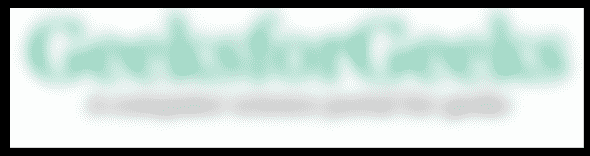

# 蟒蛇皮枕头–模糊图像

> 原文:[https://www.geeksforgeeks.org/python-pillow-blur-an-image/](https://www.geeksforgeeks.org/python-pillow-blur-an-image/)

模糊图像是降低图像中噪声水平的过程，是图像处理的重要方面之一。在本文中，我们将学习使用枕头库模糊图像。为了模糊图像，我们在图像对象上使用了这个库的 ImageFilter 类的一些方法。

**注:**所有不同方法中用于模糊的图像如下:


### ImageFilter 类提供的方法:

**1。** [**PIL。ImageFilter . box blur()**](https://www.geeksforgeeks.org/python-pil-boxblur-method/)**:**通过将每个像素设置为在每个方向上延伸半径像素的方形框中像素的平均值来模糊图像。支持任意大小的浮动半径。对于任何半径值，使用相对于图像大小以线性时间运行的优化实现。

> **语法:** PIL.ImageFilter.BoxBlur(半径)
> 
> **参数:**
> 
> *   **半径:**盒子在一个方向上的尺寸。半径 0 不模糊，返回相同的图像。半径 1 在每个方向取 1 个像素，即总共 9 个像素。

## 蟒蛇 3

```py
# Importing Image class from PIL module
from PIL import Image

# Opens a image in RGB mode
im = Image.open(r"geek.jpg")

# Blurring the image
im1 = im.filter(ImageFilter.BoxBlur(4))

# Shows the image in image viewer
im1.show()
```

**输出:**


**2。** [**PIL。ImageFilter . gaussianbulr()**](https://www.geeksforgeeks.org/python-pil-gaussianblur-method/)**:**此方法创建高斯模糊滤镜。滤镜使用半径作为参数，通过更改该半径的值，图像上的模糊强度会发生变化。函数中的参数半径决定了模糊强度。通过改变半径值，可以改变高斯光束的强度。

> **语法:** PIL。ImageFilter . GaussianBlur(半径=5)
> 
> **参数:**
> 
> *   **半径–**模糊半径。通过改变半径值，获得了不同强度的高斯光束图像。
> 
> **返回类型:**图像。

## 蟒蛇 3

```py
# Importing Image class from PIL module
from PIL import Image

# Opens a image in RGB mode
im = Image.open(r"geek.jpg")

# Blurring the image
im1 = im.filter(ImageFilter.GaussianBlur(4))

# Shows the image in image viewer
im1.show()
```

**输出:**



**3。简单模糊:**它通过特定的核或卷积矩阵对图像应用模糊效果。它不需要任何参数。

> **语法:**滤镜(ImageFilter。模糊)

## 蟒蛇 3

```py
# Importing Image class from PIL module
from PIL import Image

# Opens a image in RGB mode
im = Image.open(r"geek.jpg")

# Blurring the image
im1 = im.filter(ImageFilter.BLUR)

# Shows the image in image viewer
im1.show()
```

**输出:**

