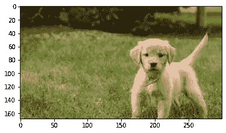
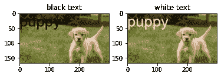

# 蟒蛇皮枕头–创建水印

> 原文:[https://www . geeksforgeeks . org/python-枕头-创建-水印/](https://www.geeksforgeeks.org/python-pillow-creating-a-watermark/)

在本文中，我们将看到如何使用 Python 中的枕头库来创建水印。枕头是一个 Python 图像库(PIL)，用于操作图像和处理不同格式的图像，如(' jpeg '，' png '，' gif '，' tiff '等。).有各种各样的图像处理，你可以使用枕头库，如调整大小，创建水印，旋转图像，合并各种图像，模糊图像等。PIL 在照片查看器中显示图像。

**安装:**

要安装库，请在命令提示符下运行以下命令。

```py
python -m pip install pip
```

或者

```py
python -m pip install pillow
```

如果 pip 和枕头已经安装在您的设备中，系统会提示“要求已经满足:”


水印有两种类型:

1.  文本水印，
2.  图像水印。

## **文本水印**

这是一种文本文档版权保护的方法。在图像中，我们可以在不同字体和格式的图像上放置一些简单的自定义文本。

**步骤 1:** 导入所有库

## 蟒蛇 3

```py
# importing the library
from PIL import Image
import matplotlib.pyplot as plt
import numpy as np
```

**步骤 2:** 使用照片查看器打开图像。

## 蟒蛇 3

```py
image = Image.open("puppy.jpg")

# this open the photo viewer
image.show() 
plt.imshow(image)
```

输出:



**步骤 3:** 创建文本水印

## 计算机编程语言

```py
# text Watermark
from PIL import ImageFont
from PIL import ImageDraw
watermark_image = image.copy()

draw = ImageDraw.Draw(watermark_image)
font = ImageFont.truetype("arial.ttf", 50)

# add watermark
draw.text((0, 0), "puppy", 
          (0, 0, 0), font=font)
plt.subplot(1, 2, 1)
plt.title("black text")
plt.imshow(watermark_image)

# add watermark
draw.text((0, 0), "puppy", 
          (255, 255, 255), font=font)
plt.subplot(1, 2, 2)
plt.title("white text")
plt.imshow(watermark_image)
```

输出:



**以下是基于上述方法的完整程序:**

## 蟒蛇 3

```py
# import all the libraries
from PIL import Image
from PIL import ImageFont
from PIL import ImageDraw
import matplotlib.pyplot as plt
import numpy as np

# image opening
image = Image.open("puppy.jpg")
# this open the photo viewer
image.show()  
plt.imshow(image)

# text Watermark
watermark_image = image.copy()

draw = ImageDraw.Draw(watermark_image)
# ("font type",font size)
font = ImageFont.truetype("arial.ttf", 50)

# add Watermark
# (0,0,0)-black color text
draw.text((0, 0), "puppy", (0, 0, 0), font=font)
plt.subplot(1, 2, 1)
plt.title("black text")
plt.imshow(watermark_image)

# add Watermark
# (255,255,255)-White color text
draw.text((0, 0), "puppy", (255, 255, 255), font=font)
plt.subplot(1, 2, 2)
plt.title("white text")
plt.imshow(watermark_image)
```