# 蟒蛇枕教程

> 原文:[https://www.geeksforgeeks.org/python-pillow-tutorial/](https://www.geeksforgeeks.org/python-pillow-tutorial/)

**数字图像处理**是指借助计算机对图像进行数字化处理。使用图像处理，我们可以执行诸如增强图像、模糊图像、从图像中提取文本等操作。有多种方法可以对图像进行数字化处理。这里我们将讨论 Python 的**枕头**模块。蟒蛇皮枕头建在 PIL(蟒蛇图片库)的顶部，被认为是 2011 年停产的 PIL 的分叉。枕头支持许多图像文件格式，包括 BMP、PNG、JPEG 和 TIFF。该库鼓励通过创建新的文件解码器来增加对库中新格式的支持。

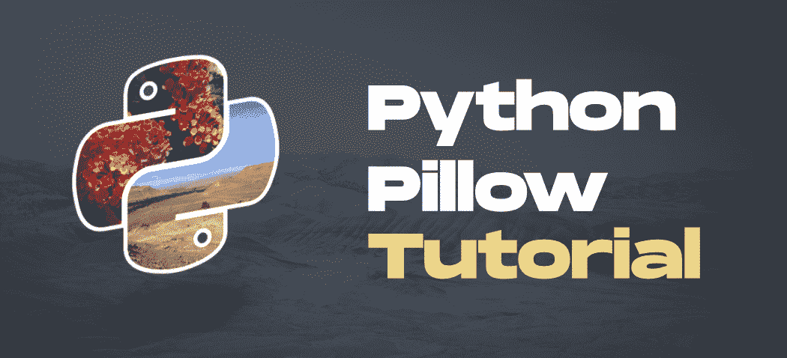

本文旨在借助解释充分的概念和示例，从基础到高级提供关于 Python 枕头的信息。所以，让我们不要浪费任何时间，深入枕头。

## 装置

Python 枕头没有内置 Python。要安装它，请在终端中键入以下命令。

```
pip install pillow
```

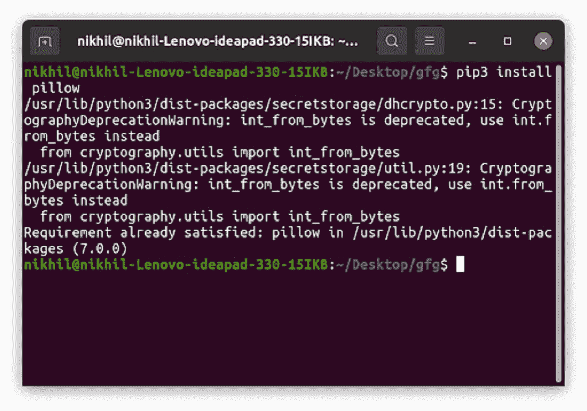

安装后，让我们开始使用枕头模块。

## 打开和显示图像

枕头模块提供**打开()**和**显示()**功能，分别读取和显示图像。为了显示图像，枕头首先将图像转换为. png 格式(在 Windows 操作系统上)，并将其存储在临时缓冲区中，然后显示它。因此，由于图像格式转换为。png 原始图像文件格式的某些属性可能会丢失(如动画)。因此，建议仅出于测试目的使用此方法。

**示例:**

**用于以下所有示例的图像:**


## 蟒蛇 3

```
from PIL import Image

# Location of the image
img = Image.open("geek.jpg")

img.show()
```

**输出:**

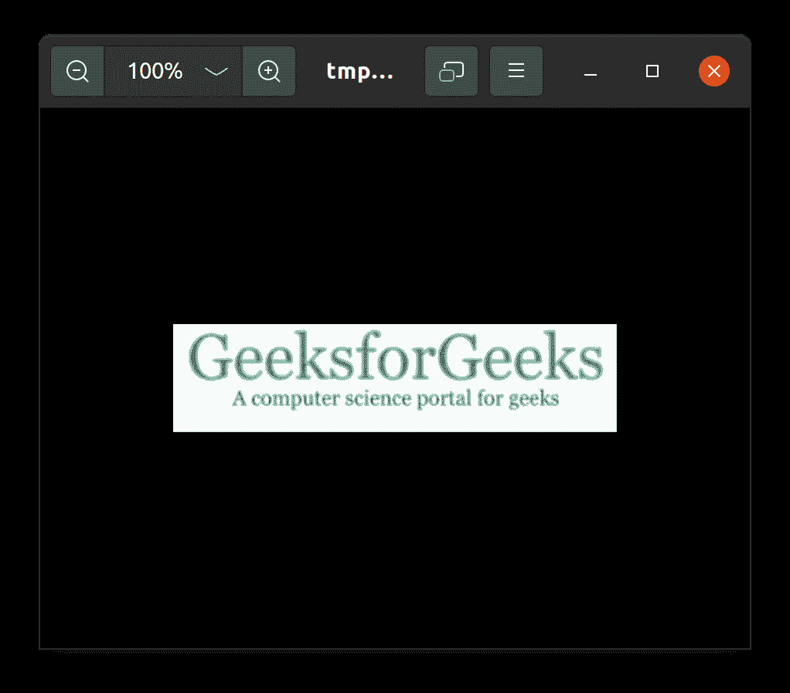

有关打开和显示图像的详细信息，请参阅以下文章。

*   [Python PIL | Image.open()方法](https://www.geeksforgeeks.org/python-pil-image-open-method/)
*   [Python PIL | Image.show()方法](https://www.geeksforgeeks.org/python-pil-image-show-method/)

## 获取打开图像的信息

### 获取图像的大小和格式

*   **大小**属性提供图像的大小。它返回一个包含宽度和高度的元组。
*   **格式**属性返回图像文件的格式。

**示例:**

## 蟒蛇 3

```
from PIL import Image

# Location of the image
img = Image.open("geek.jpg")

# size of the image
print(img.size)

# format of the image
print(img.format)
```

**输出:**

```
(287, 70)
JPEG
```

请参考下面的文章，获取有关获取图像大小和格式的详细信息

*   [在 Python 中寻找图像的尺寸分辨率](https://www.geeksforgeeks.org/finding-the-size-resolution-of-image-in-python/)
*   [如何用 Python 找到图像的宽度和高度？](https://www.geeksforgeeks.org/how-to-find-width-and-height-of-an-image-using-python/)

### 获取图像的颜色模式

图像的模式属性告诉图像中像素的类型和深度。1 位像素的范围为 0-1，8 位像素的范围为 0-255。该模块提供不同的模式。其中一些是:

<figure class="table">

| 方式 | 描述 |
| --- | --- |
| one | 1 位像素，黑白 |
| L | 8 位像素，灰度 |
| P | 8 位像素，使用调色板映射到任何其他模式 |
| RGB | 3×8 位像素，真彩色 |
| RGBA 吗 | 4×8 位像素，真彩色，带透明遮罩 |

</figure>

**示例:**

## 蟒蛇 3

```
from PIL import Image

# Location of the image
img = Image.open("geek.jpg")

# mode of the image
print(img.mode)
```

**输出:**

```
RGB
```

## 旋转图像

[**【旋转】()**](https://www.geeksforgeeks.org/python-pil-paste-and-rotate-method/)**Image 类的方法用于将图像围绕其中心逆时针旋转特定角度。旋转图像后，图像中没有像素值的部分用黑色(对于非 alpha 图像)和完全透明的像素(对于支持透明度的图像)填充。**

****语法:****

> **新对象= PIL。图像。图像。旋转(图像 _ 对象，角度，重采样=0，扩展=0)**
> 
> **运筹学**
> 
> **new_object = image_object.rotate(角度，重采样=0，扩展=0)**

****示例:****

## **蟒蛇 3**

```
# Importing Image module from
# PIL package
from PIL import Image
import PIL

# creating a image object (main image)
im1 = Image.open(r"geek.jpg")

# rotating a image 90 deg counter clockwise
im1 = im1.rotate(90, PIL.Image.NEAREST, expand = 1)

# to show specified image
im1.show()
```

****输出:****

**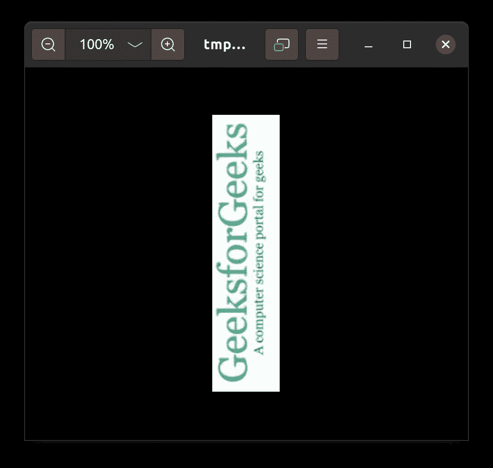**

**请参考下面的文章，获取有关旋转图像的详细信息。**

*   **[Python PIL | rotate()方法](https://www.geeksforgeeks.org/python-pil-paste-and-rotate-method/)**
*   **[如何使用 Python 旋转图像？](https://www.geeksforgeeks.org/how-to-rotate-an-image-using-python/)**

## **翻转图像**

****Image.transpose()** 用于转置图像(以 90 度步进翻转或旋转)。**

****语法:****

> **转置(度)**

**关键词 FLIP_TOP_BOTTOM 和 FLIP_LEFT_RIGHT 将传递给转置方法进行翻转。**

*   ****翻转 _ 顶部 _ 底部–**返回垂直翻转的原始图像**
*   ****翻转 _ 左 _ 右–**返回水平翻转的原始图像**

****示例:****

## **蟒蛇 3**

```
# importing PIL Module
from PIL import Image

# open the original image
original_img = Image.open("geek.jpg")

# Flip the original image vertically
vertical_img = original_img.transpose(method=Image.FLIP_TOP_BOTTOM)
vertical_img.save("vertical.png")

vertical_img.show()

# close all our files object
original_img.close()
vertical_img.close()
```

****输出:****

**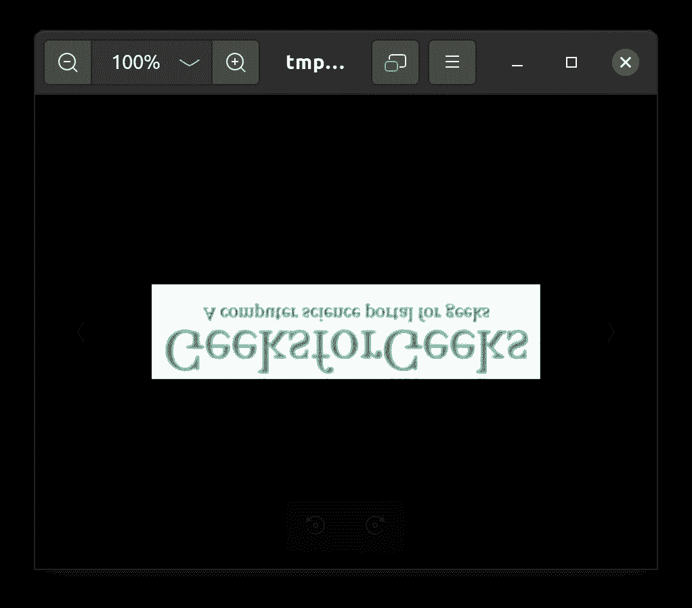**

**参考下面的文章来获得关于翻转图像的详细信息。**

*   **[Python PIL | Image .转置()方法](https://www.geeksforgeeks.org/python-pil-image-transpose-method/)**
*   **[如何在 Python 中水平或垂直翻转图像？](https://www.geeksforgeeks.org/how-to-flip-an-image-horizontally-or-vertically-in-python/)**

## **调整图像大小**

****Image.resize()** 返回调整后的图像副本。在调整大小的过程中会发生插值，因此无论是放大(调整到比原始图像更高的尺寸)还是缩小(调整到比原始图像更低的图像)，图像的质量都会发生变化。因此，在为重采样参数提供合适的值时，应该谨慎使用 resize()。**

****语法:****

> **Image.resize(大小，重采样=0)**

****示例:****

## **蟒蛇 3**

```
# Importing Image class from PIL module
from PIL import Image

# Opens a image in RGB mode
im = Image.open(r"geek.jpg")

# Size of the image in pixels
# (size of original image)
# (This is not mandatory)
width, height = im.size

# Setting the points for cropped image
left = 4
top = height / 5
right = 154
bottom = 3 * height / 5

# Cropped image of above dimension
# (It will not change original image)
im1 = im.crop((left, top, right, bottom))
newsize = (300, 300)
im1 = im1.resize(newsize)

# Shows the image in image viewer
im1.show()
```

****输出:****

**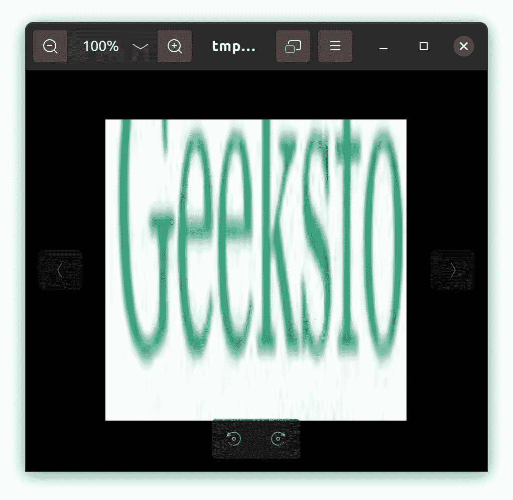**

**请参考下面的文章，获取有关调整图像大小的详细信息。**

*   **[Python PIL | Image.resize()方法](https://www.geeksforgeeks.org/python-pil-image-resize-method/)**
*   **[使用 Python–枕头](https://www.geeksforgeeks.org/change-the-ratio-between-width-and-height-of-an-image-using-python-pillow/)更改图像的宽高比**

## **保存图像**

**[**Image.save()**](https://www.geeksforgeeks.org/python-pil-image-save-method/) 以给定的文件名保存图像。如果没有指定格式，如果可能的话，使用的格式由文件扩展名决定。您可以使用文件对象代替文件名。在这种情况下，您必须始终指定格式。文件对象必须实现 seek、tell 和 write 方法，并以二进制模式打开。**

****语法:****

> **Image.save(fp，格式=无，* *参数)**

****示例:****

## **蟒蛇 3**

```
from PIL import Image

size = (40, 40)
img = Image.open(r"geek.jpg")

print("Original size of the image")
print(img.size)

# resizing the image
r_img = img.resize(size, resample = Image.BILINEAR)

# resized_test.png => Destination_path
r_img.save("resized_test.jpg")

# Opening the new image
img = Image.open(r"resized_test.jpg")

print("\nNew size of the image")
print(img.size)
```

****输出:****

```
Original size of the image
(287, 70)

New size of the image
(40, 40)
```

**到目前为止，我们已经学习了枕头的基础知识。现在让我们从一些复杂的操作开始，比如模糊图像、合并两幅图像甚至创建缩略图。让我们从合并图像开始。**

## **合并图像**

**[**image . merge()**](https://www.geeksforgeeks.org/python-pil-image-merge-method/)**用于将一组单波段图像合并为新的多波段图像。****

******语法:******

> ****PIL。Image.merge(模式，波段)****
> 
> ******参数:******
> 
> ******模式–**用于输出图像的模式。请参阅:模式。****
> 
> ******波段–**输出图像中每个波段包含一个单波段图像的序列。所有的乐队必须有相同的大小。****
> 
> ******返回:**一个图像对象。****

******注意:**我们将使用 [**Image.split()**](https://www.geeksforgeeks.org/python-pil-image-split-method/) 方法将图像分割成单个波段。****

******示例:******

## ****蟒蛇 3****

```
**# importing Image class from PIL package
from PIL import Image

# creating a object
image = Image.open(r"geek.jpg")
image.load()

# Splitting the image into individual
# bands
r, g, b, = image.split()

# merge function used
im1 = Image.merge('RGB', (g, b, r))
im1.show()**
```

******输出:******

********

### ****合并两幅或多幅图像****

****使用 merge()方法，我们还可以合并两个或多个图像。我们必须选择两个相同大小的图像，或者我们可以调整图像的大小。然后使用 [**new()**](https://www.geeksforgeeks.org/python-pil-image-new-method/) 功能我们将创建一个新的图像并将所有图像粘贴到那里。为了更好的理解，请看下面的例子。****

******示例:******

******使用的图像:******

****   ****

## ****蟒蛇 3****

```
**from PIL import Image

img_01 = Image.open("digit-number-img-0.jpg")
img_02 = Image.open("digit-number-img-1.jpg")
img_03 = Image.open("digit-number-img-2.jpg")
img_04 = Image.open("digit-number-img-3.jpg")

img_01_size = img_01.size
img_02_size = img_02.size
img_03_size = img_02.size
img_02_size = img_02.size

print('img 1 size: ', img_01_size)
print('img 2 size: ', img_02_size)
print('img 3 size: ', img_03_size)
print('img 4 size: ', img_03_size)

new_im = Image.new('RGB', (2*img_01_size[0],2*img_01_size[1]), (250,250,250))

new_im.paste(img_01, (0,0))
new_im.paste(img_02, (img_01_size[0],0))
new_im.paste(img_03, (0,img_01_size[1]))
new_im.paste(img_04, (img_01_size[0],img_01_size[1]))

new_im.save("merged_images.png", "PNG")
new_im.show()**
```

******输出:******

********

****请参考下面的文章，获取有关合并图像的详细信息。****

*   ****[Python PIL | Image.merge()方法](https://www.geeksforgeeks.org/python-pil-image-merge-method/)****
*   ****[如何使用 Python 3 模块抱枕合并相同大小的图像？](https://www.geeksforgeeks.org/how-to-merge-images-with-same-size-using-the-python-3-module-pillow/)****
*   ****[Python |使用枕头将图像复制并粘贴到其他图像上](https://www.geeksforgeeks.org/python-copy-and-paste-images-onto-other-image-using-pillow/)****
*   ****[如何使用 PIL 将一张透明的 PNG 图片与另一张图片合并？](https://www.geeksforgeeks.org/how-to-merge-a-transparent-png-image-with-another-image-using-pil/)****

## ****创建缩略图****

****[](https://www.geeksforgeeks.org/python-pil-image-thumbnail-method/)****将图像转换为缩略图。此方法修改图像以包含其自身的缩略图版本，不大于给定的大小。此方法计算适当的缩略图大小以保留图像的外观，调用 draft()方法配置文件读取器(如果适用)，最后调整图像的大小。********

********注意:**该功能将图像对象修改到位。如果您也需要使用全分辨率图像，请将此方法应用于原始图像的副本()。******

******示例:******

******使用的图像:******

********

## ****蟒蛇 3****

```
**# importing Image class from PIL package
from PIL import Image

# creating a object
image = Image.open(r"image.jpg")
MAX_SIZE = (100, 100)

# Creating the thumbnail
image.thumbnail(MAX_SIZE)

image.show()**
```

******输出:******

********

****请参考下面的文章，获取有关创建缩略图的详细信息。****

*   ****[Python PIL | Image.thumbnail()方法](https://www.geeksforgeeks.org/python-pil-image-thumbnail-method/)****
*   ****[用 Python 生成方形或圆形缩略图–枕头](https://www.geeksforgeeks.org/generate-square-or-circular-thumbnail-image-with-python-pillow/)****

## ****裁剪图像****

****裁剪是只选择图像的一部分的过程。[**裁剪()**](https://www.geeksforgeeks.org/python-pil-image-crop-method/) 方法用于裁剪任意图像的矩形部分。****

******语法:******

> ****PIL。图像.裁剪(框=无)****
> 
> ******参数:******
> 
> ******框:**定义左、上、右和下像素坐标的 4 元组。****

******示例:******

## ****蟒蛇 3****

```
**# Importing Image class from PIL module
from PIL import Image

# Opens a image in RGB mode
im = Image.open(r"geek.jpg")

# Size of the image in pixels
# (size of original image)
# (This is not mandatory)
width, height = im.size

# Setting the points for cropped image
left = 5
top = height / 4
right = 164
bottom = 3 * height / 4

# Cropped image of above dimension
# (It will not change original image)
im1 = im.crop((left, top, right, bottom))

# Shows the image in image viewer
im1.show()**
```

******输出:******

****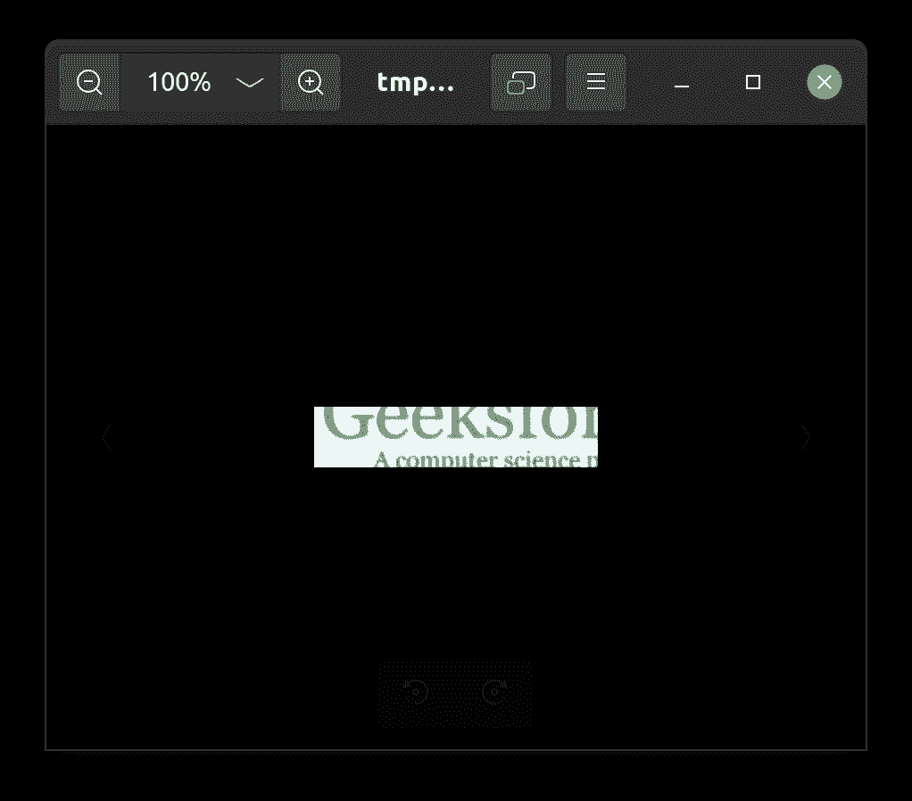****

****请参考下面的文章，获取有关裁剪图像的详细信息。****

*   ****[使用枕头裁剪图像](https://www.geeksforgeeks.org/python-crop-image-using-pillow/)****
*   ****[以圆形方式裁剪图像](https://www.geeksforgeeks.org/cropping-an-image-in-a-circular-way-using-python/)****

## ****模糊图像****

****如果仔细观察模糊的图像，通常会注意到图像是平滑的，这意味着没有观察到边缘。用于模糊的滤波器也称为低通滤波器，因为它允许低频进入并阻止高频。枕头库中的 **ImageFilter** 类提供了各种可以使用**滤镜()**方法应用的滤镜。让我们看看枕头提供的一些模糊滤镜。****

### ****简单模糊****

****该方法使用**核**矩阵或通过**卷积**矩阵模糊图像。可以使用**模糊**参数来应用。****

******语法:******

> ****过滤器(ImageFilter)。(模糊)****

******注:**更多信息请参考[什么是图像模糊](https://www.geeksforgeeks.org/what-is-image-blurring/)****

******示例:******

## ****蟒蛇 3****

```
**# Importing Image class from PIL module
from PIL import Image

# Opens a image in RGB mode
im = Image.open(r"geek.jpg")

# Blurring the image
im1 = im.filter(ImageFilter.BLUR)

# Shows the image in image viewer
im1.show()**
```

******输出:******

********

### ****高斯模糊****

****[高斯滤波器](https://www.geeksforgeeks.org/apply-a-gauss-filter-to-an-image-with-python/)被实现为奇数大小的对称核(矩阵的 DIP 版本)，其穿过感兴趣区域的每个像素以获得期望的效果。内核对剧烈的颜色变化(边缘)并不困难，因为内核中心的像素比外围的像素对最终值的权重更大。高斯滤波器可以被认为是高斯函数(数学)的近似。枕头模块提供了预定义的**gaussianbull**内核，为我们进行底层的数学运算。****

******语法:******

> ****ImageFilter。高斯-安布尔(半径=2)****

******示例:******

## ****蟒蛇 3****

```
**# Importing Image class from PIL module
from PIL import Image

# Opens a image in RGB mode
im = Image.open(r"geek.jpg")

# Blurring the image
im1 = im.filter(ImageFilter.GaussianBlur(4))

# Shows the image in image viewer
im1.show()**
```

******输出:******

********

### ****方框模糊****

****[方块模糊](https://www.geeksforgeeks.org/box-blur-algorithm-with-python-implementation/)也称为方块线性滤镜。框模糊经常用于近似高斯模糊。框模糊通常被实现为影响整个屏幕的图像效果。当前像素的模糊颜色是当前像素及其 8 个相邻像素的颜色的平均值。枕头提供了**盒子模糊()**方法也是如此。****

******语法:******

> ****ImageFilter.BoxBlur(半径)****

******示例:******

## ****蟒蛇 3****

```
**# Importing Image class from PIL module
from PIL import Image

# Opens a image in RGB mode
im = Image.open(r"geek.jpg")

# Blurring the image
im1 = im.filter(ImageFilter.BoxBlur(4))

# Shows the image in image viewer
im1.show()**
```

******输出:******

********

****参考下面的文章来获得关于模糊图像的详细信息。****

*   ****[Python PIL | gaussianbulr()方法](https://www.geeksforgeeks.org/python-pil-gaussianblur-method/)****
*   ****[使用 Python 对图像应用高斯滤镜](https://www.geeksforgeeks.org/apply-a-gauss-filter-to-an-image-with-python/)****
*   ****[Python PIL | BoxBlur()方法](https://www.geeksforgeeks.org/python-pil-boxblur-method/)****

## ****在图像上绘图****

****枕头提供**图像绘制**模块，为图像对象提供简单的 2D 图形。您可以使用此模块创建新图像，注释或修饰现有图像，并动态生成图形以供网络使用。让我们看看我们可以在图像上绘制的各种图形或文本。****

### ****添加文本****

****向图像添加文本有时是非常必要的，因为它可以用于向图像提供一些有用的信息，或者也可以用于向图像添加数字签名。有了枕头，我们可以轻松地给任何图像添加文本。让我们看看下面的例子。****

## ****蟒蛇 3****

```
**# import all the libraries
from PIL import Image
from PIL import ImageFont
from PIL import ImageDraw

# image opening
image = Image.open("image.jpg")

# creating a copy of original image
watermark_image = image.copy()

# Image is converted into editable form using
# Draw function and assigned to draw
draw = ImageDraw.Draw(watermark_image)

# ("font type",font size)
font = ImageFont.truetype("DroidSans.ttf", 50)

# Decide the text location, color and font
# (255,255,255)-White color text
draw.text((0, 0), "GeeksforGeeks", (255, 255, 255), font=font)

watermark_image.show()**
```

******输出:******

****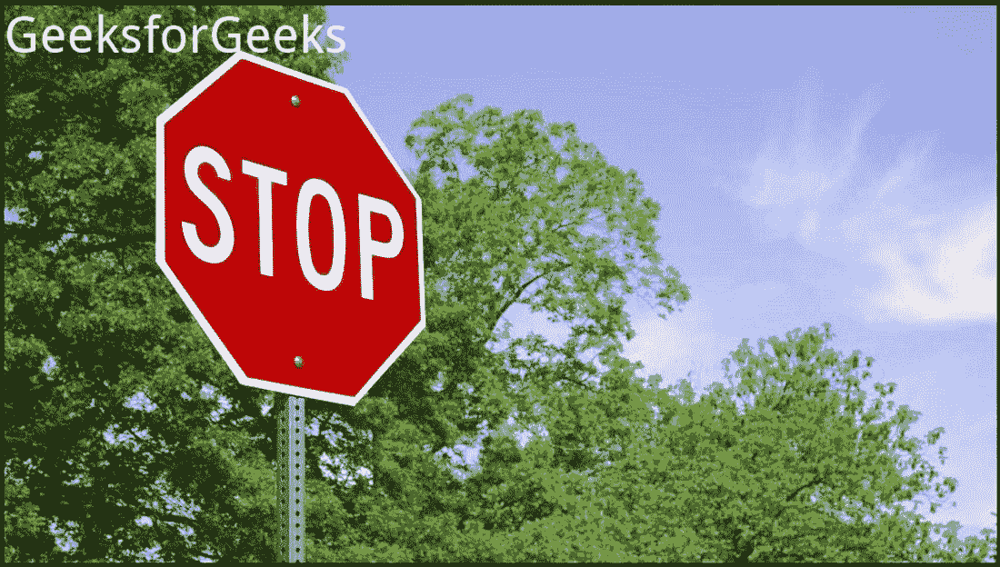****

*   ****使用**图像绘制**使图像可编辑。****
*   ****使用 **ImageFont** 指定字体和字号。这一步是可选的。对于那些希望自己的文本看起来很酷或很时尚的人来说，因为有人不会选择任何字体样式，所以系统会采用默认的字体样式。****
*   ****使用**图像字体**模块功能  创建字体，因为它需要两个参数，即(“字体类型”，大小)****
*   ****然后使用 [**【文本】(**](https://www.geeksforgeeks.org/python-pil-imagedraw-draw-text/) 功能绘制对象并传递四个参数(文本的起点、“示例文本”、颜色、ImageFont 对象)。****

****请参考下面的文章，获取有关向图像添加文本的详细信息。****

*   ****[蟒蛇枕–在图像上书写文字](https://www.geeksforgeeks.org/python-pillow-writing-text-on-image/)****
*   ****[Python PIL | ImageDraw。Draw.text()](https://www.geeksforgeeks.org/python-pil-imagedraw-draw-text/)****
*   ****[使用 Python 在图像上添加文本–PIL](https://www.geeksforgeeks.org/adding-text-on-image-using-python-pil/)****

### ****添加多行文本****

****[**ImageDraw。**](https://www.geeksforgeeks.org/python-pil-imagedraw-draw-multiline_text/) 用于在给定位置绘制字符串。****

******语法:******

> ****ImageDraw。Draw.multiline_text(xy，文本，填充=无，字体=无，定位=无，间距=0，对齐=“左”)****

******示例:******

## ****蟒蛇 3****

```
**# Importing Image and ImageFont, ImageDraw
# module from PIL package
from PIL import Image, ImageFont, ImageDraw

# creating a image object
image = Image.open(r'geek.jpg')

draw = ImageDraw.Draw(image)

# specified font size
font = ImageFont.truetype(r'DroidSans.ttf', 15)

text = u"""\
Geeks
FOR \n Geeks"""

# drawing text size
draw.text((6, 8), text, fill ="red", font = font, align ="right")

image.show()**
```

******输出:******

********

### ****画线****

****[**ImageDraw。**](https://www.geeksforgeeks.org/python-pil-imagedraw-draw-line/) 用来在 xy 列表中的坐标之间画一条线。****

******语法:******

> ****ImageDraw。画线(xy，填充=无，宽度=0)****

******示例:******

## ****蟒蛇 3****

```
**# importing image object from PIL
import math
from PIL import Image, ImageDraw

w, h = 220, 190
shape = [(40, 40), (w - 10, h - 10)]

# creating new Image object
img = Image.new("RGB", (w, h))

# create line image
img1 = ImageDraw.Draw(img)
img1.line(shape, fill="none", width=0)
img.show()**
```

******输出:******

****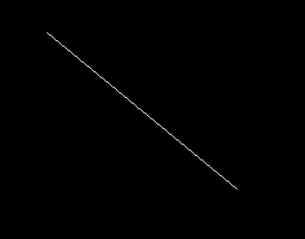****

### ****绘制矩形****

****[**ImageDraw。**](https://www.geeksforgeeks.org/python-pil-imagedraw-draw-rectangle/) 用来画一个长方形。****

******语法:******

> ****ImageDraw。绘制矩形(xy，填充=无，轮廓=无)****

******示例:******

## ****蟒蛇 3****

```
**# importing image object from PIL
import math
from PIL import Image, ImageDraw

w, h = 220, 190
shape = [(40, 40), (w - 10, h - 10)]

# creating new Image object
img = Image.new("RGB", (w, h))

# create rectangle image
img1 = ImageDraw.Draw(img)
img1.rectangle(shape, fill="# ffff33", outline="red")
img.show()**
```

******输出:******

********

### ****绘制多边形****

****[**ImageDraw。**](https://www.geeksforgeeks.org/python-pil-imagedraw-draw-polygon-method/) 用来绘制多边形。多边形轮廓由给定坐标之间的直线以及最后一个坐标和第一个坐标之间的直线组成。****

******语法:******

> ****ImageDraw。绘制多边形(xy，填充=无，轮廓=无)****

******示例:******

## ****蟒蛇 3****

```
**import math
from PIL import Image, ImageDraw
from PIL import ImagePath

side = 8
xy = [
    ((math.cos(th) + 1) * 90,
     (math.sin(th) + 1) * 60)
    for th in [i * (2 * math.pi) / side for i in range(side)]
]

image = ImagePath.Path(xy).getbbox()
size = list(map(int, map(math.ceil, image[2:])))

img = Image.new("RGB", size, "# f9f9f9")
img1 = ImageDraw.Draw(img)
img1.polygon(xy, fill="# eeeeff", outline="blue")
img.show()**
```

******输出:******

****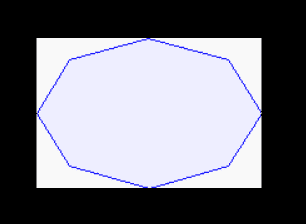****

## ****增强图像****

****蟒蛇枕提供 [**图像增强**](https://www.geeksforgeeks.org/image-enhancement-in-pil/) 模块来调整图像的颜色、亮度、对比度和锐度。****

### ****调整颜色和对比度****

******图像增强。颜色()**和**图像增强。对比度()**方法分别用于调整图像的颜色和对比度。****

*   ******图像增强。Color()** 用于调整图像的色彩平衡，方式类似于彩色电视机上的控制。增强因子为 0.0 会产生黑白图像。因子 1.0 给出原始图像。****

******语法:******

> ****ImageEnhance。颜色(图像)****

******示例:******

## ****蟒蛇 3****

```
**# This will import Image and ImageEnhance modules
from PIL import Image, ImageEnhance

# Opening Image
im = Image.open(r"geek.jpg")

# Creating object of Color class
im3 = ImageEnhance.Color(im)

# showing resultant image
im3.enhance(5.0).show()**
```

******输出:******

****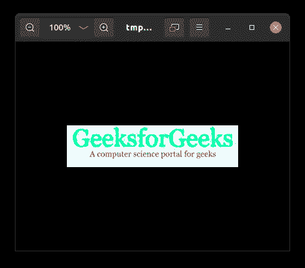****

*   ******图像增强。对比度()**用于控制图像的对比度，类似于电视机上的对比度控制。增强因子为 0.0 时，会产生一个纯灰色图像。因子 1.0 给出原始图像。****

******语法:******

> ****obj = ImageEnhance。对比度(图像)****
> 
> ****增强(因素)****

******示例:******

## ****蟒蛇 3****

```
**# This will import Image and ImageEnhance modules
from PIL import Image, ImageEnhance

# Opening Image
im = Image.open(r"geek.jpg")

# Creating object of Contrast class
im3 = ImageEnhance.Contrast(im)

# showing resultant image
im3.enhance(5.0).show()**
```

******输出:******

****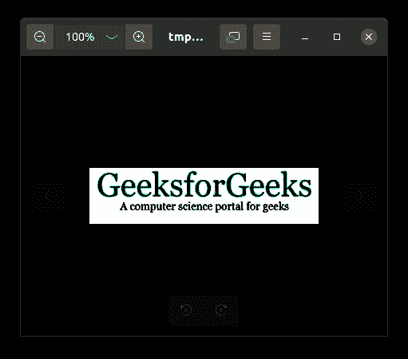****

****参考下面的文章来获得关于增强颜色和对比度的详细信息。****

*   ****[蟒蛇 PIL | image enhanced。颜色()和图像增强。对比()方法](https://www.geeksforgeeks.org/python-pil-imageenhance-color-and-imageenhance-contrast-method/)****

### ****调整亮度和清晰度****

******图像增强。亮度()**和**图像增强。锐度()**方法用于调整图像的亮度和锐度。****

*   ******图像增强。亮度()**用于控制图像的亮度。增强因子为 0.0 会产生黑色图像。因子 1.0 给出原始图像。****

******语法:******

> ****obj = ImageEnhance。亮度(图像)****
> 
> ****增强(因素)****

******示例:******

## ****蟒蛇 3****

```
**# This will import Image and ImageEnhance modules
from PIL import Image, ImageEnhance

# Opening Image
im = Image.open(r"geek.jpg")

# Creating object of Brightness class
im3 = ImageEnhance.Brightness(im)

# showing resultant image
im3.enhance(1.5).show()**
```

******输出:******

****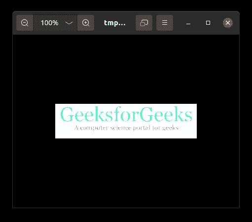****

*   ******图像增强。锐度()**用于调整图像的锐度。增强因子 0.0 给出模糊图像，因子 1.0 给出原始图像，因子 2.0 给出锐化图像。****

******语法:******

> ****obj = ImageEnhance。清晰度(图像)****
> 
> ****增强(因素)****

******示例:******

## ****蟒蛇 3****

```
**# This will import Image and ImageChops modules
from PIL import Image, ImageEnhance

# Opening Image
im = Image.open(r"geek.jpg")

# Creating object of Sharpness class
im3 = ImageEnhance.Sharpness(im)

# showing resultant image
im3.enhance(5.0).show()**
```

******输出:******

********

****请参考下面的文章，获取有关增强图像亮度和清晰度的详细信息。****

*   ****[蟒蛇 PIL | image enhanced。亮度()和图像增强。锐度()方法](https://www.geeksforgeeks.org/python-pil-imageenhance-brightness-and-imageenhance-sharpness-method/)****

## ****在各种格式之间转换图像****

*   ****[转换。GIF 到。在 Python 中是 BMP，反之亦然](https://www.geeksforgeeks.org/convert-the-gif-to-bmp-and-its-vice-versa-in-python/)****
*   ****[使用 Python 中的枕头将图像转换为 jpg 格式](https://www.geeksforgeeks.org/convert-an-image-into-jpg-format-using-pillow-in-python/)****
*   ****[使用 Python 将巴布亚新几内亚转换为 JPG](https://www.geeksforgeeks.org/convert-png-to-jpg-using-python/)****
*   ****[使用 Python 将文件从 jpg 转换为 png，反之亦然](https://www.geeksforgeeks.org/convert-files-from-jpg-to-png-and-vice-versa-using-python/)****
*   ****[转换。巴布亚新几内亚到。在 Python 中是 GIF，反之亦然](https://www.geeksforgeeks.org/convert-the-png-to-gif-and-its-vice-versa-in-python/)****
*   ****[使用 Python 将文件从 jpg 转换为 gif，反之亦然](https://www.geeksforgeeks.org/convert-files-from-jpg-to-gif-and-vice-versa-using-python/)****
*   ****[将 OpenCV 图像转换为 Python 中的 PIL 图像](https://www.geeksforgeeks.org/convert-opencv-image-to-pil-image-in-python/)****

## ****使用枕头对图像进行高级操作****

*   ****[用 Python 创建透明 png 图像–枕头](https://www.geeksforgeeks.org/create-transparent-png-image-with-python-pillow/)****
*   ****[用 Python 给图像添加填充–枕头](https://www.geeksforgeeks.org/add-padding-to-the-image-with-python-pillow/)****
*   ****[使用 Python 找到图像中最常用的颜色](https://www.geeksforgeeks.org/find-most-used-colors-in-image-using-python/)****
*   ****[Python–使用枕头进行颜色反转](https://www.geeksforgeeks.org/python-color-inversion-using-pillow/)****
*   ****[用 Python 将一个图像叠加到另一个图像上](https://www.geeksforgeeks.org/overlay-an-image-on-another-image-in-python/)****
*   ****[使用 Python 中的枕头改变图像分辨率](https://www.geeksforgeeks.org/change-image-resolution-using-pillow-in-python/)****
*   ****[使用 Python 找出两幅图像之间的差异](https://www.geeksforgeeks.org/spot-the-difference-between-two-images-using-python/)****
*   ****[如何用 Python 从图像中提取文本？](https://www.geeksforgeeks.org/how-to-extract-text-from-images-with-python/)****
*   ****[用 Python 创建并保存动画 GIF–枕头](https://www.geeksforgeeks.org/create-and-save-animated-gif-with-python-pillow/)****
*   ****[如何使用 Python 和 PIL 压缩图像？](https://www.geeksforgeeks.org/how-to-compress-images-using-python-and-pil/)****
*   ****[Python |使用 PIL ImageGrab 和 pytesserract](https://www.geeksforgeeks.org/python-using-pil-imagegrab-and-pytesseract/)****
*   ****[使用 Python 填充图像-枕头](https://www.geeksforgeeks.org/floodfill-image-using-python-pillow/)****
*   ****[Python–使用枕头的通道下降](https://www.geeksforgeeks.org/python-channel-drop-using-pillow/)****

## ****蟒蛇枕头练习及应用****

*   ****[使用 PIL 加载 Tkinter 中的图像](https://www.geeksforgeeks.org/loading-images-in-tkinter-using-pil/)****
*   ****[使用 Python-PIL 创建证书](https://www.geeksforgeeks.org/create-certificates-using-python-pil/)****
*   ****[Python |同时对文件夹中的所有图像进行光学字符识别](https://www.geeksforgeeks.org/python-ocr-on-all-the-images-present-in-a-folder-simultaneously/)****
*   ****[将更改应用到给定文件夹中的所有图像–使用 Python PIL](https://www.geeksforgeeks.org/apply-changes-to-all-the-images-in-given-folder-using-python-pil/)****