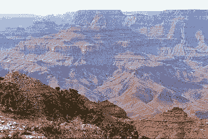
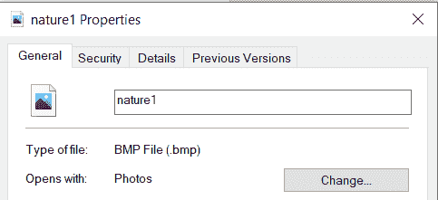
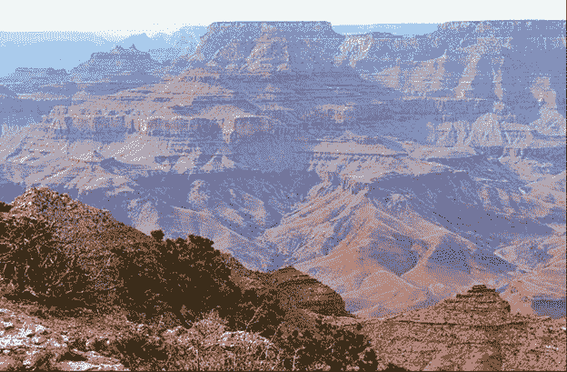
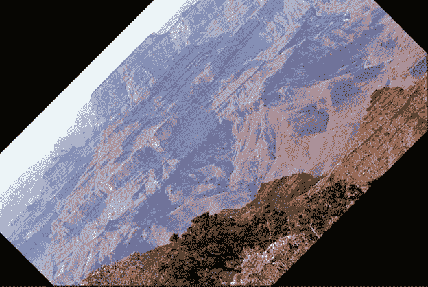
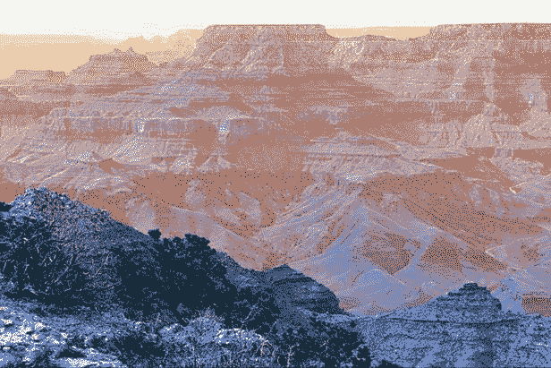
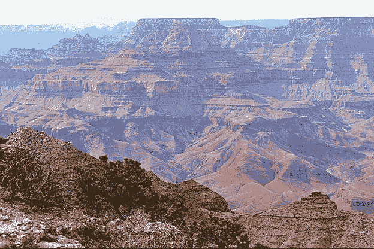
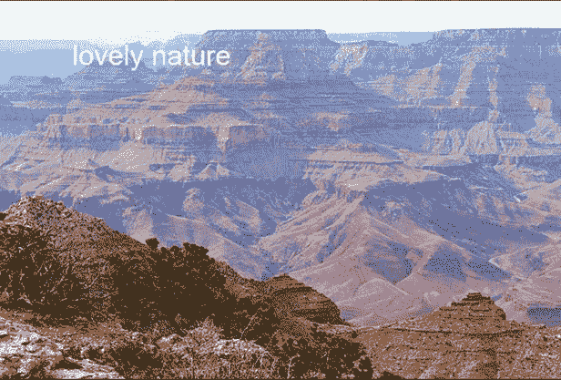

# 蟒蛇皮枕头–处理图像

> 原文:[https://www . geeksforgeeks . org/python-枕头-使用图像/](https://www.geeksforgeeks.org/python-pillow-working-with-images/)

在本文中，我们将看到如何使用 Python 中的枕头来处理图像。我们将讨论基本操作，如创建、保存、旋转图像。因此，让我们开始详细讨论，但首先，让我们看看如何安装枕头。

### **安装**

要安装此软件包，请在终端中键入以下命令。

```py
pip install pillow
```

## **创建新图像**

您可以使用 [PIL 创建新图像。Image.new()](https://www.geeksforgeeks.org/python-pil-image-new-method/) 方法。此方法创建一个具有给定模式和大小的新图像。尺寸是以像素为单位的(宽度，高度)元组

> **语法:** PIL。Image.new(模式、大小、颜色)

**代码:**

## 蟒蛇 3

```py
import PIL
image = PIL.Image.new(mode = "RGB",
                      size = (200, 200),
                      color = (255, 153, 255))
image.show()
```

**输出:**


## 打开图像

您可以使用 [PIL 打开任何图像。Image.open()](https://www.geeksforgeeks.org/python-pil-image-open-method/) 方法。

> **语法:** PIL。Image.open(fp，mode='r ')

**代码:**

## 蟒蛇 3

```py
from PIL import Image

image = Image.open('nature.jpg')
image.show()
```

**输出:**



## 获取有关图像的信息

*   **获取图像的格式:** obj.format 方法返回图像文件的格式。

## 蟒蛇 3

```py
from PIL import Image

img = Image.open("test.png")

print(img.format)
```

**输出:**

```py
PNG
```

*   **获取图像的大小:** obj.size 属性提供图像的大小。它返回一个包含宽度和高度的元组。

## 蟒蛇 3

```py
from PIL import Image

img = Image.open("test.png")

print(img.size)
```

**输出:**

```py
(180, 263)
```

## 重命名和保存图像

我们可以更改图像的名称、格式，也可以使用 [image.save()](https://www.geeksforgeeks.org/python-pil-image-save-method/) 方法对其进行重命名。

> **语法:** Image.save(fp，格式=无，* *参数)

**代码:**

## 蟒蛇 3

```py
from PIL import Image
image = Image.open('nature.jpg')
image.show()

image.save('nature1.bmp')
image1 = Image.open('nature1.bmp')
image1.show()
```

**输出:**


变更前



变化后

## 裁剪图像

PIL 是 python 图像库，它为 Python 解释器提供图像编辑功能。 [PIL。Image.crop()](https://www.geeksforgeeks.org/python-pil-image-crop-method/) 方法用于裁剪任何图像的矩形部分。

> **语法:** PIL。图像.裁剪(框=无)

**代码:**

## 蟒蛇 3

```py
from PIL import Image

# Open image
im = Image.open("nature.jpg")

# Show actual Image
im.show()

# Show cropped Image
im = im.crop((0,0,50,50)
im.show()
```

**输出:**



旋转前


裁剪图像

## 旋转图像

PIL。Image.Image.rotate()方法用于将给定的图像围绕其中心逆时针旋转给定的度数。

> **语法:** new_object = PIL。图像。图像。旋转(图像 _ 对象，角度，重采样=0，扩展=0)或新 _ 对象=图像 _ 对象。旋转(角度，重采样=0，扩展=0)

**代码:**

## 蟒蛇 3

```py
from PIL import Image

# Open image
im = Image.open("nature.jpg")

# Show actual Image
im.show()

# Show rotated Image
im = im.rotate(45)
im.show()
```

**输出:**


旋转前



旋转后

## 过滤图像

枕头库的当前版本提供了下面提到的一组预定义的图像增强过滤器。

*   虚化
*   轮廓
*   详述
*   边缘增强
*   边缘增强更多
*   装饰
*   查找边缘
*   尖锐
*   光滑的
*   平滑 _ 更多

[image filter](https://www.geeksforgeeks.org/python-pil-image-filter-with-imagefilter-module/)模块包含一组预定义过滤器的定义，可与 Image.filter() 方法一起使用。

> **语法:**过滤器(内核)
> 
> 采用内核(预定义的或自定义的)和图像的每个像素(内核卷积)。

**代码:**

## 蟒蛇 3

```py
# Import required image modules
from PIL import Image, ImageFilter

# Import all the enhancement filter from pillow
from PIL.ImageFilter import (
   BLUR, CONTOUR, DETAIL, EDGE_ENHANCE, EDGE_ENHANCE_MORE,
   EMBOSS, FIND_EDGES, SMOOTH, SMOOTH_MORE, SHARPEN
)

# Create image object
img = Image.open('nature.jpg')

# Applying the sharpen filter
# You can change the value in filter function
# to see the deifferences
img1 = img.filter(SHARPEN)
img1.show()
```

**输出:**


过滤前



锐化过滤器后

## 在图像上创建水印

这里可以使用 [ImageDraw 创建水印。Draw.text()](https://www.geeksforgeeks.org/python-pil-imagedraw-draw-text/) 这个方法在给定的位置绘制字符串。

> **语法:** ImageDraw。绘图.文本(xy，文本，填充=无，字体=无，定位=无，间距=0，对齐=“左”)

**代码:**

## 蟒蛇 3

```py
# Import required Image library
from PIL import Image, ImageDraw, ImageFont

# Create an Image Object from an Image
im = Image.open('nature.jpg')
width, height = im.size

draw = ImageDraw.Draw(im)
text = "lovely nature"

font = ImageFont.truetype('arial.ttf', 36)
textwidth, textheight = draw.textsize(text, font)

# calculate the x,y coordinates of
# the text
x = 100
y = 50

# draw watermark in the bottom right
# corner
draw.text((x, y), text, font=font)
im.show()

# Save watermarked image
im.save('watermark.jpg')
```

**输出:**



水印/文本之前



水印/文本后