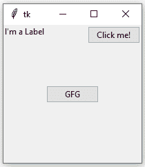
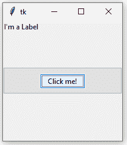

# Python |放置()方法于 Tkinter

> 原文:[https://www . geesforgeks . org/python-place-method-in-tkinter/](https://www.geeksforgeeks.org/python-place-method-in-tkinter/)

**Place** 几何管理器是 Tkinter 提供的三个通用几何管理器中最简单的一个。它允许您显式设置一个窗口的位置和大小，无论是绝对的，还是相对于另一个窗口的。
您可以通过适用于所有标准小部件的 **`place()`** 方法访问 **place** 管理器。

普通窗口和对话框布局使用 **`place()`** 通常不是一个好主意；简单来说，就是做大量的工作来让事情按照他们应该做的那样运转。为此，请使用 **`pack()`** 或 **`grid()`** 经理。

**语法:**

```py
widget.place(relx = 0.5, rely = 0.5, anchor = CENTER)

```

**注:** `place()`法既可与 **`grid()`** 法并用，也可与 **`pack()`** 法并用。

**代码#1:**

```py
# Importing tkinter module
from tkinter import * from tkinter.ttk import *

# creating Tk window
master = Tk()

# setting geometry of tk window
master.geometry("200x200")

# button widget
b1 = Button(master, text = "Click me !")
b1.place(relx = 1, x =-2, y = 2, anchor = NE)

# label widget
l = Label(master, text = "I'm a Label")
l.place(anchor = NW)

# button widget
b2 = Button(master, text = "GFG")
b2.place(relx = 0.5, rely = 0.5, anchor = CENTER)

# infinite loop which is required to
# run tkinter program infinitely
# until an interrupt occurs
mainloop()
```

**输出:**


当我们使用 **`pack()`** 或 **`grid()`** 管理器时，很容易将两个不同的小部件彼此分开，但是将其中一个放在另一个里面有点困难。但这很容易通过 **`place()`** 的方法实现。
在 **place()** 方法中，我们可以使用 in_ option 将一个小部件放在另一个里面。

**代码#2:**

```py
# Importing tkinter module
from tkinter import * from tkinter.ttk import *

# creating Tk window
master = Tk()

# setting geometry of tk window
master.geometry("200x200")

# button widget
b2 = Button(master, text = "GFG")
b2.pack(fill = X, expand = True, ipady = 10)

# button widget
b1 = Button(master, text = "Click me !")

# This is where b1 is placed inside b2 with in_ option
b1.place(in_= b2, relx = 0.5, rely = 0.5, anchor = CENTER)

# label widget
l = Label(master, text = "I'm a Label")
l.place(anchor = NW)

# infinite loop which is required to
# run tkinter program infinitely
# until an interrupt occurs
mainloop()
```

**输出:**在下图中，请注意一个按钮放在另一个按钮的内部。
T3】

