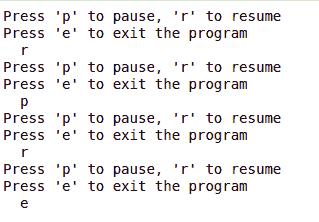

# Python |在 Pygame 中播放音频文件

> 原文:[https://www . geesforgeks . org/python-playing-audio-file-in-pygame/](https://www.geeksforgeeks.org/python-playing-audio-file-in-pygame/)

游戏编程现在很有价值，它也可以用于广告和作为教学工具。游戏开发包括数学、逻辑、物理、人工智能等等，非常有趣。在 python 中，游戏编程是在`pygame`中完成的，它是这样做的最佳模块之一。

**注:**更多信息请参考[pygame 简介](https://www.geeksforgeeks.org/introduction-to-pygame/)

为了在`pygame`中播放音乐/音频文件，使用了`pygame.mixer`(pygame 模块用于加载和播放声音)。该模块包含加载声音对象和控制回放的类。要做到这一点，基本上有四个步骤:

*   **启动搅拌机**

    ```
    mixer.init()
    ```

*   **加载歌曲。**

    ```
    mixer.music.load("song.mp3")
    ```

*   **设置音量。**

    ```
    mixer.music.set_volume(0.7)
    ```

*   **开始播放歌曲。**

    ```
    mixer.music.play()
    ```

下面是实现。

```
from pygame import mixer

# Starting the mixer
mixer.init()

# Loading the song
mixer.music.load("song.mp3")

# Setting the volume
mixer.music.set_volume(0.7)

# Start playing the song
mixer.music.play()

# infinite loop
while True:

    print("Press 'p' to pause, 'r' to resume")
    print("Press 'e' to exit the program")
    query = input("  ")

    if query == 'p':

        # Pausing the music
        mixer.music.pause()     
    elif query == 'r':

        # Resuming the music
        mixer.music.unpause()
    elif query == 'e':

        # Stop the mixer
        mixer.music.stop()
        break
```

**输出:**



**该代码还会播放“song.mp3”文件。**