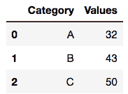
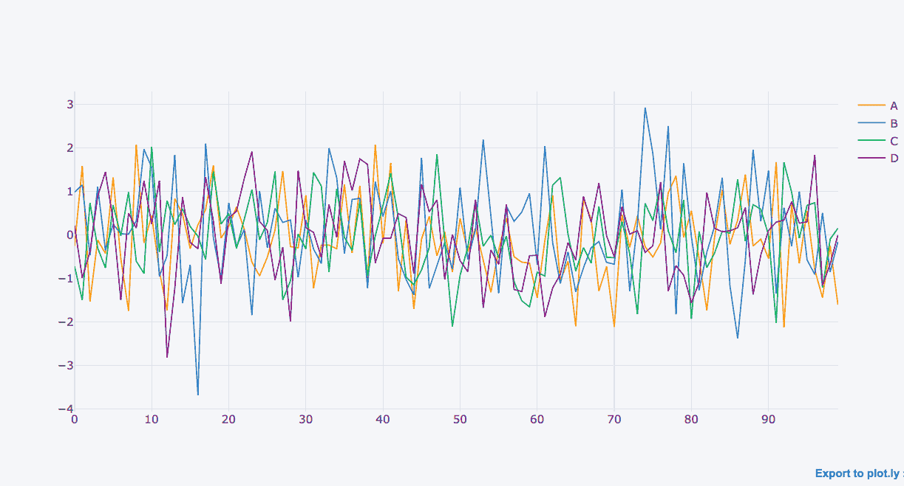
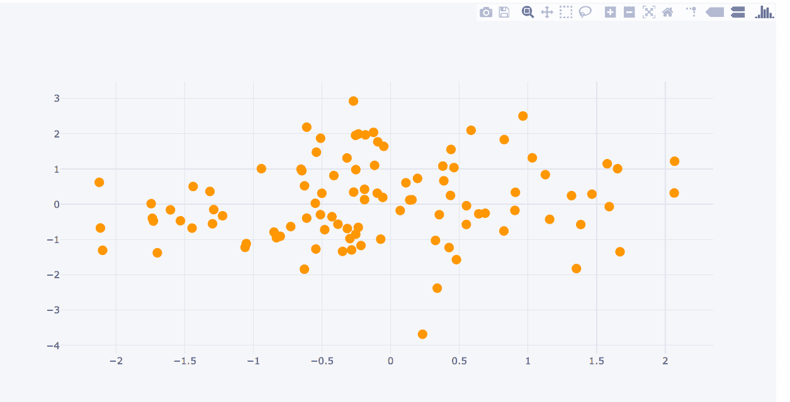
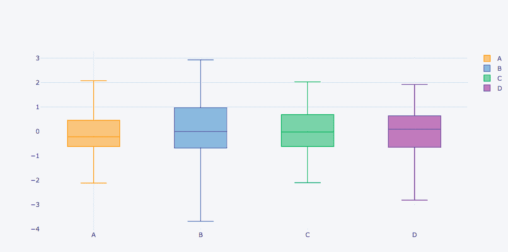
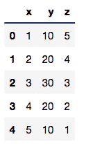
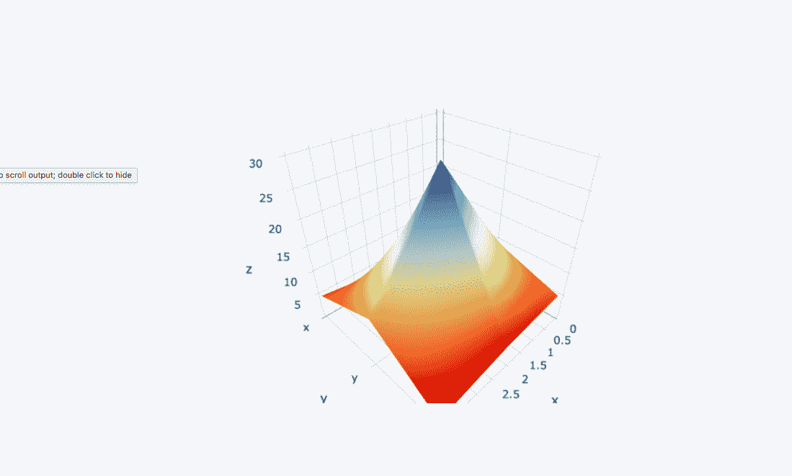

# 使用 Python 的绘图和袖扣模块绘制图形

> 原文:[https://www . geesforgeks . org/python-plot-differential-graph-use-plot-and-袖扣/](https://www.geeksforgeeks.org/python-plot-different-graphs-using-plotly-and-cufflinks/)

**plot**是一个 Python 库，用来设计图形，尤其是交互图形。它可以绘制各种图形和图表，如直方图、条形图、箱线图、展开图等。它主要用于数据分析以及财务分析。**剧情上**是一个交互式可视化库。

**袖扣**与熊猫进行剧情连接，直接创建数据框的图形和图表。**地名**用来描述美国的地理标绘。choropleth 用于绘制世界地图和其他许多地图。

让我们绘制不同类型的图，如箱线图、展开图等。使用阴谋和袖扣。

**命令安装程序:**

```
pip install plotly 
```

**安装袖扣的命令:**

```
pip install cufflink
```

**代码#1:** 显示数据帧

```
# import all necessary libraries
import pandas as pd
import numpy as np

% matplotlib inline
from plotly import __version__
import cufflinks as cf

from plotly.offline import download_plotlyjs, init_notebook_mode, plot, iplot

# to get the connection
init_notebook_mode(connected = True)

# plotly also serves online,
# but we are using just a sample
cf.go_offline()

# creating dataframes
df = pd.DataFrame(np.random.randn(100, 4), columns ='A B C D'.split())

df2 = pd.DataFrame({'Category':['A', 'B', 'C'], 'Values':[32, 43, 50]})
df2.head()
```

**输出:**


**代码#2:** 正常绘图

```
# plotly function
df.iplot()
```

**输出:**


**代码#3:** 散点图

```
# markers are made to point in the graph
df.iplot(kind ='scatter', x ='A', y ='B', mode ='markers')
```

**输出:**


**代码#4:** 方块图

```
# boxplot
df.iplot(kind ='box')
```

**输出:**


**代码#5:** 绘制数据帧

```
# creating dataframe with three axes
df3 = pd.DataFrame({'x':[1, 2, 3, 4, 5],
                    'y':[10, 20, 30, 20, 10],
                    'z':[5, 4, 3, 2, 1]})
```

**输出:**


**代码#6:** 表面图

```
# surface plot
# colorscale:red(rd), yellow(yl), blue(bu)
df3.iplot(kind ='surface', colorscale ='rdylbu')
```

**输出:**
