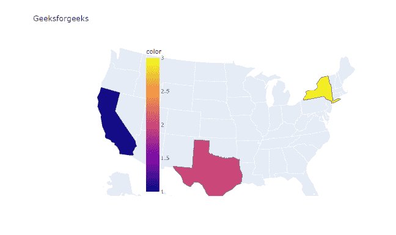
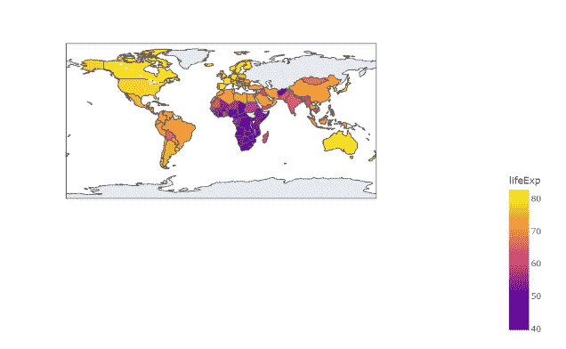

# Python Plotly–如何为 choropleth 地图设置颜色条位置？

> 原文:[https://www . geeksforgeeks . org/python-plotly-how-set-color bar-position-for-a-cholopleth-map/](https://www.geeksforgeeks.org/python-plotly-how-to-set-colorbar-position-for-a-choropleth-map/)

在本文中，我们将学习如何使用 Plotly 在 Python 中设置 colorbar 位置。

颜色条是从亮到暗或从暗到亮的渐变。它们非常适合可视化从低到高的数据，如收入、温度或年龄。局部贴图用于绘制带有阴影或图案区域的贴图，这些区域相对于数据变量是着色的、阴影的或图案化的。它们由彩色多边形组成。它们用于表示一个地理区域内数量的空间变化。

在这里，我们将讨论如何使用不同的例子来设置 colorbar 的位置，以使它更加清晰。

> **语法:** #设置颜色条位置
> 
> *   图. update _ layout(color axis _ color bar _ x =浮点值)
> *   图. update _ layout(color axis _ color bar _ y =浮点值)

### **示例 1:** 设置 X 轴的色带位置

## 蟒蛇 3

```
# importing libraries
import plotly.express as px

# figure setup using dataset
fig = px.choropleth(locations=["CA", "TX", "NY"],
                    locationmode="USA-states",
                    color=[1, 2, 3], scope="usa",
                    title="Geeksforgeeks")

# set colorbar position for X-axis
fig.update_layout(coloraxis_colorbar_x=0.26)

fig.show()
```

**输出:**



### **示例 2:** 设置 Y 轴的色带位置

## 蟒蛇 3

```
# importing packages
import plotly.express as px

# using gapminder datasheet.
df = px.data.gapminder().query("year==2007")

# figure setup
fig = px.choropleth(df, locations="iso_alpha",

                    # lifeExp is a column of gapminder
                    color="lifeExp",  

                    # column to add to hover information
                    hover_name="country",  
                    color_continuous_scale=px.colors.sequential.Plasma)

# set colorbar position for Y-axis
fig.update_layout(coloraxis_colorbar_y=-0.3)

fig.show()
```

**输出:**



### **例 3:** 同时设置 X 轴和 Y 轴的彩条位置

这里我们还可以看到，这种方法也适用于另一个图形。

## 蟒蛇 3

```
# importing packages
import plotly.express as px

# using the gapminder dataset
data = px.data.gapminder()
data_canada = data[data.country == 'Canada']

# plotting the bar chart
fig = px.scatter(data_canada, x='year', y='pop',
                 hover_data=['lifeExp', 'gdpPercap'], 
                 color='lifeExp',
                 labels={'pop': 'population of Canada'},
                 height=400, title="Geeksforgeeks")

# set colorbar position for X-axis
fig.update_layout(coloraxis_colorbar_x=0.9)

# set colorbar position for Y-axis
fig.update_layout(coloraxis_colorbar_y=0.1)

fig.show()
```

**输出:**

