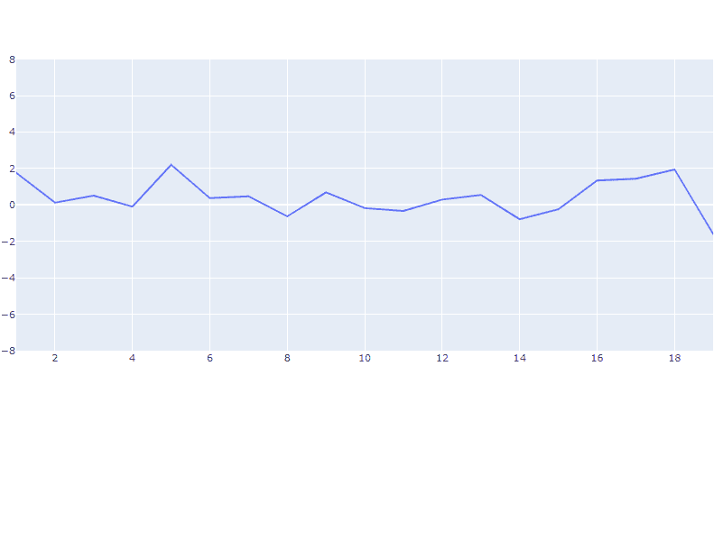
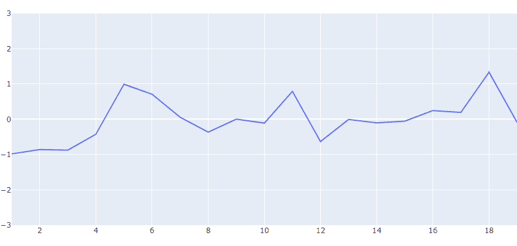
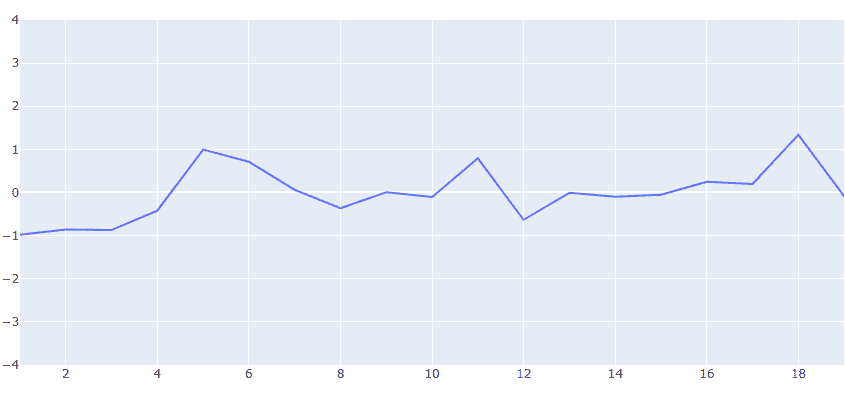

# Python Plotly:如何设置 y 轴的范围？

> 原文:[https://www . geeksforgeeks . org/python-plotly-如何设置 y 轴的范围/](https://www.geeksforgeeks.org/python-plotly-how-to-set-the-range-of-the-y-axis/)

在本文中，我们将学习如何在 Python 中使用 plotly 设置图形 y 轴的范围。

**要安装该模块，请在终端中键入以下命令:**

```
pip install plotly
```

**例 1:使用 layout_yaxis_range 作为参数**

在这个例子中，我们首先导入了所需的库，即 **pandas，numpy** 和 **plotly.objs，**然后我们生成了一些在 x 轴和 y 轴上绘图的数字列表，此外，我们还使用了 [**go。散点图()**](https://www.geeksforgeeks.org/scatter-plot-in-plotly-using-graph_objects-class/) 功能制作散点图。**走了。图()**函数接收数据作为输入，我们使用**模式=【线】**将模式设置为**【线】**。我们使用了神奇的下划线符号，即 **layout_yaxis_range=[-8，8]** 来设置 y 轴范围从-8 到 8。最后我们使用 [**show()**](https://www.geeksforgeeks.org/matplotlib-pyplot-show-in-python/) 功能显示该图。

## 蟒蛇 3

```
# Importing Libraries
import pandas as pd
import plotly.graph_objs as go
import numpy as np

# generating numbers ranging from 1 to 20
# on x-axis
x = list(range(1,20))

# generating random numbers on y-axis
y = np.random.randn(20)

# plotting scatter plot on x and y data with 'lines'
# as mode and setting the y-axis range from -8 to 8
fig = go.Figure(data=go.Scatter(x=x, y=y, mode='lines'),
                layout_yaxis_range=[-8,8])

# to display the figure in the output screen
fig.show()
```

**输出:**



**例 2:稍后使用 update_layout()函数设置 y 轴范围**

在下面的例子中，这里我们已经建立了没有设置 y 轴范围的绘图。此外，我们使用 [**update_layout()**](https://www.geeksforgeeks.org/title-alignment-in-plotly/) 功能设置 y 轴范围，即**fig . update _ layout(yaxis _ range =[-3，3])** 设置范围从-3 到 3。

## 蟒蛇 3

```
# Importing Libraries
import pandas as pd
import plotly.graph_objs as go
import numpy as np

np.random.seed(5)

# generating numbers ranging from 1 to 20
# on x-axis
x = list(range(1,20))

# generating random numbers on y-axis
y = np.random.randn(20)

# plotting scatter plot on x and y data with
# 'lines' as mode
fig = go.Figure(data=go.Scatter(x=x, y=y, mode='lines'))

# setting the y-axis range from -3 to 3
fig.update_layout(yaxis_range=[-3,3])

# to display the figure in the output screen
fig.show()
```

**输出:**



**例 3:**

同样，这里我们将 **dict(range=[-4，4])** 作为数字字典传递给参数**亚西**内的[T5【update _ layout()](https://www.geeksforgeeks.org/title-alignment-in-plotly/)函数。

## 蟒蛇 3

```
# Importing Libraries
import numpy as np
import pandas as pd
import plotly.graph_objs as go

np.random.seed(5)

# generating numbers ranging from 1 to 20
# on x-axis
x = list(range(1,20))

# generating random numbers on y-axis
y = np.random.randn(20)

# plotting scatter plot on x and y data with
# 'lines' as mode
fig = go.Figure(data=go.Scatter(x=x, y=y, mode='lines'))

# and setting the y-axis range from -4 to 4
fig.update_layout(yaxis=dict(range=[-4,4]))

# to display the figure in the output screen
fig.show()
```

**输出:**

