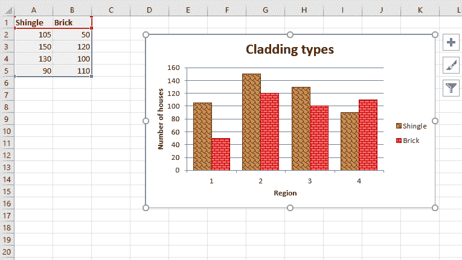

# Python |使用 XlsxWriter 模块

绘制带有填充列模式的 Excel 图表

> 原文:[https://www . geeksforgeeks . org/python-绘图-excel-带模式的图表-填充列-使用-xlsxwriter-module/](https://www.geeksforgeeks.org/python-plotting-an-excel-chart-with-pattern-fills-in-column-using-xlsxwriter-module/)

**先决条件:** [在 excel 表格上创建并书写](https://www.geeksforgeeks.org/python-create-and-write-on-excel-file-using-xlsxwriter-module/)

**`XlsxWriter`** 是一个 Python 库，使用它可以对 excel 文件执行多种操作，如创建、编写、算术运算和绘制图形。让我们看看如何使用实时数据绘制带有模式填充的图表。

图表至少由一系列一个或多个数据点组成。系列本身由单元格区域的引用组成。要在 excel 表上绘制图表，首先要创建特定图表类型的图表对象(如柱形图等)。).创建图表对象后，在其中插入数据，最后，将该图表对象添加到工作表对象中。

**代码:**绘制带有图案填充的图表。
要在 excel 表上绘制这种类型的图表，请使用带有图表对象的`'pattern'`关键字参数的`add_series()`方法。

```
# import xlsxwriter module
import xlsxwriter

# Workbook() takes one, non-optional, argument   
# which is the filename that we want to create.
workbook = xlsxwriter.Workbook('chart_pattern.xlsx')

# The workbook object is then used to add new   
# worksheet via the add_worksheet() method.  
worksheet = workbook.add_worksheet()

# Create a new Format object to formats cells 
# in worksheets using add_format() method . 

# here we create bold format object . 
bold = workbook.add_format({'bold': 1})

# Add the worksheet data that the charts will refer to.
headings = ['Shingle', 'Brick']
data = [
    [105, 150, 130, 90 ],
    [50,  120, 100, 110],
]

# Write a row of data starting from 'A1' 
# with bold format . 
worksheet.write_row('A1', headings, bold)

# Write a column of data starting from  
# 'A2', 'B2' respectively . 
worksheet.write_column('A2', data[0])
worksheet.write_column('B2', data[1])

# Create a chart object that can be added 
# to a worksheet using add_chart() method. 

# here we create a column chart object 
chart = workbook.add_chart({'type': 'column'})

# Add a data series with pattern to a chart 
# using add_series method.  The gap is used
# to make the patterns more visible.

# Configure the first series. 
# = Sheet1 !$A$1 is equivalent to ['Sheet1', 0, 0].

# note : spaces is not inserted in b / w
# = and Sheet1, Sheet1 and !
# if space is inserted it throws warning.
chart.add_series({
    'name':   '= Sheet1 !$A$1',
    'values': '= Sheet1 !$A$2:$A$5',
    'pattern': {
        'pattern':  'shingle',
        'fg_color': '# 804000',
        'bg_color': '# c68c53'
    },
    'border':  {'color': '# 804000'},
    'gap':     70,
})

# Configure a second series. 
chart.add_series({
    'name':   '= Sheet1 !$B$1',
    'values': '= Sheet1 !$B$2:$B$5',
    'pattern': {
        'pattern':  'horizontal_brick',
        'fg_color': '# b30000',
        'bg_color': '# ff6666'
    },
    'border':  {'color': '# b30000'},
})

# Add a chart title 
chart.set_title ({'name': 'Cladding types'})

# Add x-axis label 
chart.set_x_axis({'name': 'Region'})

# Add y-axis label 
chart.set_y_axis({'name': 'Number of houses'})

# add chart to the worksheet with given
# offset values at the top-left corner of
# a chart is anchored to cell D2 .
worksheet.insert_chart('D2', chart,  {'x_offset': 25, 'y_offset': 10})

# Finally, close the Excel file  
# via the close() method.  
workbook.close()
```

**输出:**
