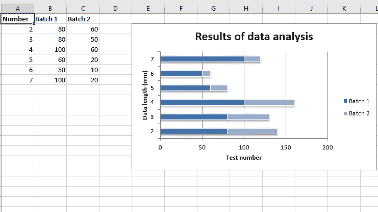
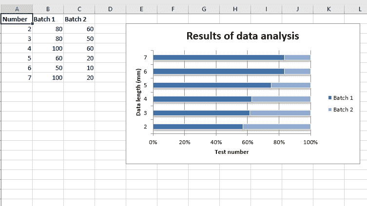

# Python |使用 XlsxWriter 模块在 excel 工作表中绘制条形图

> 原文:[https://www . geesforgeks . org/python-绘图-条形图-excel-sheet-use-xlsxwriter-module/](https://www.geeksforgeeks.org/python-plotting-bar-charts-in-excel-sheet-using-xlsxwriter-module/)

**先决条件:** [](https://www.geeksforgeeks.org/python-create-and-write-on-excel-file-using-xlsxwriter-module/)创建[并写在 excel 文件](https://www.geeksforgeeks.org/python-create-and-write-on-excel-file-using-xlsxwriter-module/)上。
**XlsxWriter** 是一个 Python 库，使用它可以对 excel 文件执行多种操作，如创建、编写、算术运算和绘制图形。让我们看看如何使用实时数据绘制不同类型的条形图。
图表至少由一系列一个或多个数据点组成。系列本身由单元格区域的引用组成。
在 excel 表格上绘制图表时，首先创建特定图表类型的图表对象(如条形图、堆积条形图、堆积百分比条形图等)。).创建图表对象后，在其中插入数据，最后，将该图表对象添加到工作表对象中。
**代码#1 :** 绘制简单条形图。
要在 excel 工作表中绘制简单条形图，请使用 add_chart()方法，并键入工作簿对象的“Bar”关键字参数。

## 蟒蛇 3

```
# import xlsxwriter module
import xlsxwriter

# Workbook() takes one, non-optional, argument 
# which is the filename that we want to create.
workbook = xlsxwriter.Workbook('chart_bar.xlsx')

# The workbook object is then used to add new 
# worksheet via the add_worksheet() method.
worksheet = workbook.add_worksheet()

# Create a new Format object to formats cells
# in worksheets using add_format() method .

# here we create bold format object .
bold = workbook.add_format({'bold': 1})

# create a data list .
headings = ['Number', 'Batch 1', 'Batch 2']

data = [
    [2, 3, 4, 5, 6, 7],
    [80, 80, 100, 60, 50, 100],
    [60, 50, 60, 20, 10, 20],
]

# Write a row of data starting from 'A1'
# with bold format .
worksheet.write_row('A1', headings, bold)

# Write a column of data starting from
# 'A2', 'B2', 'C2' respectively .
worksheet.write_column('A2', data[0])
worksheet.write_column('B2', data[1])
worksheet.write_column('C2', data[2])

# Create a chart object that can be added
# to a worksheet using add_chart() method.

# here we create a bar chart object .
chart1 = workbook.add_chart({'type': 'bar'})

# Add a data series to a chart
# using add_series method.

# Configure the first series.
# = Sheet1 !$A$1 is equivalent to ['Sheet1', 0, 0].
chart1.add_series({
    'name':       '= Sheet1 !$B$1',
    'categories': '= Sheet1 !$A$2:$A$7',
    'values':     '= Sheet1 !$B$2:$B$7',
})

# Configure a second series.
# Note use of alternative syntax to define ranges.
# [sheetname, first_row, first_col, last_row, last_col].
chart1.add_series({
    'name':       ['Sheet1', 0, 2],
    'categories': ['Sheet1', 1, 0, 6, 0],
    'values':     ['Sheet1', 1, 2, 6, 2],
})

# Add a chart title
chart1.set_title ({'name': 'Results of data analysis'})

# Add x-axis label
chart1.set_x_axis({'name': 'Test number'})

# Add y-axis label
chart1.set_y_axis({'name': 'Data length (mm)'})

# Set an Excel chart style.
chart1.set_style(11)

# add chart to the worksheet
# the top-left corner of a chart
# is anchored to cell E2 .
worksheet.insert_chart('E2', chart1)

# Finally, close the Excel file
# via the close() method.
workbook.close()
```

**输出:**


**代码#2 :** 绘制堆叠条形图。
要在 excel 工作表中绘制堆叠条形图，请使用 add_chart()方法，该方法带有工作簿对象的类型“Bar”和子类型“Stacked”关键字参数。

## 蟒蛇 3

```
# import xlsxwriter module
import xlsxwriter

# Workbook() takes one, non-optional, argument 
# which is the filename that we want to create.
workbook = xlsxwriter.Workbook('chart_bar2.xlsx')

# The workbook object is then used to add new 
# worksheet via the add_worksheet() method.
worksheet = workbook.add_worksheet()

# Create a new Format object to formats cells
# in worksheets using add_format() method .

# here we create bold format object .
bold = workbook.add_format({'bold': 1})

# create a data list .
headings = ['Number', 'Batch 1', 'Batch 2']

data = [
    [2, 3, 4, 5, 6, 7],
    [80, 80, 100, 60, 50, 100],
    [60, 50, 60, 20, 10, 20],
]

# Write a row of data starting from 'A1'
# with bold format .
worksheet.write_row('A1', headings, bold)

# Write a column of data starting from
# 'A2', 'B2', 'C2' respectively .
worksheet.write_column('A2', data[0])
worksheet.write_column('B2', data[1])
worksheet.write_column('C2', data[2])

# Create a chart object that can be added
# to a worksheet using add_chart() method.

# here we create a stacked bar chart object .
chart1 = workbook.add_chart({'type': 'bar', 'subtype': 'stacked'})

# Add a data series to a chart
# using add_series method.

# Configure the first series.
# = Sheet1 !$A$1 is equivalent to ['Sheet1', 0, 0].
chart1.add_series({
    'name':       '= Sheet1 !$B$1',
    'categories': '= Sheet1 !$A$2:$A$7',
    'values':     '= Sheet1 !$B$2:$B$7',
})

# Configure a second series.
# Note use of alternative syntax to define ranges.
# [sheetname, first_row, first_col, last_row, last_col].
chart1.add_series({
    'name':       ['Sheet1', 0, 2],
    'categories': ['Sheet1', 1, 0, 6, 0],
    'values':     ['Sheet1', 1, 2, 6, 2],
})

# Add a chart title
chart1.set_title ({'name': 'Results of data analysis'})

# Add x-axis label
chart1.set_x_axis({'name': 'Test number'})

# Add y-axis label
chart1.set_y_axis({'name': 'Data length (mm)'})

# Set an Excel chart style.
chart1.set_style(11)

# add chart to the worksheet
# the top-left corner of a chart
# is anchored to cell E2 .
worksheet.insert_chart('E2', chart1)

# Finally, close the Excel file
# via the close() method.
workbook.close()
```

**输出:**



**代码#3 :** 绘制百分比堆积条形图。
要在 excel 工作表中绘制堆积百分比条形图，请使用 add_chart()方法，该方法带有工作簿对象的类型“条形图”和子类型“堆积百分比”关键字参数。

## 蟒蛇 3

```
# import xlsxwriter module
import xlsxwriter

# Workbook() takes one, non-optional, argument 
# which is the filename that we want to create.
workbook = xlsxwriter.Workbook('chart_bar3.xlsx')

# The workbook object is then used to add new 
# worksheet via the add_worksheet() method.
worksheet = workbook.add_worksheet()

# Create a new Format object to formats cells
# in worksheets using add_format() method .

# here we create bold format object .
bold = workbook.add_format({'bold': 1})

# create a data list .
headings = ['Number', 'Batch 1', 'Batch 2']

data = [
    [2, 3, 4, 5, 6, 7],
    [80, 80, 100, 60, 50, 100],
    [60, 50, 60, 20, 10, 20],
]

# Write a row of data starting from 'A1'
# with bold format .
worksheet.write_row('A1', headings, bold)

# Write a column of data starting from
# 'A2', 'B2', 'C2' respectively .
worksheet.write_column('A2', data[0])
worksheet.write_column('B2', data[1])
worksheet.write_column('C2', data[2])

# Create a chart object that can be added
# to a worksheet using add_chart() method.

# here we create a percent stacked bar chart object .
chart1 = workbook.add_chart({'type': 'bar', 'subtype': 'percent_stacked'})

# Add a data series to a chart
# using add_series method.

# Configure the first series.
# = Sheet1 !$A$1 is equivalent to ['Sheet1', 0, 0].
chart1.add_series({
    'name':       '= Sheet1 !$B$1',
    'categories': '= Sheet1 !$A$2:$A$7',
    'values':     '= Sheet1 !$B$2:$B$7',
})

# Configure a second series.
# Note use of alternative syntax to define ranges.
# [sheetname, first_row, first_col, last_row, last_col].
chart1.add_series({
    'name':       ['Sheet1', 0, 2],
    'categories': ['Sheet1', 1, 0, 6, 0],
    'values':     ['Sheet1', 1, 2, 6, 2],
})

# Add a chart title
chart1.set_title ({'name': 'Results of data analysis'})

# Add x-axis label
chart1.set_x_axis({'name': 'Test number'})

# Add y-axis label
chart1.set_y_axis({'name': 'Data length (mm)'})

# Set an Excel chart style.
chart1.set_style(11)

# add chart to the worksheet
# the top-left corner of a chart
# is anchored to cell E2 .
worksheet.insert_chart('E2', chart1)

# Finally, close the Excel file
# via the close() method.
workbook.close()
```

**输出:**

