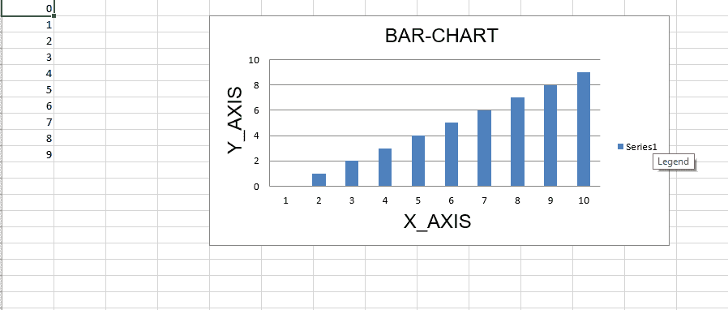
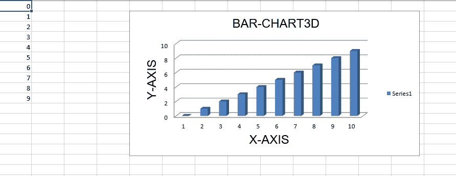
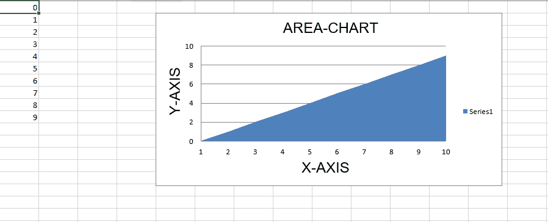
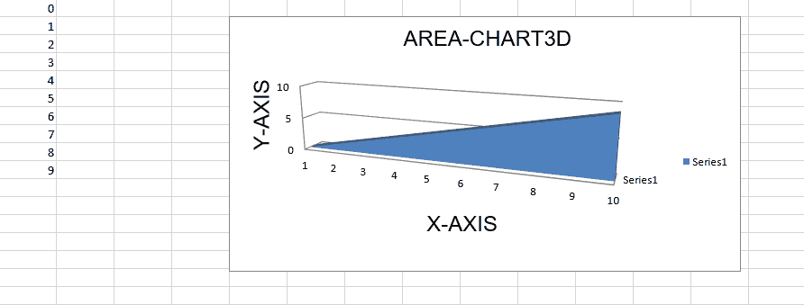
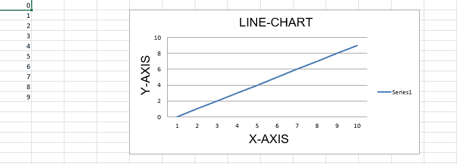
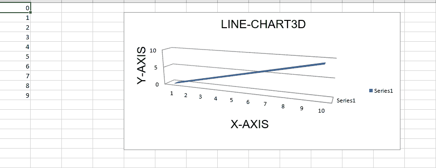

# Python |使用 openpyxl 模块在 excel 表格中绘制图表| Set–1

> 原文:[https://www . geesforgeks . org/python-绘图-excel 中的图表-工作表-使用-openpyxl-module-set-1/](https://www.geeksforgeeks.org/python-plotting-charts-in-excel-sheet-using-openpyxl-module-set-1/)

**先决条件:** [读取](https://www.geeksforgeeks.org/python-reading-excel-file-using-openpyxl-module/) & [使用 openpyxl 将](https://www.geeksforgeeks.org/python-writing-excel-file-using-openpyxl-module/)写入 excel 工作表

`**Openpyxl**` 是一个 Python 库，使用它可以对 excel 文件进行读取、写入、算术运算和绘制图形等多种操作。让我们看看如何使用实时数据绘制不同的图表。

图表至少由一系列一个或多个数据点组成。系列本身由单元格区域的引用组成。

要在 excel 表上绘制图表，首先要创建特定图表类的图表对象(如条形图、折线图等)。).创建图表对象后，在其中插入数据，最后，将该图表对象添加到工作表对象中。

**代码#1 :** 绘制条形图
要在 excel 表格上绘制条形图，请使用 openpyxl.chart 子模块中的`BarChart class`。

```
# import openpyxl module
import openpyxl

# import BarChart class from openpyxl.chart sub_module
from openpyxl.chart import BarChart,Reference

# Call a Workbook() function of openpyxl 
# to create a new blank Workbook object
wb = openpyxl.Workbook()

# Get workbook active sheet 
# from the active attribute.
sheet = wb.active

# write o to 9 in 1st column of the active sheet
for i in range(10):
    sheet.append([i])

# create data for plotting
values = Reference(sheet, min_col = 1, min_row = 1,
                         max_col = 1, max_row = 10)

# Create object of BarChart class
chart = BarChart()

# adding data to the Bar chart object
chart.add_data(values)

# set the title of the chart
chart.title = " BAR-CHART "

# set the title of the x-axis
chart.x_axis.title = " X_AXIS "

# set the title of the y-axis
chart.y_axis.title = " Y_AXIS "

# add chart to the sheet
# the top-left corner of a chart
# is anchored to cell E2 .
sheet.add_chart(chart, "E2")

# save the file
wb.save("barChart.xlsx")
```

**输出:**


**代码#2 :** 绘制三维条形图

要在 excel 表格上绘制三维条形图，请使用 openpyxl.chart 子模块中的`BarChart3D class`。

```
# import openpyxl module
import openpyxl

# import BarChart3D class from openpyxl.chart sub_module
from openpyxl.chart import BarChart3D,Reference

# write o to 9 in 1st column of the active sheet
for i in range(10):
    sheet.append([i])

values = Reference(sheet, min_col = 1, min_row = 1,
                         max_col = 1, max_row = 10)

# Create object of BarChart3D class
chart = BarChart3D()

chart.add_data(values)

# set the title of the chart
chart.title = " BAR-CHART3D "

# set the title of the x-axis
chart.x_axis.title = " X AXIS "

# set the title of the y-axis
chart.y_axis.title = " Y AXIS "

# add chart to the sheet
# the top-left corner of a chart
# is anchored to cell E2.
sheet.add_chart(chart, "E2")

# save the file
wb.save("BarChart3D.xlsx")
```

**输出:**


**代码#3 :** 绘制面积图

要在 excel 表格上绘制面积图，请使用 openpyxl.chart 子模块中的`AreaChart class`。

```
import openpyxl

# import AreaChart class from openpyxl.chart sub_module
from openpyxl.chart import AreaChart,Reference

wb = openpyxl.Workbook()
sheet = wb.active

# write o to 9 in 1st column of the active sheet
for i in range(10):
    sheet.append([i])

values = Reference(sheet, min_col = 1, min_row = 1,
                         max_col = 1, max_row = 10)

# create object of AreaChart class
chart = AreaChart()

chart.add_data(values)

# set the title of the chart
chart.title = " AREA-CHART "

# set the title of the x-axis
chart.x_axis.title = " X-AXIS "

# set the title of the y-axis
chart.y_axis.title = " Y-AXIS "

# add chart to the sheet
# the top-left corner of a chart
# is anchored to cell E2 .
sheet.add_chart(chart, "E2")

# save the file
wb.save("AreaChart.xlsx")
```

**输出:**


**代码#4 :** 绘制三维面积图

要在 excel 表格上绘制三维面积图，请使用 openpyxl.chart 子模块中的`AreaChart3D class`。

```
import openpyxl

# import AreaChart3D class from openpyxl.chart sub_module
from openpyxl.chart import AreaChart3D,Reference

wb = openpyxl.Workbook()
sheet = wb.active

# write o to 9 in 1st column of the active sheet
for i in range(10):
    sheet.append([i])

values = Reference(sheet, min_col = 1, min_row = 1,
                         max_col = 1, max_row = 10)

# Create object of AreaChart3D class
chart = AreaChart3D()

chart.add_data(values)

# set the title of the chart
chart.title = " AREA-CHART3D "

# set the title of the x-axis
chart.x_axis.title = " X-AXIS "

# set the title of the y-axis
chart.y_axis.title = " Y-AXIS "

# add chart to the sheet
# the top-left corner of a chart
# is anchored to cell E2 .
sheet.add_chart(chart, "E2")

# save the file
wb.save("AreaChart3D.xlsx")
```

**输出:**


**代码#5 :** 绘制折线图。
在 excel 表格上绘制折线图时，使用 openpyxl.chart 子模块中的`LineChart class`。

```
# import openpyxl module
import openpyxl

# import LineChart class from openpyxl.chart sub_module
from openpyxl.chart import LineChart,Reference

wb = openpyxl.Workbook()
sheet = wb.active

# write o to 9 in 1st column of the active sheet
for i in range(10):
    sheet.append([i])

values = Reference(sheet, min_col = 1, min_row = 1,
                         max_col = 1, max_row = 10)

# Create object of LineChart class
chart = LineChart()

chart.add_data(values)

# set the title of the chart
chart.title = " LINE-CHART "

# set the title of the x-axis
chart.x_axis.title = " X-AXIS "

# set the title of the y-axis
chart.y_axis.title = " Y-AXIS "

# add chart to the sheet
# the top-left corner of a chart
# is anchored to cell E2 .
sheet.add_chart(chart, "E2")

# save the file
wb.save("LineChart.xlsx")
```

**输出:**


**代码#6 :** 绘制三维折线图。
为了在 excel 表格上绘制三维折线图，我们必须使用 openpyxl.chart 子模块中的`LineChart3D class`。

```
import openpyxl

# import LineChart3D class from openpyxl.chart sub_module
from openpyxl.chart import LineChart3D,Reference

wb = openpyxl.Workbook()
sheet = wb.active

# write o to 9 in 1st column of the active sheet
for i in range(10):
    sheet.append([i])

values = Reference(sheet, min_col = 1, min_row = 1,
                         max_col = 1, max_row = 10)

# Create object of LineChart3D class
chart = LineChart3D()

chart.add_data(values)

# set the title of the chart
chart.title = " LINE-CHART3D "

# set the title of the x-axis
chart.x_axis.title = " X-AXIS "

# set the title of the y-axis
chart.y_axis.title = " Y-AXIS "

# add chart to the sheet
# the top-left corner of a chart
# is anchored to cell E2 .
sheet.add_chart(chart, "E2")

# save the file
wb.save("LineChart3D.xlsx")
```

**输出:**
