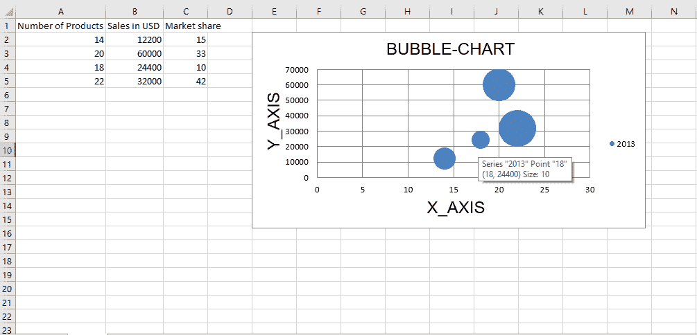
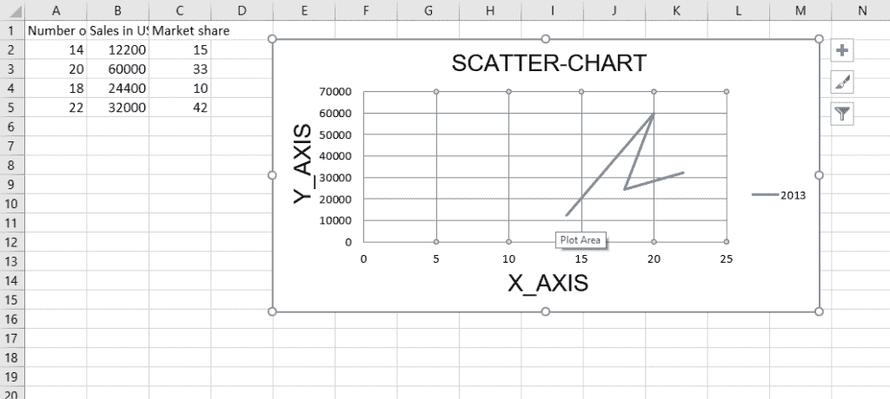
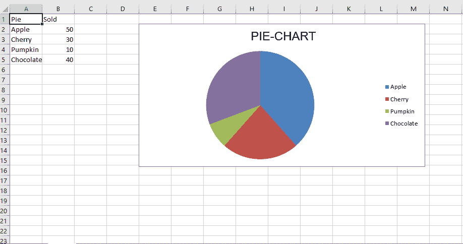
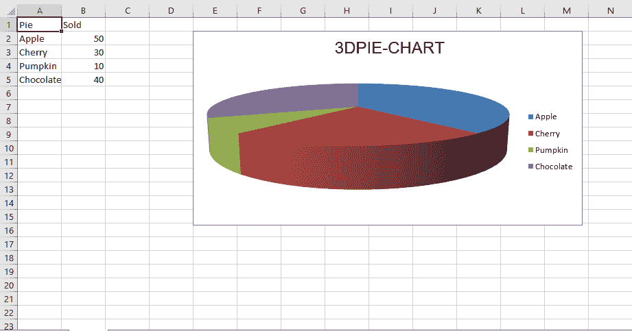

# Python |使用 openpyxl 模块在 excel 表格中绘制图表| Set–2

> 原文:[https://www . geesforgeks . org/python-绘图-excel 中的图表-工作表-使用-openpyxl-module-set-2/](https://www.geeksforgeeks.org/python-plotting-charts-in-excel-sheet-using-openpyxl-module-set-2/)

**先决条件:** [Python |使用 openpyxl 模块在 excel 表格中绘制图表| Set–1](https://www.geeksforgeeks.org/python-plotting-charts-in-excel-sheet-using-openpyxl-module-set-1/)

**`Openpyxl`** 是一个 Python 库，使用它可以对 excel 文件进行读取、写入、算术运算和绘制图形等多种操作。

图表至少由一系列一个或多个数据点组成。系列本身由单元格区域的引用组成。让我们看看如何使用 openpyxl 在 excel 表上绘制散点图、气泡图、饼图、三维饼图。

要在 excel 表上绘制图表，首先要创建特定图表类的图表对象(如散点图、饼图等)。).创建图表对象后，在其中插入数据，最后，将该图表对象添加到工作表对象中。让我们看看如何使用实时数据绘制不同的图表。

**代码#1 :** 绘制气泡图。

气泡图类似于散点图，但使用第三维来确定气泡的大小。图表可以包括多个系列。

要在 excel 表格上绘制气泡图，请使用 openpyxl.chart 子模块中的`BubbleChart class`。

```
# import openpyxl module
import openpyxl

# import BubbleChart, Reference, Series class
# from openpyxl.chart sub_module
from openpyxl.chart import BubbleChart, Reference, Series

# Call a Workbook() function of openpyxl 
# to create a new blank Workbook object
wb = openpyxl.Workbook()

# Get workbook active sheet 
# from the active attribute.
sheet = wb.active

rows = [
    ("Number of Products", "Sales in USD", "Market share"),
    (14, 12200, 15),
    (20, 60000, 33),
    (18, 24400, 10),
    (22, 32000, 42),
]

# write content of each row in 1st, 2nd and 3rd
# column of the active sheet respectively.
for row in rows:
    sheet.append(row)

# Create object of BubbleChart class
chart = BubbleChart()

# create data for plotting
xvalues = Reference(sheet, min_col = 1,
                    min_row = 2, max_row = 5)

yvalues = Reference(sheet, min_col = 2,
                    min_row = 2, max_row = 5)

size = Reference(sheet, min_col = 3,
                min_row = 2, max_row = 5)

# create a 1st series of data
series = Series(values = yvalues, xvalues = xvalues,
                      zvalues = size, title ="2013")

# add series data to the chart object
chart.series.append(series)

# set the title of the chart
chart.title = " BUBBLE-CHART "

# set the title of the x-axis
chart.x_axis.title = " X_AXIS "

# set the title of the y-axis
chart.y_axis.title = " Y_AXIS "

# add chart to the sheet
# the top-left corner of a chart
# is anchored to cell E2 .
sheet.add_chart(chart, "E2")

# save the file
wb.save("bubbleChart.xlsx")
```

**输出:**


**代码#2** :绘制散点图

散点图或 xy 图类似于一些折线图。要在 excel 工作表中绘制散点图，请使用 openpyxl.chart 子模块中的散点图类。

```
# import openpyxl module
import openpyxl

# import ScatterChart, Reference, Series
# class from openpyxl.chart sub_module
from openpyxl.chart import ScatterChart, Reference, Series

# Call a Workbook() function of openpyxl 
# to create a new blank Workbook object
wb = openpyxl.Workbook()

# Get workbook active sheet 
# from the active attribute.
sheet = wb.active

rows = [
    ("Number of Products", "Sales in USD", "Market share"),
    (14, 12200, 15),
    (20, 60000, 33),
    (18, 24400, 10),
    (22, 32000, 42),
]

# write content of each row in 1st, 2nd and 3rd
# column of the active sheet respectively .
for row in rows:
    sheet.append(row)

# Create object of ScatterChart class
chart = ScatterChart()

# create data for plotting
xvalues = Reference(sheet, min_col = 1,
                    min_row = 2, max_row = 5)

yvalues = Reference(sheet, min_col = 2,
                    min_row = 2, max_row = 5)

size = Reference(sheet, min_col = 3,
                 min_row = 2, max_row = 5)

# create a 1st series of data
series = Series(values = yvalues, xvalues = xvalues,
                      zvalues = size, title ="2013")

# add series data to the chart object
chart.series.append(series)

# set the title of the chart
chart.title = " SCATTER-CHART "

# set the title of the x-axis
chart.x_axis.title = " X_AXIS "

# set the title of the y-axis
chart.y_axis.title = " Y_AXIS "

# add chart to the sheet
# the top-left corner of a chart
# is anchored to cell E2 .
sheet.add_chart(chart, "E2")

# save the file
wb.save(" ScatterChart.xlsx")
```

**输出:**


**代码#3** :绘制饼图

饼图将数据绘制成圆形的切片，每个切片代表整体的百分比。切片以顺时针方向绘制，0 位于圆的顶部。饼图只能包含一系列数据。

若要在 excel 工作表中绘制饼图，请使用 openpyxl.chart 子模块中的饼图类。

```
# import openpyxl module
import openpyxl

# import PieChart, Reference class
# from openpyxl.chart sub_module
from openpyxl.chart import PieChart, Reference

# Call a Workbook() function of openpyxl 
# to create a new blank Workbook object
wb = openpyxl.Workbook()

# Get workbook active sheet 
# from the active attribute.
sheet = wb.active

datas = [
    ['Pie', 'Sold'],
    ['Apple', 50],
    ['Cherry', 30],
    ['Pumpkin', 10],
    ['Chocolate', 40],
]

# write content of each row in 1st, 2nd and 3rd
# column of the active sheet respectively .
for row in datas:
    sheet.append(row)

# Create object of PieChart class
chart = PieChart()

# create data for plotting
labels = Reference(sheet, min_col = 1,
                   min_row = 2, max_row = 5)

data = Reference(sheet, min_col = 2,
                   min_row = 1, max_row = 5)

# adding data to the Pie chart object
chart.add_data(data, titles_from_data = True)

# set labels in the chart object
chart.set_categories(labels)

# set the title of the chart
chart.title = " PIE-CHART "

# add chart to the sheet
# the top-left corner of a chart
# is anchored to cell E2 .
sheet.add_chart(chart, "E2")

# save the file
wb.save(" PieChart.xlsx")
```

**输出:**


**代码#4** :绘制条形图

要在 excel 工作表中绘制三维饼图，请使用 openpyxl.chart 子模块中的 PieChart3D 类。

```
# import openpyxl module
import openpyxl

# import PieChart3D, Reference class
# from openpyxl.chart sub_module
from openpyxl.chart import PieChart3D, Reference

# Call a Workbook() function of openpyxl 
# to create a new blank Workbook object
wb = openpyxl.Workbook()

# Get workbook active sheet 
# from the active attribute.
sheet = wb.active

datas = [
    ['Pie', 'Sold'],
    ['Apple', 50],
    ['Cherry', 30],
    ['Pumpkin', 10],
    ['Chocolate', 40],
]

# write content of each row in 1st, 2nd and 3rd
# column of the active sheet respectively .
for row in datas:
    sheet.append(row)

# Create object of PiChart3D class
chart = PieChart3D()

# create data for plotting
labels = Reference(sheet, min_col = 1,
                   min_row = 2, max_row = 5)
data = Reference(sheet, min_col = 2,
                   min_row = 1, max_row = 5)

# adding data to the Pie chart object
chart.add_data(data, titles_from_data = True)

# set labels in the chart object
chart.set_categories(labels)

# set the title of the chart
chart.title = " 3DPIE-CHART "

# add chart to the sheet
# the top-left corner of a chart
# is anchored to cell E2 .
sheet.add_chart(chart, "E2")

# save the file
wb.save(" 3DPieChart.xlsx")
```

**输出:**
