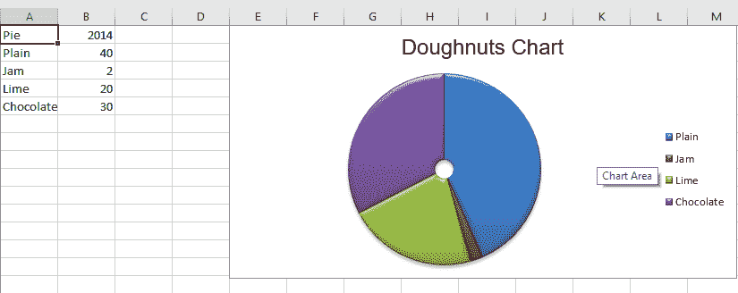
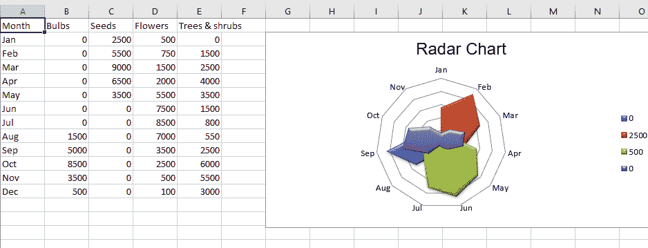
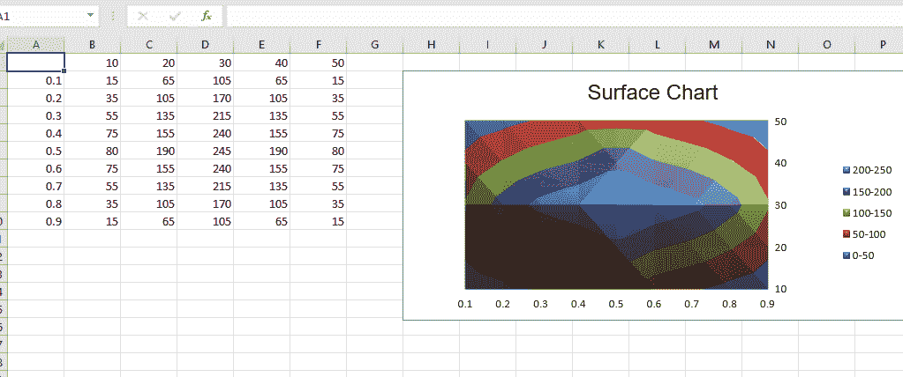
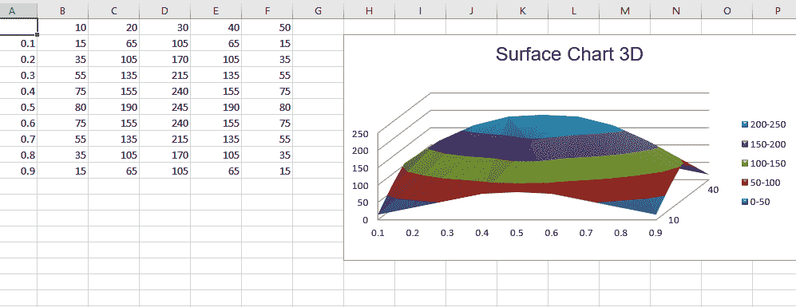

# Python |使用 openpyxl 模块在 excel 表格中绘制图表|设置 3

> 原文:[https://www . geesforgeks . org/python-绘图-excel 中的图表-工作表-使用-openpyxl-module-set-3/](https://www.geeksforgeeks.org/python-plotting-charts-in-excel-sheet-using-openpyxl-module-set-3/)

**先决条件:**使用 openpyxl 模块在 excel 表格中绘制图表[Set–1](https://www.geeksforgeeks.org/python-plotting-charts-in-excel-sheet-using-openpyxl-module-set-1/)|[Set–2](https://www.geeksforgeeks.org/python-plotting-charts-in-excel-sheet-using-openpyxl-module-set-2/)
**Openpyxl**是一个 Python 库，使用它可以对 excel 文件执行读取、写入、算术运算和绘制图表等多种操作。
图表至少由一系列一个或多个数据点组成。系列本身由单元格区域的引用组成。让我们看看如何使用 openpyxl 在 excel 表格上绘制多尔特、雷达、表面、三维表面图。
在 excel 表格上绘制图表时，首先创建特定图表类的图表对象(如曲面图、雷达图等)。).创建图表对象后，在其中插入数据，最后，将该图表对象添加到工作表对象中。让我们看看如何使用实时数据绘制不同的图表。
**代码#1 :** 绘制甜甜圈图
甜甜圈图类似于饼图，只是用一个圆环代替了圆形。他们还可以将几组数据绘制成同心环。要在 excel 工作表中绘制圆环图，请使用 openpyxl.chart 子模块中的圆环图类。

## 蟒蛇 3

```
# import Workbook from openpyxl
from openpyxl import Workbook

# import DoughnutChart, Reference from openpyxl.chart sub_module .
from openpyxl.chart import DoughnutChart, Reference

# import DataPoint from openpyxl.chart.series class
from openpyxl.chart.series import DataPoint

# Call a Workbook() function of openpyxl
# to create a new blank Workbook object
wb = Workbook()

# Get workbook active sheet
# from the active attribute.
ws = wb.active

# data given
data = [
    ['Pie', 2014],
    ['Plain', 40],
    ['Jam', 2],
    ['Lime', 20],
    ['Chocolate', 30],
]

# write content of each row in 1st and 2nd
# column of the active sheet respectively .
for row in data:
    ws.append(row)

# Create object of DoughnutChart class
chart = DoughnutChart()

# create data for plotting
labels = Reference(ws, min_col = 1, min_row = 2, max_row = 5)
data = Reference(ws, min_col = 2, min_row = 1, max_row = 5)

# adding data to the Doughnut chart object
chart.add_data(data, titles_from_data = True)

# set labels in the chart object
chart.set_categories(labels)

# set the title of the chart
chart.title = "Doughnuts Chart"

# set style of the chart
chart.style = 26

# add chart to the sheet
# the top-left corner of a chart
# is anchored to cell E1 .
ws.add_chart(chart, "E1")

# save the file
wb.save("doughnut.xlsx")
```

**输出:**



**代码#2:** 绘制雷达图
在工作表上按列或行排列的数据可以绘制在雷达图中。雷达图比较多个数据系列的聚合值。它实际上是面积图在圆形 x 轴上的投影。要在 excel 表上绘制雷达图，请使用 openpyxl.chart 子模块中的雷达图类。

## 蟒蛇 3

```
# import Workbook from openpyxl
from openpyxl import Workbook

# import RadarChart, Reference from openpyxl.chart sub_module .
from openpyxl.chart import RadarChart, Reference

# Call a Workbook() function of openpyxl
# to create a new blank Workbook object
wb = Workbook()

# Get workbook active sheet
# from the active attribute.
ws = wb.active

# data given
data = [
    ['Month', "Bulbs", "Seeds", "Flowers", "Trees & shrubs"],
    ['Jan', 0, 2500, 500, 0, ],
    ['Feb', 0, 5500, 750, 1500],
    ['Mar', 0, 9000, 1500, 2500],
    ['Apr', 0, 6500, 2000, 4000],
    ['May', 0, 3500, 5500, 3500],
    ['Jun', 0, 0, 7500, 1500],
    ['Jul', 0, 0, 8500, 800],
    ['Aug', 1500, 0, 7000, 550],
    ['Sep', 5000, 0, 3500, 2500],
    ['Oct', 8500, 0, 2500, 6000],
    ['Nov', 3500, 0, 500, 5500],
    ['Dec', 500, 0, 100, 3000 ],
]

# write content of each row in 1st and 2nd
# column of the active sheet respectively .
for row in data:
    ws.append(row)

# Create object of RadarChart class
chart = RadarChart()

# filled type of radar chart
chart.type = "filled"

# create data for plotting
labels = Reference(ws, min_col = 1, min_row = 2, max_row = 13)
data = Reference(ws, min_col = 2, max_col = 5, min_row = 2, max_row = 13)

# adding data to the Radar chart object
chart.add_data(data, titles_from_data = True)

# set labels in the chart object
chart.set_categories(labels)

# set the title of the chart
chart.title = "Radar Chart"

# set style of the chart
chart.style = 26

# delete y axis from the chart
chart.y_axis.delete = True

# add chart to the sheet
# the top-left corner of a chart
# is anchored to cell G2 .
ws.add_chart(chart, "G2")

# save the file
wb.save("Radar.xlsx")
```

**输出:**



**代码#3 :** 绘制表面图
在工作表上按列或行排列的数据可以绘制在表面图中。当您想要在两组数据之间找到最佳组合时，表面图非常有用。与地形图中一样，颜色和图案表示值范围相同的区域。要在 excel 工作表中绘制表面图，请使用 openpyxl.chart 子模块中的表面图类。

## 蟒蛇 3

```
# import Workbook from openpyxl
from openpyxl import Workbook

# import SurfaceChart, Reference, Series from openpyxl.chart sub_module .
from openpyxl.chart import SurfaceChart, Reference, Series

# Call a Workbook() function of openpyxl
# to create a new blank Workbook object
wb = Workbook()

# Get workbook active sheet
# from the active attribute.
ws = wb.active

# given data
data = [
    [None, 10, 20, 30, 40, 50, ],
    [0.1, 15, 65, 105, 65, 15, ],
    [0.2, 35, 105, 170, 105, 35, ],
    [0.3, 55, 135, 215, 135, 55, ],
    [0.4, 75, 155, 240, 155, 75, ],
    [0.5, 80, 190, 245, 190, 80, ],
    [0.6, 75, 155, 240, 155, 75, ],
    [0.7, 55, 135, 215, 135, 55, ],
    [0.8, 35, 105, 170, 105, 35, ],
    [0.9, 15, 65, 105, 65, 15],
]

# write content of each row in 1st and 2nd
# column of the active sheet respectively .
for row in data:
    ws.append(row)

# Create object of SurfaceChart class
chart = SurfaceChart()

# create data for plotting
labels = Reference(ws, min_col = 1, min_row = 2, max_row = 10)
data = Reference(ws, min_col = 2, max_col = 6, min_row = 1, max_row = 10)

# adding data to the Surface chart object
chart.add_data(data, titles_from_data = True)

# set labels in the chart object
chart.set_categories(labels)

# set the title of the chart
chart.title = "Surface Chart"

# set style of the chart
chart.style = 26

# add chart to the sheet
# the top-left corner of a chart
# is anchored to cell H2 .
ws.add_chart(chart, "H2")

# save the file
wb.save("Surface.xlsx")
```

**输出:**



**代码#4 :** 绘制三维表面图
要在 excel 工作表中绘制三维表面图，请使用 openpyxl.chart 子模块中的 SurfaceChart3D 类。

## 蟒蛇 3

```
# import Workbook from openpyxl
from openpyxl import Workbook

# import SurfaceChart3D, Reference, Series from openpyxl.chart sub_module .
from openpyxl.chart import SurfaceChart3D, Reference, Series

# Call a Workbook() function of openpyxl
# to create a new blank Workbook object
wb = Workbook()

# Get workbook active sheet
# from the active attribute.
ws = wb.active

# given data
data = [
    [None, 10, 20, 30, 40, 50, ],
    [0.1, 15, 65, 105, 65, 15, ],
    [0.2, 35, 105, 170, 105, 35, ],
    [0.3, 55, 135, 215, 135, 55, ],
    [0.4, 75, 155, 240, 155, 75, ],
    [0.5, 80, 190, 245, 190, 80, ],
    [0.6, 75, 155, 240, 155, 75, ],
    [0.7, 55, 135, 215, 135, 55, ],
    [0.8, 35, 105, 170, 105, 35, ],
    [0.9, 15, 65, 105, 65, 15],
]

# write content of each row in 1st and 2nd
# column of the active sheet respectively .
for row in data:
    ws.append(row)

# Create object of SurfaceChart3D class
chart = SurfaceChart3D()

# create data for plotting
labels = Reference(ws, min_col = 1, min_row = 2, max_row = 10)
data = Reference(ws, min_col = 2, max_col = 6, min_row = 1, max_row = 10)

# adding data to the Surface chart 3D object
chart.add_data(data, titles_from_data = True)

# set labels in the chart object
chart.set_categories(labels)

# set the title of the chart
chart.title = "Surface Chart 3D"

# set style of the chart
chart.style = 26

# add chart to the sheet
# the top-left corner of a chart
# is anchored to cell H2 .
ws.add_chart(chart, "H2")

# save the file
wb.save("Surface3D.xlsx")
```

**输出:**

