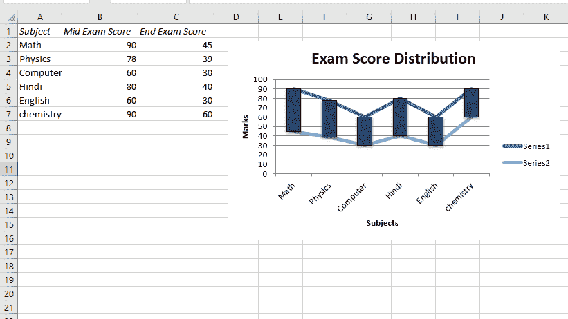
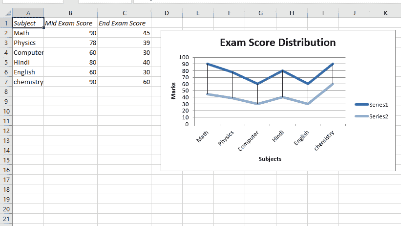
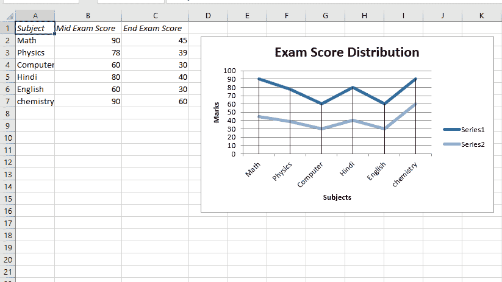

# Python |使用 XlsxWriter 模块使用数据工具在 excel 工作表中绘制图表| Set–2

> 原文:[https://www . geesforgeks . org/python-绘图-excel 中的图表-带数据的工作表-工具-使用-xlsxwriter-module-set-2/](https://www.geeksforgeeks.org/python-plotting-charts-in-excel-sheet-with-data-tools-using-xlsxwriter-module-set-2/)

**先决条件:** [在 excel 表格上创建和书写](https://www.geeksforgeeks.org/python-create-and-write-on-excel-file-using-xlsxwriter-module/)
**XlsxWriter** 是一个 Python 库，使用它可以对 excel 文件执行多种操作，如创建、书写、算术运算和绘制图形。让我们看看如何使用不同类型的数据工具使用实时数据绘制图表。
图表由至少一系列一个或多个数据点组成。系列本身由单元格区域的引用组成。要在 excel 表上绘制图表，首先要创建特定图表类型的图表对象(如折线图等)。).创建图表对象后，在其中插入数据，最后，将该图表对象添加到工作表对象中。
**代码#1 :** 绘制带有上下条的图表。
要在 excel 工作表中绘制这种类型的图表，请使用图表对象的 set _ up _ down _ bars()方法。

## 蟒蛇 3

```py
# import xlsxwriter module
import xlsxwriter

# Workbook() takes one, non-optional, argument  
# which is the filename that we want to create.
workbook = xlsxwriter.Workbook('Example4_chart.xlsx')

# The workbook object is then used to add new  
# worksheet via the add_worksheet() method.
worksheet = workbook.add_worksheet()

# Create a new Format object to formats cells
# in worksheets using add_format() method .

# here we create italic format object
italic = workbook.add_format({'italic': 1})

# Add the worksheet data that the charts will refer to.
Data1 = ['Subject', 'Mid Exam Score', 'End Exam Score']
Data2 = [
    ["Math", "Physics", "Computer",
     "Hindi", "English", "chemistry"],
    [90, 78, 60, 80, 60, 90],
    [45, 39, 30, 40, 30, 60]
]

# Write a row of data starting from 'A1'
# with bold format .
worksheet.write_row('A1', Data1, italic)

# Write a column of data starting from 
# 'A2', 'B2', 'C2' respectively
worksheet.write_column('A2', Data2[0])
worksheet.write_column('B2', Data2[1])
worksheet.write_column('C2', Data2[2])

# set the width of B and C column
worksheet.set_column('B:C', 15)

# Create a chart object that can be added
# to a worksheet using add_chart() method.

# here we create a line chart object .
chart1 = workbook.add_chart({'type': 'line'})

# Adding the Up-Down Bars.
chart1.set_up_down_bars()

# Add a data series to a chart 
# using add_series method. 

# Configure the first series. 
# = Sheet1 !$A$1 is equivalent to ['Sheet1', 0, 0].

# note : spaces is not inserted in b / w
# = and Sheet1, Sheet1 and !
# if space is inserted it throws warning.
chart1.add_series({
    'categories': '= Sheet1 !$A$2:$A$7',
    'values':     '= Sheet1 !$B$2:$B$7',
})

# Configure the second series.
chart1.add_series({
    'categories': '= Sheet1 !$A$2:$A$7',
    'values':     '= Sheet1 !$C$2:$C$7',
})

# Add a chart title.
chart1.set_title({'name': 'Exam Score Distribution'})

# Add x-axis label 
chart1.set_x_axis({'name': 'Subjects'}) 

# Add y-axis label 
chart1.set_y_axis({'name': 'Marks'})

# Set an Excel chart style. 
chart1.set_style(11)

# add chart to the worksheet with given
# offset values at the top-left corner of
# a chart is anchored to cell D2 
worksheet.insert_chart('D2', chart1, 
    {'x_offset': 20, 'y_offset': 5})

# Finally, close the Excel file  
# via the close() method.  
workbook.close()
```

**输出:**



**代码#2 :** 用高低线绘制图表。
要在 excel 工作表中绘制这种类型的图表，请使用图表对象的 set _ high _ low _ lines()方法。

## 蟒蛇 3

```py
# import xlsxwriter module
import xlsxwriter

# Workbook() takes one, non-optional, argument  
# which is the filename that we want to create.
workbook = xlsxwriter.Workbook('Example5_chart.xlsx')

# The workbook object is then used to add new  
# worksheet via the add_worksheet() method.
worksheet = workbook.add_worksheet()

# Create a new Format object to formats cells
# in worksheets using add_format() method .

# here we create italic format object
italic = workbook.add_format({'italic': 1})

# Add the worksheet data that the charts will refer to.
Data1 = ['Subject', 'Mid Exam Score', 'End Exam Score']
Data2 = [
    ["Math", "Physics", "Computer",
     "Hindi", "English", "chemistry"],
    [90, 78, 60, 80, 60, 90],
    [45, 39, 30, 40, 30, 60] ]

# Write a row of data starting from 'A1'
# with bold format .
worksheet.write_row('A1', Data1, italic)

# Write a column of data starting from 
# 'A2', 'B2', 'C2' respectively
worksheet.write_column('A2', Data2[0])
worksheet.write_column('B2', Data2[1])
worksheet.write_column('C2', Data2[2])

# set the width of B and C column
worksheet.set_column('B:C', 15)

# Create a chart object that can be added
# to a worksheet using add_chart() method.

# here we create a line chart object .
chart2 = workbook.add_chart({'type': 'line'})

# Adding the High-Low lines.
chart2.set_high_low_lines()

# Add a data series to a chart 
# using add_series method. 

# Configure the first series. 
# = Sheet1 !$A$1 is equivalent to ['Sheet1', 0, 0].

# note : spaces is not inserted in b / w
# = and Sheet1, Sheet1 and !
# if space is inserted it throws warning.
chart2.add_series({
    'categories': '= Sheet1 !$A$2:$A$7',
    'values':     '= Sheet1 !$B$2:$B$7',
})

# Configure the second series.
chart2.add_series({
    'categories': '= Sheet1 !$A$2:$A$7',
    'values':     '= Sheet1 !$C$2:$C$7',
})

# Add a chart title.
chart2.set_title({'name': 'Exam Score Distribution'})

# Add x-axis label 
chart2.set_x_axis({'name': 'Subjects'}) 

# Add y-axis label 
chart2.set_y_axis({'name': 'Marks'})

# Set an Excel chart style. 
chart2.set_style(11)

# add chart to the worksheet with given
# offset values at the top-left corner of
# a chart is anchored to cell D2 
worksheet.insert_chart('D2', chart2, 
    {'x_offset': 20, 'y_offset': 5})

# Finally, close the Excel file  
# via the close() method.  
workbook.close()
```

**输出:**



**代码#3 :** 绘制带有垂直线的图表。
要在 excel 工作表中绘制这种类型的图表，请使用图表对象的 set_drop_lines()方法。

## 蟒蛇 3

```py
# import xlsxwriter module
import xlsxwriter

# Workbook() takes one, non-optional, argument  
# which is the filename that we want to create.
workbook = xlsxwriter.Workbook('Example6_chart.xlsx')
# The workbook object is then used to add new  
# worksheet via the add_worksheet() method.
worksheet = workbook.add_worksheet()

# Create a new Format object to formats cells
# in worksheets using add_format() method .

# here we create italic format object
italic = workbook.add_format({'italic': 1})

# Add the worksheet data that the charts will refer to.
Data1 = ['Subject', 'Mid Exam Score', 'End Exam Score']
Data2 = [
    ["Math", "Physics", "Computer",
     "Hindi", "English", "chemistry"],
    [90, 78, 60, 80, 60, 90],
    [45, 39, 30, 40, 30, 60] ]

# Write a row of data starting from 'A1'
# with bold format .
worksheet.write_row('A1', Data1, italic)

# Write a column of data starting from 
# 'A2', 'B2', 'C2' respectively
worksheet.write_column('A2', Data2[0])
worksheet.write_column('B2', Data2[1])
worksheet.write_column('C2', Data2[2])

# set the width of B and C column
worksheet.set_column('B:C', 15)

# Create a chart object that can be added
# to a worksheet using add_chart() method.

# here we create a line chart object .
chart3 = workbook.add_chart({'type': 'line'})

# Adding the Drop Lines.
chart3.set_drop_lines()

# Add a data series to a chart 
# using add_series method. 

# Configure the first series. 
# = Sheet1 !$A$1 is equivalent to ['Sheet1', 0, 0].

# note : spaces is not inserted in b / w
# = and Sheet1, Sheet1 and !
# if space is inserted it throws warning.
chart3.add_series({
    'categories': '= Sheet1 !$A$2:$A$7',
    'values':     '= Sheet1 !$B$2:$B$7',
})

# Configure the second series.
chart3.add_series({
    'categories': '= Sheet1 !$A$2:$A$7',
    'values':     '= Sheet1 !$C$2:$C$7',
})

# Add a chart title.
chart3.set_title({'name': 'Exam Score Distribution'})

# Add x-axis label 
chart3.set_x_axis({'name': 'Subjects'}) 

# Add y-axis label 
chart3.set_y_axis({'name': 'Marks'})

# Set an Excel chart style. 
chart3.set_style(11)

# add chart to the worksheet with given
# offset values at the top-left corner of
# a chart is anchored to cell D2 
worksheet.insert_chart('D2', chart3, 
    {'x_offset': 20, 'y_offset': 5})

# Finally, close the Excel file  
# via the close() method.  
workbook.close()
```

**输出:**

