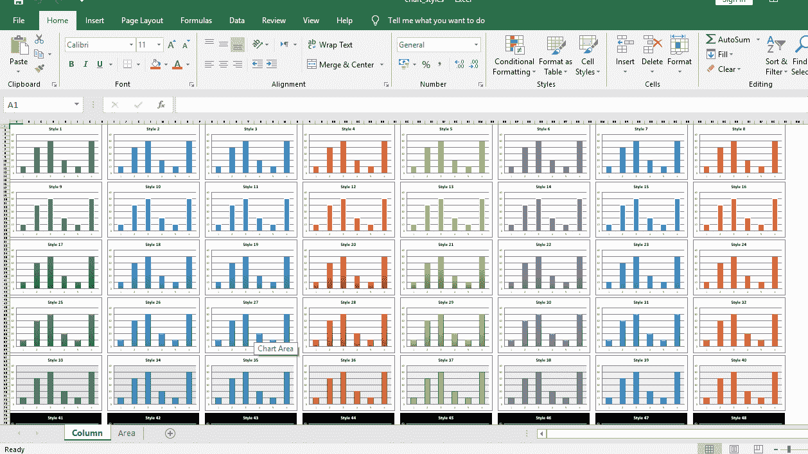
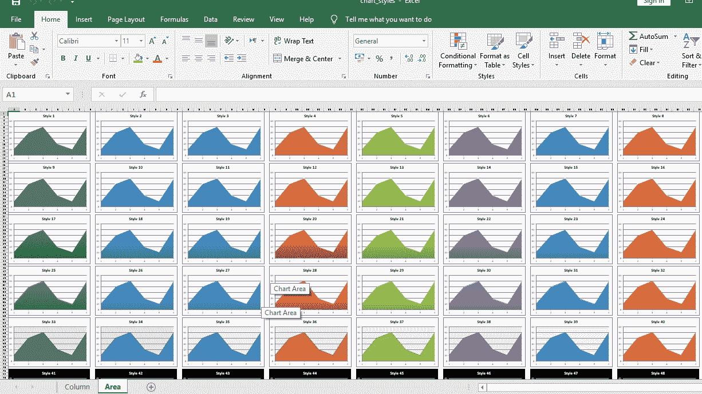

# Python |使用 XlsxWriter 模块在 excel 工作表中绘制不同类型的样式表

> 原文:[https://www . geesforgeks . org/python-绘图-不同类型的样式-excel 中的图表-工作表-使用-xlsxwriter-module/](https://www.geeksforgeeks.org/python-plotting-different-types-of-style-charts-in-excel-sheet-using-xlsxwriter-module/)

**先决条件:** [在 excel 表格上创建并书写](https://www.geeksforgeeks.org/python-create-and-write-on-excel-file-using-xlsxwriter-module/)

**`XlsxWriter`** 是一个 Python 库，使用它可以对 excel 文件执行多种操作，如创建、编写、算术运算和绘制图形。让我们看看如何使用实时数据绘制不同类型的风格图。

图表至少由一系列一个或多个数据点组成。系列本身由单元格区域的引用组成。要在 excel 表上绘制图表，首先要创建特定图表类型的图表对象(如折线图、柱形图等)。).创建图表对象后，在其中插入数据，最后，将该图表对象添加到工作表对象中。

**代码:**绘制不同类型的风格图。

要在 excel 工作表中绘制不同类型的样式图表，请使用具有相应样式 id 的图表对象的`use set_style()`方法。

```
# import xlsxwriter module 
import xlsxwriter

# Workbook() takes one, non-optional, argument   
# which is the filename that we want to create.
workbook = xlsxwriter.Workbook('chart_styles.xlsx')

# Show the styles for column and area chart types.
chart_types = ['column', 'area']

for chart_type in chart_types:

    # The workbook object is then used to add new   
    # worksheet via the add_worksheet() method.
    # Add a worksheet for each chart type
    worksheet = workbook.add_worksheet(chart_type.title())

    # set zoom option
    worksheet.set_zoom(30)

    # initialize style
    style_number = 1

    # Create 48 built-in styles, each with a different style.
    # each chart dimension is 15 X 8.
    for row_num in range(0, 90, 15):
        for col_num in range(0, 64, 8):

            # Create a chart object that can be added 
            # to a worksheet using add_chart() method. 

            # here we create a respective chart object .
            chart = workbook.add_chart({'type': chart_type})

            # Add a data series to a chart 
            # using add_series method. 
            chart.add_series({'values': '= Data !$A$1:$A$6'})

            # Add a chart title  
            chart.set_title ({'name': 'Style % d' % style_number})

            # Turn off the chart legend.
            chart.set_legend({'none': True})

            # Set an Excel chart style.
            chart.set_style(style_number)

            # add chart to the worksheet 
            # at the top-left corner of
            # a chart is anchored to
            # respective position of cell.  
            worksheet.insert_chart(row_num, col_num, chart)

            # do increment
            style_number += 1

# The workbook object is then used to add new   
# worksheet via the add_worksheet() method. 
# create a worksheet for writing data. 
data_worksheet = workbook.add_worksheet('Data')

# create a data list . 
data = [10, 40, 50, 20, 10, 50]

# Write a column of data starting from 'A1'
data_worksheet.write_column('A1', data)

# hide the data worksheet
data_worksheet.hide()

# Finally, close the Excel file  
# via the close() method.  
workbook.close()
```

**输出:**

