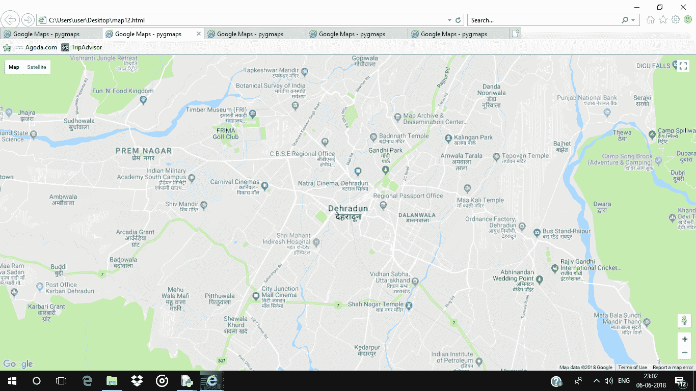
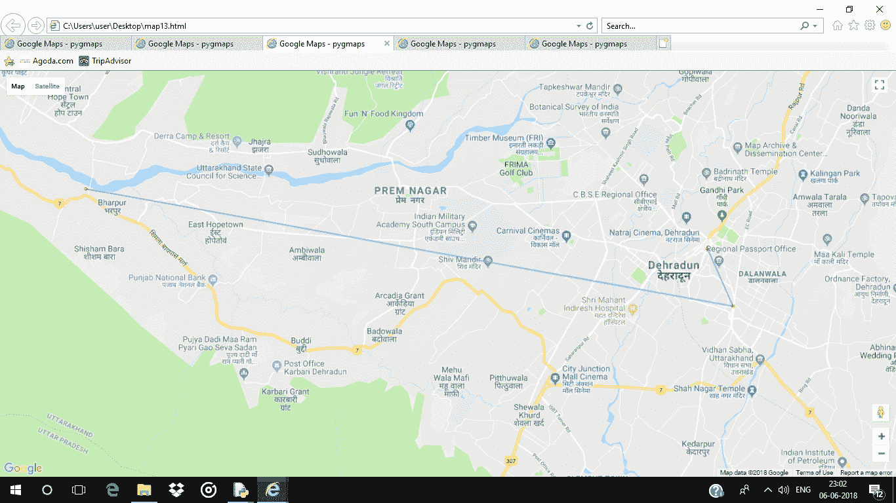
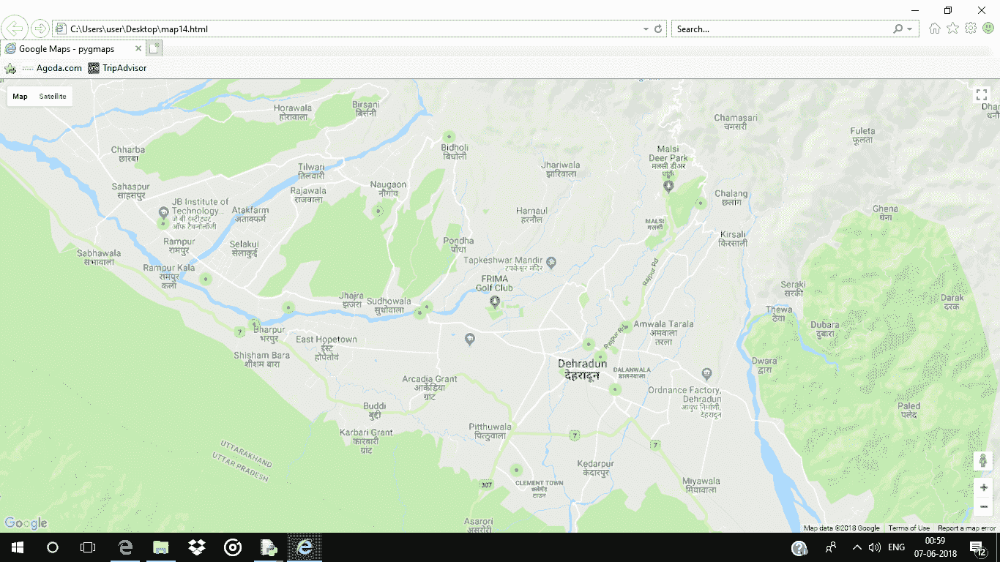
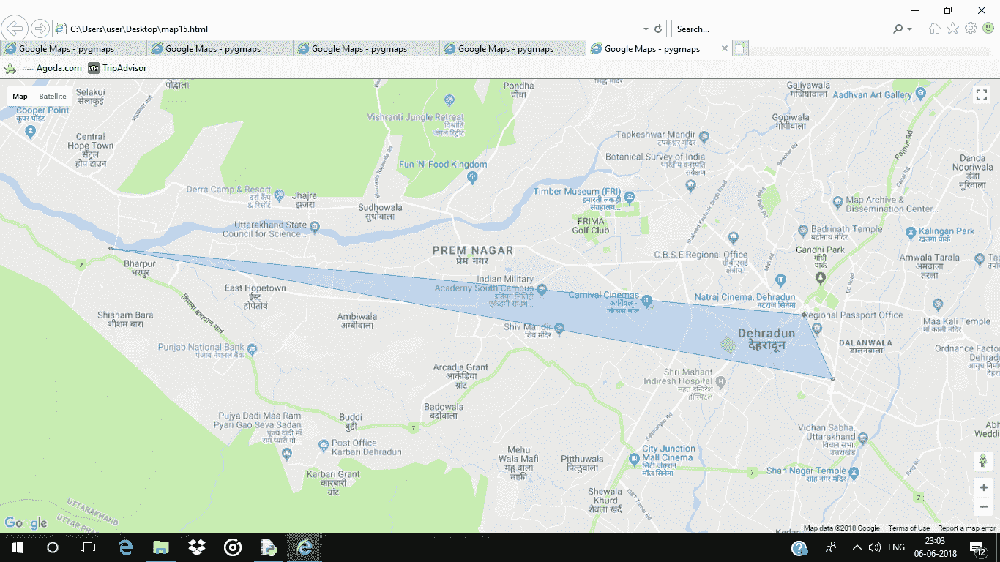

# Python |使用 gmplot 包绘制谷歌地图

> 原文:[https://www . geesforgeks . org/python-绘图-Google-map-use-gmplot-package/](https://www.geeksforgeeks.org/python-plotting-google-map-using-gmplot-package/)

**gmplot** 是一个类似 matplotlib 的界面，用于生成 HTML 和 javascript，以在谷歌地图上呈现用户想要的所有数据。

命令安装 **`gmplot`** :

```
pip install gmplot
```

**代码#1 :** 创建基础地图

```
# import gmplot package
import gmplot

# GoogleMapPlotter return Map object
# Pass the center latitude and
# center longitude
gmap1 = gmplot.GoogleMapPlotter(30.3164945,
                                78.03219179999999, 13 )

# Pass the absolute path
gmap1.draw( "C:\\Users\\user\\Desktop\\map11.html" )
```

**输出:**


**代码#2 :** 创建基础地图的另一种方法

```
# import gmplot package
import gmplot

# from_geocode method return the
# latitude and longitude of given location .
gmap2 = gmplot.GoogleMapPlotter.from_geocode( "Dehradun, India" )

gmap2.draw( "C:\\Users\\user\\Desktop\\map12.html" )
```

**输出:**


**代码#3 :** 在谷歌地图上分散点，并在它们之间画一条线。

```
# import gmplot package
import gmplot

latitude_list = [ 30.3358376, 30.307977, 30.3216419 ]
longitude_list = [ 77.8701919, 78.048457, 78.0413095 ]

gmap3 = gmplot.GoogleMapPlotter(30.3164945,
                                78.03219179999999, 13)

# scatter method of map object 
# scatter points on the google map
gmap3.scatter( latitude_list, longitude_list, '# FF0000',
                              size = 40, marker = False )

# Plot method Draw a line in
# between given coordinates
gmap3.plot(latitude_list, longitude_list, 
           'cornflowerblue', edge_width = 2.5)

gmap3.draw( "C:\\Users\\user\\Desktop\\map13.html" )
```

**输出:**


**代码#4 :** 显示热图图

```
# import gmplot package
import gmplot

latitude_list = [30.3358376, 30.307977, 30.3216419, 30.3427904,
                  30.378598, 30.3548185, 30.3345816, 30.387299,
                    30.3272198, 30.3840597, 30.4158, 30.340426,
                             30.3984348, 30.3431313, 30.273471]

longitude_list = [77.8701919, 78.048457, 78.0413095, 77.886958,
                  77.825396, 77.8460573, 78.0537813, 78.090614,
                    78.0355272, 77.9311923, 77.9663, 77.952092,
                            78.0747887, 77.9555512, 77.9997158]

gmap4 = gmplot.GoogleMapPlotter.from_geocode("Dehradun, India")

# heatmap plot heating Type
# points on the Google map
gmap4.heatmap( latitude_list, longitude_list )

gmap4.draw( "C:\\Users\\user\\Desktop\\map14.html" )
```

**输出:**


**代码#5 :** 在谷歌地图上画一个多边形

```
# import gmplot package
import gmplot

latitude_list = [ 30.3358376, 30.307977, 30.3216419 ]
longitude_list = [ 77.8701919, 78.048457, 78.0413095 ]

gmap5 = gmplot.GoogleMapPlotter(30.3164945,
                                78.03219179999999, 13)

gmap5.scatter( latitude_list, longitude_list, '# FF0000',
                                size = 40, marker = False)

# polygon method Draw a polygon with
# the help of coordinates
gmap5.polygon(latitude_list, longitude_list,
                   color = 'cornflowerblue')

gmap5.draw( "C:\\Users\\user\\Desktop\\map15.html" )
```

**输出:**
