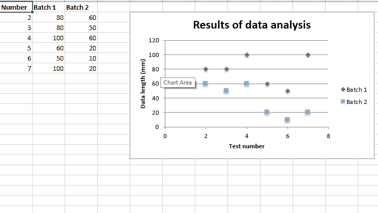
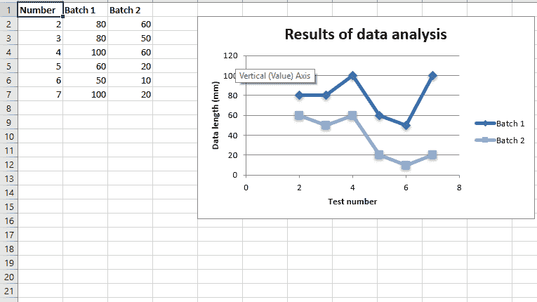
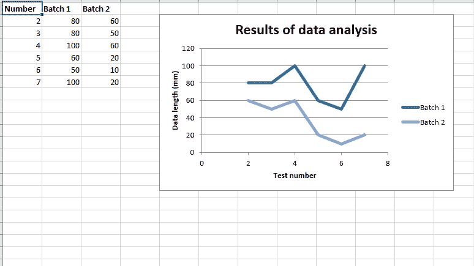
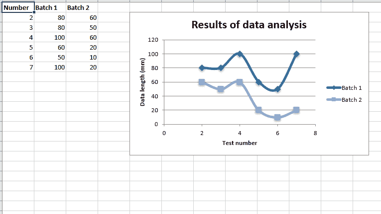
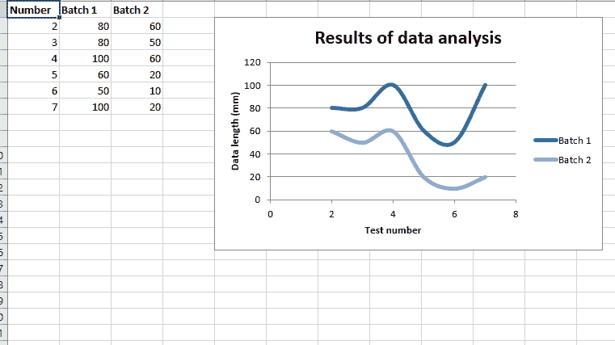

# Python |使用 XlsxWriter 模块在 excel 表格中绘制散点图

> 原文:[https://www . geesforgeks . org/python-绘图-散点图-excel-sheet-use-xlsxwriter-module/](https://www.geeksforgeeks.org/python-plotting-scatter-charts-in-excel-sheet-using-xlsxwriter-module/)

先决条件:[在 excel 文件上创建并写入。](https://www.geeksforgeeks.org/python-create-and-write-on-excel-file-using-xlsxwriter-module/)

**`XlsxWriter`** 是一个 Python 库，使用它可以对 excel 文件执行多种操作，如创建、编写、算术运算和绘制图形。让我们看看如何使用实时数据绘制不同类型的散点图。
图表由至少一个系列的一个或多个数据点组成。系列本身由单元格区域的引用组成。

要在 excel 表格上绘制图表，**首先，创建特定图表类型的图表对象(如散点图等)。).创建图表对象后，在其中插入数据，最后，将该图表对象添加到工作表对象中。**

**代码#1 :** 绘制简单散点图。

要在 excel 工作表中绘制简单的散点图，请使用 add_chart()方法，并在工作簿对象中键入“散点图”关键字参数。

```
# import xlsxwriter module 
import xlsxwriter 

# Workbook() takes one, non-optional, argument   
# which is the filename that we want to create. 
workbook = xlsxwriter.Workbook('chart_scatter.xlsx') 

# The workbook object is then used to add new   
# worksheet via the add_worksheet() method.  
worksheet = workbook.add_worksheet() 

# Create a new Format object to formats cells 
# in worksheets using add_format() method . 

# here we create bold format object . 
bold = workbook.add_format({'bold': 1}) 

# create a data list . 
headings = ['Number', 'Batch 1', 'Batch 2'] 

data = [ 
    [2, 3, 4, 5, 6, 7], 
    [80, 80, 100, 60, 50, 100], 
    [60, 50, 60, 20, 10, 20], 
] 

# Write a row of data starting from 'A1' 
# with bold format . 
worksheet.write_row('A1', headings, bold) 

# Write a column of data starting from  
# 'A2', 'B2', 'C2' respectively . 
worksheet.write_column('A2', data[0]) 
worksheet.write_column('B2', data[1]) 
worksheet.write_column('C2', data[2]) 

# Create a chart object that can be added 
# to a worksheet using add_chart() method. 

# here we create a scatter chart object . 
chart1 = workbook.add_chart({'type': 'scatter'}) 

# Add a data series to a chart 
# using add_series method. 

# Configure the first series. 
# = Sheet1 !$A$1 is equivalent to ['Sheet1', 0, 0].

# note : spaces is not inserted in b / w
# = and Sheet1, Sheet1 and !
# if space is inserted it throws warning.
chart1.add_series({ 
    'name':       '= Sheet1 !$B$1', 
    'categories': '= Sheet1 !$A$2:$A$7', 
    'values':     '= Sheet1 !$B$2:$B$7', 
}) 

# Configure a second series. 
# Note use of alternative syntax to define ranges. 
# [sheetname, first_row, first_col, last_row, last_col]. 
chart1.add_series({ 
    'name':       ['Sheet1', 0, 2], 
    'categories': ['Sheet1', 1, 0, 6, 0], 
    'values':     ['Sheet1', 1, 2, 6, 2], 
}) 

# Add a chart title  
chart1.set_title ({'name': 'Results of data analysis'}) 

# Add x-axis label 
chart1.set_x_axis({'name': 'Test number'}) 

# Add y-axis label 
chart1.set_y_axis({'name': 'Data length (mm)'}) 

# Set an Excel chart style. 
chart1.set_style(11) 

# add chart to the worksheet  
# the top-left corner of a chart  
# is anchored to cell E2 .  
worksheet.insert_chart('E2', chart1) 

# Finally, close the Excel file  
# via the close() method.  
workbook.close() 
```

**输出:**


**代码#2 :** 用直线和标记绘制散点图子类型。

若要在 excel 工作表中绘制这种类型的图表，请使用 add_chart()方法，该方法带有工作簿对象的“散布”类型和子类型“直带标记”关键字参数。

```
# import xlsxwriter module 
import xlsxwriter 

# Workbook() takes one, non-optional, argument   
# which is the filename that we want to create. 
workbook = xlsxwriter.Workbook('chart_scatter2.xlsx') 

# The workbook object is then used to add new   
# worksheet via the add_worksheet() method.  
worksheet = workbook.add_worksheet() 

# Create a new Format object to formats cells 
# in worksheets using add_format() method . 

# here we create bold format object . 
bold = workbook.add_format({'bold': 1}) 

# create a data list . 
headings = ['Number', 'Batch 1', 'Batch 2'] 

data = [ 
    [2, 3, 4, 5, 6, 7], 
    [80, 80, 100, 60, 50, 100], 
    [60, 50, 60, 20, 10, 20], 
] 

# Write a row of data starting from 'A1' 
# with bold format . 
worksheet.write_row('A1', headings, bold) 

# Write a column of data starting from 
# 'A2', 'B2', 'C2' respectively . 
worksheet.write_column('A2', data[0]) 
worksheet.write_column('B2', data[1]) 
worksheet.write_column('C2', data[2]) 

# Create a chart object that can be added 
# to a worksheet using add_chart() method. 

# here we create a  Scatter chart sub-type with
# straight lines and markers object . 
chart1 = workbook.add_chart({'type': 'scatter', 'subtype': 'straight_with_markers'}) 

# Add a data series to a chart 
# using add_series method. 

# Configure the first series. 
# = Sheet1 !$A$1 is equivalent to ['Sheet1', 0, 0]. 
chart1.add_series({ 
    'name':       '= Sheet1 !$B$1', 
    'categories': '= Sheet1 !$A$2:$A$7', 
    'values':     '= Sheet1 !$B$2:$B$7', 
}) 

# Configure a second series. 
# Note use of alternative syntax to define ranges. 
# [sheetname, first_row, first_col, last_row, last_col]. 
chart1.add_series({ 
    'name':       ['Sheet1', 0, 2], 
    'categories': ['Sheet1', 1, 0, 6, 0], 
    'values':     ['Sheet1', 1, 2, 6, 2], 
}) 

# Add a chart title  
chart1.set_title ({'name': 'Results of data analysis'}) 

# Add x-axis label 
chart1.set_x_axis({'name': 'Test number'}) 

# Add y-axis label 
chart1.set_y_axis({'name': 'Data length (mm)'}) 

# Set an Excel chart style. 
chart1.set_style(11) 

# add chart to the worksheet  
# the top-left corner of a chart  
# is anchored to cell E2 .  
worksheet.insert_chart('E2', chart1) 

# Finally, close the Excel file  
# via the close() method.  
workbook.close() 
```

**输出:**


**代码#3 :** 用直线绘制散点图子类型，无标记。

若要在 excel 工作表中绘制这种类型的图表，请将 add_chart()方法与工作簿对象的类型“散点”和子类型“直线”关键字参数一起使用。

```
# import xlsxwriter module 
import xlsxwriter 

# Workbook() takes one, non-optional, argument   
# which is the filename that we want to create. 
workbook = xlsxwriter.Workbook('chart_scatter3.xlsx') 

# The workbook object is then used to add new   
# worksheet via the add_worksheet() method.  
worksheet = workbook.add_worksheet() 

# Create a new Format object to formats cells 
# in worksheets using add_format() method . 

# here we create bold format object . 
bold = workbook.add_format({'bold': 1}) 

# create a data list . 
headings = ['Number', 'Batch 1', 'Batch 2'] 

data = [ 
    [2, 3, 4, 5, 6, 7], 
    [80, 80, 100, 60, 50, 100], 
    [60, 50, 60, 20, 10, 20], 
] 

# Write a row of data starting from 'A1' 
# with bold format . 
worksheet.write_row('A1', headings, bold) 

# Write a column of data starting from 
# 'A2', 'B2', 'C2' respectively . 
worksheet.write_column('A2', data[0]) 
worksheet.write_column('B2', data[1]) 
worksheet.write_column('C2', data[2]) 

# Create a chart object that can be added 
# to a worksheet using add_chart() method. 

# here we create a  Scatter chart sub-type with
# straight lines and no markers object . 
chart1 = workbook.add_chart({'type': 'scatter', 'subtype': 'straight'}) 

# Add a data series to a chart 
# using add_series method. 

# Configure the first series. 
# = Sheet1 !$A$1 is equivalent to ['Sheet1', 0, 0]. 
chart1.add_series({ 
    'name':       '= Sheet1 !$B$1', 
    'categories': '= Sheet1 !$A$2:$A$7', 
    'values':     '= Sheet1 !$B$2:$B$7', 
}) 

# Configure a second series. 
# Note use of alternative syntax to define ranges. 
# [sheetname, first_row, first_col, last_row, last_col]. 
chart1.add_series({ 
    'name':       ['Sheet1', 0, 2], 
    'categories': ['Sheet1', 1, 0, 6, 0], 
    'values':     ['Sheet1', 1, 2, 6, 2], 
}) 

# Add a chart title  
chart1.set_title ({'name': 'Results of data analysis'}) 

# Add x-axis label 
chart1.set_x_axis({'name': 'Test number'}) 

# Add y-axis label 
chart1.set_y_axis({'name': 'Data length (mm)'}) 

# Set an Excel chart style. 
chart1.set_style(11) 

# add chart to the worksheet  
# the top-left corner of a chart  
# is anchored to cell E2 .  
worksheet.insert_chart('E2', chart1) 

# Finally, close the Excel file  
# via the close() method.  
workbook.close() 
```

**输出:**


**代码#4 :** 用平滑的线条和标记绘制散点图子类型。

若要在 excel 工作表中绘制这种类型的图表，请使用 add_chart()方法，该方法带有工作簿对象的“散布”类型和子类型“smooth_with_markers”关键字参数。

```
# import xlsxwriter module 
import xlsxwriter 

# Workbook() takes one, non-optional, argument   
# which is the filename that we want to create. 
workbook = xlsxwriter.Workbook('chart_scatter4.xlsx') 

# The workbook object is then used to add new   
# worksheet via the add_worksheet() method.  
worksheet = workbook.add_worksheet() 

# Create a new Format object to formats cells 
# in worksheets using add_format() method . 

# here we create bold format object . 
bold = workbook.add_format({'bold': 1}) 

# create a data list . 
headings = ['Number', 'Batch 1', 'Batch 2'] 

data = [ 
    [2, 3, 4, 5, 6, 7], 
    [80, 80, 100, 60, 50, 100], 
    [60, 50, 60, 20, 10, 20], 
] 

# Write a row of data starting from 'A1' 
# with bold format . 
worksheet.write_row('A1', headings, bold) 

# Write a column of data starting from 
# 'A2', 'B2', 'C2' respectively . 
worksheet.write_column('A2', data[0]) 
worksheet.write_column('B2', data[1]) 
worksheet.write_column('C2', data[2]) 

# Create a chart object that can be added 
# to a worksheet using add_chart() method. 

# here we create a  Scatter chart sub-type with
# smooth lines and markers object . 
chart1 = workbook.add_chart({'type': 'scatter', 'subtype': 'smooth_with_markers'}) 

# Add a data series to a chart 
# using add_series method. 

# Configure the first series. 
# = Sheet1 !$A$1 is equivalent to ['Sheet1', 0, 0]. 
chart1.add_series({ 
    'name':       '= Sheet1 !$B$1', 
    'categories': '= Sheet1 !$A$2:$A$7', 
    'values':     '= Sheet1 !$B$2:$B$7', 
}) 

# Configure a second series. 
# Note use of alternative syntax to define ranges. 
# [sheetname, first_row, first_col, last_row, last_col]. 
chart1.add_series({ 
    'name':       ['Sheet1', 0, 2], 
    'categories': ['Sheet1', 1, 0, 6, 0], 
    'values':     ['Sheet1', 1, 2, 6, 2], 
}) 

# Add a chart title  
chart1.set_title ({'name': 'Results of data analysis'}) 

# Add x-axis label 
chart1.set_x_axis({'name': 'Test number'}) 

# Add y-axis label 
chart1.set_y_axis({'name': 'Data length (mm)'}) 

# Set an Excel chart style. 
chart1.set_style(11) 

# add chart to the worksheet  
# the top-left corner of a chart  
# is anchored to cell E2 .  
worksheet.insert_chart('E2', chart1) 

# Finally, close the Excel file  
# via the close() method.  
workbook.close() 
```

**输出:**


**代码#5 :** 绘制散点图子类型，线条流畅，无标记。

若要在 excel 工作表中绘制这种类型的图表，请将 add_chart()方法与工作簿对象的“散布”类型和“平滑”子类型关键字参数一起使用。

```
# import xlsxwriter module 
import xlsxwriter 

# Workbook() takes one, non-optional, argument   
# which is the filename that we want to create. 
workbook = xlsxwriter.Workbook('chart_scatter5.xlsx') 

# The workbook object is then used to add new   
# worksheet via the add_worksheet() method.  
worksheet = workbook.add_worksheet() 

# Create a new Format object to formats cells 
# in worksheets using add_format() method . 

# here we create bold format object . 
bold = workbook.add_format({'bold': 1}) 

# create a data list . 
headings = ['Number', 'Batch 1', 'Batch 2'] 

data = [ 
    [2, 3, 4, 5, 6, 7], 
    [80, 80, 100, 60, 50, 100], 
    [60, 50, 60, 20, 10, 20], 
] 

# Write a row of data starting from 'A1' 
# with bold format . 
worksheet.write_row('A1', headings, bold) 

# Write a column of data starting from 
# 'A2', 'B2', 'C2' respectively . 
worksheet.write_column('A2', data[0]) 
worksheet.write_column('B2', data[1]) 
worksheet.write_column('C2', data[2]) 

# Create a chart object that can be added 
# to a worksheet using add_chart() method. 

# here we create a  Scatter chart sub-type with
# smooth lines and no markers object . 
chart1 = workbook.add_chart({'type': 'scatter', 'subtype': 'smooth'}) 

# Add a data series to a chart 
# using add_series method. 

# Configure the first series. 
# = Sheet1 !$A$1 is equivalent to ['Sheet1', 0, 0]. 
chart1.add_series({ 
    'name':       '= Sheet1 !$B$1', 
    'categories': '= Sheet1 !$A$2:$A$7', 
    'values':     '= Sheet1 !$B$2:$B$7', 
}) 

# Configure a second series. 
# Note use of alternative syntax to define ranges. 
# [sheetname, first_row, first_col, last_row, last_col]. 
chart1.add_series({ 
    'name':       ['Sheet1', 0, 2], 
    'categories': ['Sheet1', 1, 0, 6, 0], 
    'values':     ['Sheet1', 1, 2, 6, 2], 
}) 

# Add a chart title  
chart1.set_title ({'name': 'Results of data analysis'}) 

# Add x-axis label 
chart1.set_x_axis({'name': 'Test number'}) 

# Add y-axis label 
chart1.set_y_axis({'name': 'Data length (mm)'}) 

# Set an Excel chart style. 
chart1.set_style(11) 

# add chart to the worksheet  
# the top-left corner of a chart  
# is anchored to cell E2 .  
worksheet.insert_chart('E2', chart1) 

# Finally, close the Excel file  
# via the close() method.  
workbook.close() 
```

**输出:**
