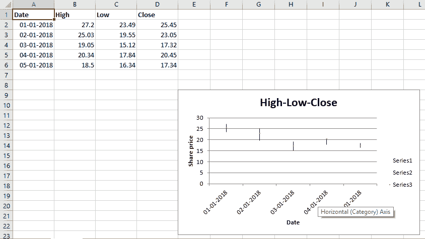

# Python |使用 XlsxWriter 模块在 excel 表格中绘制股票图表

> 原文:[https://www . geesforgeks . org/python-绘图-股票-excel 中的图表-工作表-使用-xlsxwriter-module/](https://www.geeksforgeeks.org/python-plotting-stock-charts-in-excel-sheet-using-xlsxwriter-module/)

**先决条件:** [在 excel 表格上创建并书写](https://www.geeksforgeeks.org/python-create-and-write-on-excel-file-using-xlsxwriter-module/)

**XlsxWriter** 是一个 Python 库，使用它可以对 excel 文件执行多种操作，如创建、编写、算术运算和绘制图形。让我们看看如何使用实时数据绘制股票图表。
图表至少由一系列一个或多个数据点组成。系列本身由单元格区域的引用组成。要在 excel 表上绘制图表，首先要创建特定图表类型的图表对象(如股票图表等)。).创建图表对象后，在其中插入数据，最后，将该图表对象添加到工作表对象中。

**代码:**绘制股价图。

要在 excel 工作表中绘制股票图表，请使用带有工作簿对象类型“股票”关键字参数的 **add_chart()** 方法。

## 蟒蛇 3

```
# from datetime libraray import datetime method
from datetime import datetime

# import xlsxwriter library
import xlsxwriter

# Workbook() takes one, non-optional, argument  
# which is the filename that we want to create.
workbook = xlsxwriter.Workbook('chart_stock.xlsx')

# The workbook object is then used to add new  
# worksheet via the add_worksheet() method. 
worksheet = workbook.add_worksheet()

# Create a new Format object to formats cells
# in worksheets using add_format() method .

# here we create bold format object .
bold = workbook.add_format({'bold': 1})

# here we create date format object
date_format = workbook.add_format({'num_format': 'dd/mm/yyyy'})

# Create a chart object that can be added
# to a worksheet using add_chart() method.

# here we create a stock chart object .
chart = workbook.add_chart({'type': 'stock'})

# Add the worksheet data that the charts will refer to.
headings = ['Date', 'High', 'Low', 'Close']
data = [
    ['2018-01-01', '2018-01-02', '2018-01-03', '2018-01-04', '2018-01-05'],
    [27.2, 25.03, 19.05, 20.34, 18.5],
    [23.49, 19.55, 15.12, 17.84, 16.34],
    [25.45, 23.05, 17.32, 20.45, 17.34],
]

# Write a row of data starting from 'A1'
# with bold format .
worksheet.write_row('A1', headings, bold)

# Filling the data in an excel sheet
for row in range(5):

    # convert a string type date into date of respective format.
    date = datetime.strptime(data[0][row], "% Y-% m-% d")

    # apply a date_format object on this particular cell
    worksheet.write(row + 1, 0, date, date_format)

    # write data in the respective cells
    worksheet.write(row + 1, 1, data[1][row])
    worksheet.write(row + 1, 2, data[2][row])
    worksheet.write(row + 1, 3, data[3][row])

# width of A to D column set to 11.
worksheet.set_column('A:D', 11)

# Add a series for each of the High-Low-Close columns.
# Add a data series to a chart
# using add_series method.

# note : spaces is not inserted in b / w
# = and Sheet1, Sheet1 and !
# if space is inserted it throws warning.

# data take from A2 to A6 and B2 to B6 respectively.
chart.add_series({
    'categories': '= Sheet1 !$A$2:$A$6',
    'values': '= Sheet1 !$B$2:$B$6',
})

# data take from A2 to A6 and C2 to C6 respectively.
chart.add_series({
    'categories': '= Sheet1 !$A$2:$A$6',
    'values':     '= Sheet1 !$C$2:$C$6',
})

# data take from A2 to A6 and D2 to D6 respectively.
chart.add_series({
    'categories': '= Sheet1 !$A$2:$A$6',
    'values': '= Sheet1 !$D$2:$D$6',
})

# Add a chart title 
chart.set_title ({'name': 'High-Low-Close'})

# Add x-axis label
chart.set_x_axis({'name': 'Date'})

# Add y-axis label
chart.set_y_axis({'name': 'Share price'})

# add chart to the worksheet with given
# offset values at the top-left corner of
# a chart is anchored to cell E9
worksheet.insert_chart('E9', chart)

# Finally, close the Excel file 
# via the close() method. 
workbook.close()
```

**输出:**

