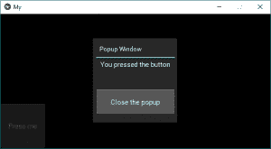

# Python | Kivy 中的弹出小部件使用。kv 文件

> 原文:[https://www . geesforgeks . org/python-popup-widget-in-kivy-using-kv-file/](https://www.geeksforgeeks.org/python-popup-widget-in-kivy-using-kv-file/)

Kivy 是 Python 中独立于平台的 GUI 工具。因为它可以在安卓、IOS、linux 和 Windows 等平台上运行。它基本上是用来开发安卓应用程序的，但并不意味着它不能在桌面应用程序上使用。

> 👉🏽 [Kivy 教程–通过示例学习 Kivy](https://www.geeksforgeeks.org/kivy-tutorial/)。

### 弹出窗口小部件：

要使用弹出窗口，您必须导入:

```
from kivy.uix.popup import Popup
```

弹出窗口小部件用于创建弹出窗口。默认情况下，弹出窗口将覆盖整个“父”窗口。创建弹出窗口时，您必须至少设置一个弹出窗口标题和弹出窗口内容。
请记住，小部件的默认大小是 size_hint=(1，1)。如果您不想让弹出窗口显示在全屏幕上，您必须给出小于 1 的大小提示(例如 size_hint=(.8，. 8))，或者停用 size_hint 并使用固定大小属性。

**注意:** Popup 是一个特殊的小部件。不要试图将其作为孩子添加到任何其他小部件中。如果您这样做了，弹出窗口将像普通的小部件一样处理，不会隐藏在后台创建，例如:

## 蟒蛇 3

```
BoxLayout:
   MyPopup:  # bad !
```

**基本方法:**

```
1) import kivy
2) import kivyApp
3) import Widget
4) import Floatlayout
5) import Label
6) import popup
7) Set minimum version(optional)
8) Create widget class
9) Create Layout class :
10) create App class
9) create .kv file (name same as the app class):
        1) create Widget
        2) create popup
        3) Give label to popup
        4) create button to close popup
10) return Layout/widget/Class(according to requirement)
11) define popup function(Which shows the popup on press the button)
12) Run an instance of the class
```

**实施方法:**

**弹出式. py 文件**

## 蟒蛇 3

```
# Kivy example for the Popup widget

# Program to Show how to create a switch
# import kivy module   
import kivy 

# base Class of your App inherits from the App class.   
# app:always refers to the instance of your application  
from kivy.app import App

# this restrict the kivy version i.e 
# below this kivy version you cannot 
# use the app or software 
kivy.require('1.9.0')

# Widgets are elements of a graphical user
# interface that form part of the User Experience.
from kivy.uix.widget import Widget
# The Label widget is for rendering text. 
from kivy.uix.label import Label

# module consist the floatlayout 
# to work with FloatLayout first 
# you have to import it 
from kivy.uix.floatlayout import FloatLayout

# Popup widget is used to create popups.
# By default, the popup will cover
# the whole “parent” window.
# When you are creating a popup,
# you must at least set a Popup.title and Popup.content.
from kivy.uix.popup import Popup

# Creating a widget class
# through this we add button
# the commands of the class is in .kv file
class Widgets(Widget):
    def btn(self):
        # calling of the show popup function
        show_popup()

# Popup class is defined
# The command of the class is in .kv file
class Popups(FloatLayout):
    pass

# create App class
class MyApp(App):
    def build(self):
        # return the widget
        return Widgets()

# define popup function in this we create the popup
def show_popup():
    show = Popups()

    popupWindow = Popup(title ="Popup Window", content = show,
                        size_hint =(None, None), size =(200, 200))

    # open popup window
    popupWindow.open()

    # Attach close button press with popup.dismiss action
    # content.bind(on_press = popup.dismiss)

# run the App 
if __name__ == "__main__":
    MyApp().run()
```

[。kv 文件](https://www.geeksforgeeks.org/python-kivy-kv-file/)执行:

## 蟒蛇 3

```
# .kv file of the popup code

# Adding Button widget
<Widgets>:
    Button:
        text: "Press me"
        on_release: root.btn()

# Adding Label, Button to popup
<Popups>:

    Label:
        text: "You pressed the button"
        size_hint: 0.6, 0.2
        pos_hint: {"x":0.2, "top":1}

    Button:
        text: "Close the popup"
        # set size of the button
        size_hint: 1, 0.4
        # set position of the button  
        pos_hint: {"x":0, "y":0.1}
```

**输出:**

当按钮按下弹出窗口出现时，点击窗口中除弹出屏幕以外的任何地方弹出窗口都会消失:
