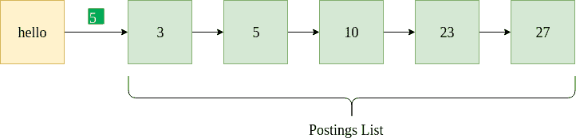
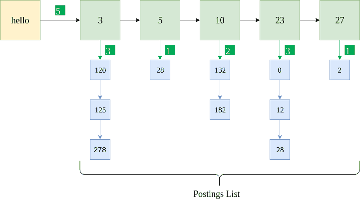

# Python |位置索引

> 原文:[https://www.geeksforgeeks.org/python-positional-index/](https://www.geeksforgeeks.org/python-positional-index/)

这篇[文章](https://www.geeksforgeeks.org/inverted-index/)谈到为信息检索(IR)系统建立倒排索引。然而，在现实生活的 IR 系统中，我们不仅会遇到单个单词的查询(如“狗”、“计算机”或“亚历克斯”)，还会遇到**短语查询**(如“冬天来了”、“纽约”或“凯文在哪里”)。为了处理这样的查询，使用倒排索引是不够的。

为了更好地理解动机，假设用户查询“圣玛丽学校”。现在，倒排索引将独立地为我们提供一个包含术语“圣徒”、“玛丽”和“学校”的文档列表。然而，我们实际上需要的是整个“圣玛丽学校”一字不差地出现的文件。为了成功地回答这样的查询，我们需要一个文档索引，它也存储了术语的位置。

**发布列表**
在倒排索引的情况下，发布列表是术语出现的文档列表。它通常按文档标识排序，并以链表的形式存储。



上图显示了术语“你好”的示例发布列表。它表示“hello”出现在 docIDs 为 3、5、10、23 和 27 的文档中。它还指定了文档频率 5(以绿色突出显示)。给出了一个 Python 数据格式示例，其中包含一个字典和用于存储发布列表的链接列表。

```py
{"hello" : [5, [3, 5, 10, 23, 27] ] }
```

在位置索引的情况下，术语在特定文档中出现的位置也与文档标识一起存储。



上图显示了为位置索引实现的相同发布列表。蓝色方框表示术语“你好”在相应文档中的位置。例如，“hello”出现在文档 5 的三个位置:120、125 和 278。此外，为每个文档存储术语的频率。给出了相同的示例 Python 数据格式。

```py
{"hello" : [5, [ {3 : [3, [120, 125, 278]]}, {5 : [1, [28] ] }, {10 : [2, [132, 182]]}, {23 : [3, [0, 12, 28]]}, {27 : [1, [2]]} ] }
```

为了简单起见，还可以省略单个文档中的频率一词(如示例代码中所做的)。数据格式如下所示。

```py
{"hello" : [5, {3 : [120, 125, 278]}, {5 : [28]}, {10 : [132, 182]}, {23 : [0, 12, 28]}, {27 : [2]} ] }
```

**建立位置索引的步骤**

*   去拿文件。
*   去掉停止词，把结果词加上词干。
*   如果该单词已经存在于词典中，请添加文档及其出现的相应位置。否则，创建一个新条目。
*   同时更新每个文档的词频，以及出现的文档数量。

**代码**
为了实现位置索引，我们使用了一个名为“20 个新闻组”的样本数据集。

## 蟒蛇 3

```py
# importing libraries
import numpy as np
import os
import nltk
from nltk.stem import PorterStemmer
from nltk.tokenize import TweetTokenizer
from natsort import natsorted
import string

def read_file(filename):
    with open(filename, 'r', encoding ="ascii", errors ="surrogateescape") as f:
        stuff = f.read()

    f.close()

    # Remove header and footer.
    stuff = remove_header_footer(stuff)

    return stuff

def remove_header_footer(final_string):
    new_final_string = ""
    tokens = final_string.split('\n\n')

    # Remove tokens[0] and tokens[-1]
    for token in tokens[1:-1]:
        new_final_string += token+" "
    return new_final_string

def preprocessing(final_string):
        # Tokenize.
    tokenizer = TweetTokenizer()
    token_list = tokenizer.tokenize(final_string)

    # Remove punctuations.
    table = str.maketrans('', '', '\t')
    token_list = [word.translate(table) for word in token_list]
    punctuations = (string.punctuation).replace("'", "")
    trans_table = str.maketrans('', '', punctuations)
    stripped_words = [word.translate(trans_table) for word in token_list]
    token_list = [str for str in stripped_words if str]

    # Change to lowercase.
    token_list =[word.lower() for word in token_list]
    return token_list

# In this example, we create the positional index for only 1 folder.
folder_names = ["comp.graphics"]

# Initialize the stemmer.
stemmer = PorterStemmer()

# Initialize the file no.
fileno = 0

# Initialize the dictionary.
pos_index = {}

# Initialize the file mapping (fileno -> file name).
file_map = {}

for folder_name in folder_names:

    # Open files.
    file_names = natsorted(os.listdir("20_newsgroups/" + folder_name))

    # For every file.
    for file_name in file_names:

        # Read file contents.
        stuff = read_file("20_newsgroups/" + folder_name + "/" + file_name)

        # This is the list of words in order of the text.
        # We need to preserve the order because we require positions.
        # 'preprocessing' function does some basic punctuation removal,
        # stopword removal etc.
        final_token_list = preprocessing(stuff)

        # For position and term in the tokens.
        for pos, term in enumerate(final_token_list):

                    # First stem the term.
                    term = stemmer.stem(term)

                    # If term already exists in the positional index dictionary.
                    if term in pos_index:

                        # Increment total freq by 1.
                        pos_index[term][0] = pos_index[term][0] + 1

                        # Check if the term has existed in that DocID before.
                        if fileno in pos_index[term][1]:
                            pos_index[term][1][fileno].append(pos)

                        else:
                            pos_index[term][1][fileno] = [pos]

                    # If term does not exist in the positional index dictionary
                    # (first encounter).
                    else:

                        # Initialize the list.
                        pos_index[term] = []
                        # The total frequency is 1.
                        pos_index[term].append(1)
                        # The postings list is initially empty.
                        pos_index[term].append({})     
                        # Add doc ID to postings list.
                        pos_index[term][1][fileno] = [pos]

        # Map the file no. to the file name.
        file_map[fileno] = "20_newsgroups/" + folder_name + "/" + file_name

        # Increment the file no. counter for document ID mapping             
        fileno += 1

# Sample positional index to test the code.
sample_pos_idx = pos_index["andrew"]
print("Positional Index")
print(sample_pos_idx)

file_list = sample_pos_idx[1]
print("Filename, [Positions]")
for fileno, positions in file_list.items():
    print(file_map[fileno], positions)
```

**输出:**

```py
Positional Index
[10, {215: [2081], 539: [66], 591: [879], 616: [462, 473], 680: [135], 691: [2081], 714: [4], 809: [333], 979: [0]}]
Filename, [Positions]
20_newsgroups/comp.graphics/38376 [2081]
20_newsgroups/comp.graphics/38701 [66]
20_newsgroups/comp.graphics/38753 [879]
20_newsgroups/comp.graphics/38778 [462, 473]
20_newsgroups/comp.graphics/38842 [135]
20_newsgroups/comp.graphics/38853 [2081]
20_newsgroups/comp.graphics/38876 [4]
20_newsgroups/comp.graphics/38971 [333]
20_newsgroups/comp.graphics/39663 [0]
```