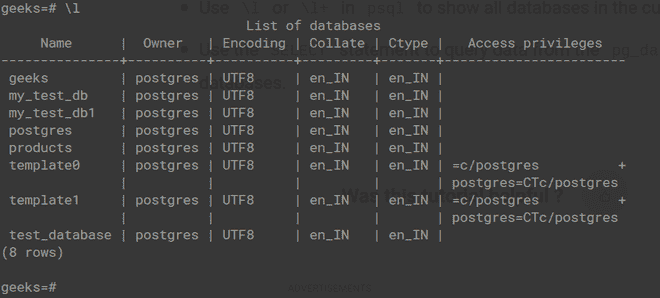

# Python PostgreSQL–创建数据库

> 原文:[https://www . geesforgeks . org/python-PostgreSQL-create-database/](https://www.geeksforgeeks.org/python-postgresql-create-database/)

在本文中，我们将讨论如何使用 Python 中的 pysopg2 在 PsotgreSQL 中创建数据库。

**CREATE DATABASE** 是 PostgreSQL 数据库管理系统支持的数据定义语言 **( DDL )** 语句之一。它用于在 PostgreSQL 中创建数据库。数据库名称应该总是唯一的。如果它已经存在，那么它表明特定的数据库已经存在。

> **语法:**CREATE DATABASE _ DATABASE _ name；

### 示例:使用 Pyscopg2 创建数据库

## 蟒蛇 3

```
import psycopg2

# connection establishment
conn = psycopg2.connect(
   database="postgres",
    user='postgres',
    password='password',
    host='localhost',
    port= '5432'
)

conn.autocommit = True

# Creating a cursor object
cursor = conn.cursor()

# query to create a database 
sql = ''' CREATE database products ''';

# executing above query
cursor.execute(sql)
print("Database has been created successfully !!");

# Closing the connection
conn.close()
```

**输出**

```
Database has been created successfully !!
```

#### **我们来看看** PostgreSQL 中的数据库:

